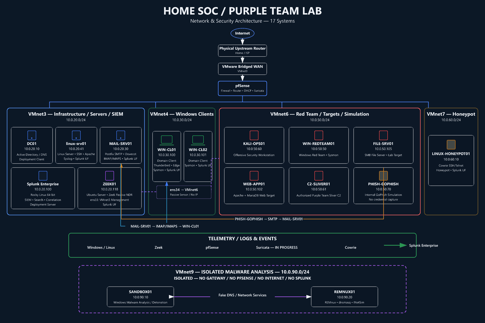

# SOC & Purple Team Home Lab

## Overview

This repository documents a segmented, enterprise-style home lab used to practice SOC operations, adversary simulation, SIEM engineering, and detection validation. It demonstrates how Windows and network telemetry is collected in Splunk Enterprise, turned into defensible detections, tested in a controlled environment, and investigated with known limitations preserved.

> Core SIEM platform: **Splunk Enterprise**. Suricata is deployed on pfSense; Suricata alert ingestion into Splunk is currently in progress.

> **Public sanitization:** This repository represents an isolated cybersecurity home lab. Documented IP addresses are private lab addressing unless explicitly stated otherwise, and all identities are lab/test accounts. Screenshots and evidence are reviewed before publication; credentials, secrets, public endpoints, and sensitive operational information are intentionally excluded.

## Quick Navigation

- [Architecture](#architecture)
- [Technology Stack](#technology-stack)
- [Detection Engineering](#detection-engineering)
- [Featured Detection Case Studies](#featured-detection-case-studies)
- [Current Status / Known Limitations](#current-status--known-limitations)
- [Roadmap](#roadmap)

## Architecture

The lab is segmented into dedicated infrastructure, endpoint, offensive-security, deception, phishing-simulation, and isolated malware-analysis networks.



### Architecture at a Glance

- **VMnet3 — 10.0.20.0/24:** Infrastructure / Servers / SIEM
- **VMnet4 — 10.0.30.0/24:** Windows Clients
- **VMnet6 — 10.0.50.0/24:** Red Team / Targets / Simulation
- **VMnet7 — 10.0.60.0/24:** Honeypot / Deception
- **VMnet9 — 10.0.90.0/24:** Isolated Malware Analysis

The environment contains **17 systems**. pfSense segments the routed lab zones, Splunk Enterprise serves as the central SIEM, and the dual-interface ZEEK01 sensor provides passive network monitoring. pfSense's WAN receives a private RFC1918 address from the upstream router, which provides Internet-facing NAT.

> VMnet9 is intentionally isolated with no gateway, no pfSense connectivity, no Internet access, and no Splunk connectivity.

For a text-based and version-control-friendly representation, see [`docs/lab-architecture-ascii.md`](docs/lab-architecture-ascii.md).

## What I Built

- Active Directory domain services and DNS on Windows Server 2022
- Two domain-joined Windows endpoints with Sysmon and Splunk Universal Forwarder
- pfSense routing, firewall policy, DHCP, and Suricata IDS/IPS across segmented zones
- Splunk Enterprise pipelines for Windows telemetry and pfSense syslog
- A Linux-based internal mail stack using Postfix, Dovecot, Thunderbird, internal TLS, and Splunk mail telemetry
- An internal GoPhish simulation integrated with MAIL-SRV01 and validated through GoPhish, Sysmon, pfSense, and Splunk
- An Apache telemetry pipeline from WEB-APP01 to Splunk Enterprise for controlled web-attack detection engineering
- A dual-interface Zeek NDR sensor that forwards JSON telemetry from passive VMnet6 observation to Splunk Enterprise through a management-only VMnet3 path
- An isolated malware-analysis network with local fake DNS and Internet-service simulation
- 16 documented Splunk detections—DET-001 through DET-015 and DET-018—with attack or traffic-based validation evidence
- CIM-based `tstats` searches for authentication use cases and documented raw-search fallbacks where field mappings are incomplete

## Key Project Highlights

- Documented 16 detections spanning authentication, lateral movement, reconnaissance, network activity, PowerShell execution, user discovery, command-and-control communication, sensitive SMB-share writes, PowerShell download activity, phishing-simulation infrastructure, tracked GoPhish link interaction, XSS-like HTTP requests, and Zeek-based beaconing analysis.
- Identified 759 distinct destination ports touched in one minute during controlled vertical-scan validation.
- Captured 2,651 failed SMB logons against a local Administrator account and documented the Windows RID 500 lockout limitation.
- Investigated stale GeoLite2 results, confirmed the observed hits as false positives, and added VirusTotal enrichment to the existing search workflow.
- Deployed Cowrie in a dedicated DECEPTION zone and resolved a multi-layer Splunk ingestion issue involving filesystem access, temporary monitor configurations, and newline-delimited JSON event breaking; final validation returned 23 individual events with extracted fields.
- Built an internal Postfix/Dovecot mail workflow and safe GoPhish campaign, then correlated the recipient's Microsoft Edge connection across Sysmon Event ID 3 and pfSense using the complete network tuple and time proximity.
- Deployed ZEEK01 with separate management and passive-sensor interfaces, validated Zeek JSON ingestion and custom Notice telemetry, and built DET-018 around timing regularity, DNS context, and cached VirusTotal enrichment.
- Identified a Sysmon `NetworkConnect` include-rule visibility gap and a pfSense prefix-dependent parsing failure, corrected both, and repeated the activity to validate final telemetry rather than treating missing events as missing activity.
- Preserved root-cause findings for CIM mapping, Windows log placement, DHCP configuration, timestamps, and WAN stability in [Lab Engineering Notes](docs/lab-engineering-notes.md).

## Technology Stack

| Component | Purpose |
|---|---|
| Windows Server 2022 | Active Directory Domain Services and DNS |
| Windows 10 endpoints | Domain-joined detection targets |
| Splunk Enterprise | Log aggregation, SPL searches, and alerting |
| Splunk Universal Forwarder + Sysmon | Endpoint telemetry collection |
| Splunk CIM Add-on | Authentication data-model normalization |
| pfSense CE 2.8.1 | Routing, firewalling, DHCP, and syslog |
| Suricata | IDS/IPS installed and integrated with pfSense; Splunk ingestion pending |
| Zeek 8.0.10 LTS / ZeekControl 2.6.0-31 | Passive network monitoring on ZEEK01 with JSON telemetry forwarded to Splunk; partial VMnet6 visibility |
| Postfix | Internal SMTP transport, queueing, and local message delivery on MAIL-SRV01 |
| Dovecot | IMAP/IMAPS access to Linux-local lab mailboxes |
| Thunderbird | Mail client used by the controlled recipient on WIN-CL01 |
| GoPhish | Authorized internal phishing-simulation platform; no credentials collected |
| Apache HTTP Server | WEB-APP01 access telemetry for controlled web-attack detection engineering |
| Cowrie | SSH/Telnet deception, credential capture, and attacker command/session telemetry |
| Sliver | Controlled command-and-control simulation for authorized Purple Team validation |
| REMnux + dnsmasq + INetSim | Isolated malware-analysis support, fake DNS, and simulated Internet services |
| Kali Linux | Controlled attack-simulation platform |
| VMware Workstation | Virtualization and network segmentation |

## Network / Security Zones

| Network / zone | Subnet / gateway | pfSense connection | Connected systems | Purpose |
|---|---|---|---|---|
| VMnet0 | WAN / upstream | pfSense WAN | pfSense | Upstream connectivity |
| VMnet3 | `10.0.20.0/24` | pfSense | Rocky Linux 64-bit (Splunk), linux-srv01, DC01, MAIL-SRV01, ZEEK01 (`ens33`) | Servers, infrastructure, mail, SIEM, and ZEEK01 management |
| VMnet4 | `10.0.30.0/24` | pfSense | WIN-CL01, WIN-CL02 | Windows client network |
| VMnet6 | `10.0.50.0/24`; gateway `10.0.50.1` | pfSense OPT2 | KALI-OPS01, WEB-APP01, FILE-SRV01, WIN-REDTEAM01, C2-SLIVER01, PHISH-GOPHISH; ZEEK01 `ens34` observes passively with no IP | RED_NET, simulation infrastructure, security testing, and partial passive monitoring |
| VMnet7 | `10.0.60.0/24`; gateway `10.0.60.1` | pfSense DECEPTION | LINUX-HONEYPOT01 | DECEPTION zone for isolated honeypot services |
| VMnet9 | `10.0.90.0/24`; no gateway | None | SANDBOX01, REMNUX01 | Isolated malware analysis, detonation, and simulated network services |

## Lab Systems

| # | Machine / VM | Operating System | Primary Role | VMware Network | Network / Subnet | Known IP | Zone / Purpose | Status |
|---|---|---|---|---|---|---|---|---|
| 1 | pfSense | pfSense / FreeBSD | Firewall, router, segmentation, DHCP, Suricata | VMnet0, VMnet3, VMnet4, VMnet6, VMnet7 | WAN + `10.0.20.0/24` + `10.0.30.0/24` + `10.0.50.0/24` + `10.0.60.0/24` | Multiple interfaces | Core network / firewall | Active |
| 2 | Rocky Linux 64-bit | Rocky Linux | Splunk Enterprise Server / SIEM / Deployment Server | VMnet3 | `10.0.20.0/24` | `10.0.20.100` | SIEM / management | Active |
| 3 | linux-srv01 | Ubuntu Server | Linux server, SSH, Apache, Syslog, Splunk UF | VMnet3 | `10.0.20.0/24` | `10.0.20.41` | Server / monitoring | Active |
| 4 | DC01 | Windows Server | Active Directory / Domain Controller / DNS / Splunk Deployment Client | VMnet3 | `10.0.20.0/24` | `10.0.20.10` | Infrastructure / AD | Active |
| 5 | WIN-CL01 | Windows | Domain / endpoint client | VMnet4 | `10.0.30.0/24` | `10.0.30.100` | Windows client zone | Active |
| 6 | WIN-CL02 | Windows | Domain / endpoint client | VMnet4 | `10.0.30.0/24` | `10.0.30.101` | Windows client zone | Active |
| 7 | KALI-OPS01 | Kali Linux 2026.2 | Offensive security / attack workstation | VMnet6 | `10.0.50.0/24` | `10.0.50.60` | Red Team | Active |
| 8 | FILE-SRV01 | Windows Server | File server / lab target | VMnet6 | `10.0.50.0/24` | `10.0.50.105` | Red / target services | Active |
| 9 | WEB-APP01 | Ubuntu Server | Apache + MariaDB / web application target | VMnet6 | `10.0.50.0/24` | `10.0.50.102` | Red / target services | Active |
| 10 | WIN-REDTEAM01 | Windows 11 Pro | Windows Red Team workstation / Sysmon telemetry target | VMnet6 | `10.0.50.0/24` | `10.0.50.50` | Red Team | Active |
| 11 | LINUX-HONEYPOT01 | Ubuntu Server | Cowrie honeypot / deception host / attacker-session telemetry | VMnet7 | `10.0.60.0/24` | `10.0.60.10` | Honeypot / Deception Zone | Active |
| 12 | C2-SLIVER01 | Linux Server | Sliver C2 server / Red Team command-and-control infrastructure | VMnet6 | `10.0.50.0/24` | `10.0.50.61` | Red Team / C2 | Active |
| 13 | REMNUX01 | REMnux / Linux | Malware-analysis support, dnsmasq, INetSim, fake Internet, and DNS simulation | VMnet9 | `10.0.90.0/24` | `10.0.90.20` | Malware Analysis / Simulation Services | Active |
| 14 | SANDBOX01 | Windows | Isolated malware-analysis workstation / detonation and behavioral-analysis target | VMnet9 | `10.0.90.0/24` | `10.0.90.10` | Malware Analysis Sandbox | Active |
| 15 | MAIL-SRV01 | Ubuntu Server | Postfix SMTP, Dovecot IMAP/IMAPS, Linux-local mailboxes, TLS, Splunk UF | VMnet3 | `10.0.20.0/24` | `10.0.20.30` | Internal mail / telemetry | Active |
| 16 | PHISH-GOPHISH | Ubuntu Server | GoPhish internal phishing-simulation platform | VMnet6 | `10.0.50.0/24` | `10.0.50.70` | Purple Team simulation infrastructure | Active |
| 17 | ZEEK01 | Ubuntu 26.04 LTS | Zeek NDR sensor / Splunk Universal Forwarder | VMnet3 (`ens33`), VMnet6 (`ens34`) | Management: `10.0.20.0/24`; passive sensor: VMnet6 | `10.0.20.118` on `ens33`; no IP on `ens34` | Management / partial passive RED_NET visibility | Active |

### Network Segmentation Summary

```text
VMnet3 / 10.0.20.0/24
└── Infrastructure / Servers / SIEM
    ├── Splunk Enterprise
    ├── DC01
    ├── linux-srv01
    ├── MAIL-SRV01
    └── ZEEK01 ens33 (management)

VMnet4 / 10.0.30.0/24
└── Windows Clients
    ├── WIN-CL01
    └── WIN-CL02

VMnet6 / 10.0.50.0/24
└── Red Team / Targets / C2
    ├── KALI-OPS01
    ├── WIN-REDTEAM01
    ├── FILE-SRV01
    ├── WEB-APP01
    ├── C2-SLIVER01
    ├── PHISH-GOPHISH
    └── ZEEK01 ens34 (passive sensor; no IP or gateway)

VMnet7 / 10.0.60.0/24
└── Honeypot / Deception
    └── LINUX-HONEYPOT01

VMnet9 / 10.0.90.0/24 (isolated; no gateway or routed connection)
└── Malware Analysis
    ├── REMNUX01
    └── SANDBOX01
```

VMnet9 is separate from pfSense and every routed lab zone. It has no default gateway, host virtual adapter, Internet route, Splunk path, or cross-zone connectivity. REMNUX01 supplies local fake DNS and simulated network services only to SANDBOX01.

## Telemetry & Logging Pipeline

```text
Windows Security/System logs + Sysmon
                │
       Splunk Universal Forwarder
                │
                ├──────────────► Splunk Enterprise
                │
linux-srv01 Syslog + Splunk Universal Forwarder ──► Splunk Enterprise

Splunk Deployment Server (`10.0.20.100`) ──► DC01 Deployment Client

pfSense firewall/system/DHCP ──► UDP 5514 syslog

Suricata on pfSense ──► Splunk ingestion in progress / incomplete

ZEEK01 (`10.0.20.118` on `ens33` / VMnet3 management)
    ├─ `ens34` / VMnet6 ─► passive observation only (no IP or gateway)
    └─ Zeek JSON logs ─► Splunk Universal Forwarder 10.4.3
                              └─ TCP/9997 ─► Splunk Enterprise (`index=zeek`)
                                  ├─ `zeek:conn:json`   ├─ `zeek:dns:json`
                                  ├─ `zeek:http:json`   ├─ `zeek:ssl:json`
                                  ├─ `zeek:files:json`  └─ `zeek:notice:json`

MAIL-SRV01 (`10.0.20.30`)
    ├─ Postfix + Dovecot `mail.log` ─► Splunk Universal Forwarder
    │                                      └─► Splunk Enterprise (`index=mail`)
    └─ IMAPS/SMTP ─► Thunderbird on WIN-CL01

PHISH-GOPHISH (`10.0.50.70`)
    ├─ SMTP ─► MAIL-SRV01 / Postfix ─► Linux-local recipient mailbox
    ├─ HTTP TCP/80 ◄─ Microsoft Edge on WIN-CL01
                           ├─ Sysmon Event ID 3 ─► Splunk Enterprise
                           └─ pfSense firewall flow ─► Splunk Enterprise
    └─ `gophish.log` ─► Splunk Universal Forwarder ─► Splunk Enterprise
                            (`index=gophish`, `sourcetype=gophish:log`)

WEB-APP01 (`10.0.50.102`)
    └─ Apache `/var/log/apache2/access.log` ─► Splunk Universal Forwarder
                                                └─ TCP/9997 ─► Splunk Enterprise (`10.0.20.100`)
                                                                   `index=linux_web`, `sourcetype=apache:access`

KALI-OPS01 (`10.0.50.60`)
    └─ SSH TCP/2222 ─► LINUX-HONEYPOT01 / Cowrie (`10.0.60.10`)
                           └─ `cowrie.json` ─► Splunk Universal Forwarder
                                                  └─ TCP/9997 ─► Splunk Enterprise (`10.0.20.100`)
                                                                     `index=honeypot`, `sourcetype=cowrie:json`

Isolated VMnet9 operational flow (no external or SIEM connection):
SANDBOX01 (`10.0.90.10`) ── fake DNS/network requests ──► REMNUX01 (`10.0.90.20`)
REMNUX01 ── dnsmasq / INetSim responses ──► SANDBOX01
```

Windows telemetry is stored in dedicated Splunk indexes. The Splunk Enterprise host also acts as the Deployment Server, with DC01 documented as a Deployment Client. linux-srv01 provides Syslog and Splunk Universal Forwarder telemetry. MAIL-SRV01 forwards Postfix and Dovecot mail telemetry to `index=mail`; the mailboxes are Linux-local and are not represented as Active Directory-integrated. PHISH-GOPHISH forwards GoPhish operational telemetry through Splunk Universal Forwarder to `10.0.20.100:9997`, using `index=gophish` and `sourcetype=gophish:log`. ZEEK01 forwards Zeek JSON telemetry to `index=zeek` over its VMnet3 management interface; its no-IP `ens34` interface observes VMnet6 passively. pfSense forwards firewall, system, and DHCP events for traffic that traverses pfSense. Cowrie JSON telemetry is forwarded from LINUX-HONEYPOT01 to Splunk over TCP/9997. Suricata operates on pfSense, but its alerts are not yet part of the Splunk pipeline. VMnet9 has no Splunk connection; its fake-service traffic remains inside the isolated malware-analysis network.

## Detection Engineering

| ID | Detection | Primary data source | MITRE ATT&CK | Status |
|---|---|---|---|---|
| [DET-001](detections/splunk/DET-001-brute-force-authentication.md) | Brute-force authentication | Windows Security 4625 / CIM Authentication | T1110 | Validated |
| [DET-002](detections/splunk/DET-002-success-after-failures.md) | Success after failures | Windows Security 4624/4625 / CIM Authentication | T1078 | Validated |
| [DET-003](detections/splunk/DET-003-psexec-service-creation.md) | PsExec service creation | Windows System 7045 | T1021.002, T1569.002 | Validated |
| [DET-004](detections/splunk/DET-004-risky-geolocation-traffic.md) | Risky geolocation traffic | pfSense `filterlog` | N/A / Context-dependent | Experimental |
| [DET-005](detections/splunk/DET-005-vertical-port-scan.md) | Vertical port scan | pfSense `filterlog` | T1046 | Validated |
| [DET-006](detections/splunk/DET-006-local-admin-smb-brute-force.md) | Local Administrator SMB brute force | Windows Security 4625 | T1110.001 | Validated |
| [DET-007](detections/splunk/DET-007-encoded-powershell.md) | Encoded PowerShell | Sysmon 1 | T1059.001 | Validated |
| [DET-008](detections/splunk/DET-008-whoami-user-discovery.md) | Windows Whoami User Discovery | Sysmon 1 | T1033 | Validated |
| [DET-009](detections/splunk/DET-009-sliver-c2-communication.md) | Sliver C2 Communication | Sysmon 3 | T1071 | Validated |
| [DET-010](detections/splunk/DET-010-suspicious-network-service-scanning.md) | Suspicious Network Service Scanning | pfSense `pfsense:firewall` | T1046 | Validated |
| [DET-011](detections/splunk/DET-011-suspicious-write-to-sensitive-smb-share.md) | Suspicious Write to Sensitive SMB Share | Windows Security 5145 | N/A / Context-dependent | Validated |
| [DET-012](detections/splunk/DET-012-powershell-download-activity.md) | PowerShell Download Activity | Sysmon 1 | T1059.001 | Validated |
| [DET-013](detections/splunk/DET-013-browser-connection-to-known-phishing-infrastructure.md) | Browser Connection to Known Phishing Infrastructure | Sysmon 3 / pfSense | T1566.002 / Scenario-dependent | Validated / Lab-specific |
| [DET-014](detections/splunk/DET-014-cross-site-scripting-xss-attempt.md) | Cross-Site Scripting (XSS) Attempt | Apache HTTP access logs (`linux_web`, `apache:access`) | T1190 / Scenario-dependent | Validated / Lab-specific |
| [DET-015](detections/splunk/DET-015-gophish-tracked-phishing-link-click.md) | GoPhish Tracked Phishing Link Click | GoPhish application log (`gophish`, `gophish:log`) | T1566.002 / Scenario-dependent | Validated / Lab-specific |
| [DET-018](detections/splunk/DET-018-beaconing-c2-communication.md) | Beaconing / C2 Communication | Zeek connection/DNS telemetry and cached VirusTotal context | T1071 | Validated / Lab-specific |

See the complete [Splunk Detection Catalog](detections/splunk/README.md).

## Featured Detection Case Studies

- [DET-003 — PsExec Service Creation](detections/splunk/DET-003-psexec-service-creation.md): distinguishes the service's `LocalSystem` account from the SID that installed it and documents why the CIM Change model was not used.
- [DET-005 — Vertical Port Scan](detections/splunk/DET-005-vertical-port-scan.md): validates a network pattern against a controlled 1,000-port scan through pfSense.
- [DET-006 — Local Administrator SMB Brute Force](detections/splunk/DET-006-local-admin-smb-brute-force.md): captures a sustained password-guessing test and records the unresolved CIM `src` mapping gap.
- [DET-013 — Browser Connection to Known Phishing Infrastructure](detections/splunk/DET-013-browser-connection-to-known-phishing-infrastructure.md): validates an authorized GoPhish link interaction through process-attributed Sysmon telemetry and matching pfSense flows while preserving the difference between scenario ground truth and a network connection.

## Repository Structure / Navigation

```text
.
├── README.md
├── detections/
│   └── splunk/                  # Catalog, DET-001 through DET-015, and DET-018
├── docs/
│   ├── cowrie-honeypot-deployment.md
│   ├── lab-engineering-notes.md
│   ├── mail-srv01-gophish-phishing-simulation.md
│   ├── malware-analysis-sandbox.md
│   ├── phish-gophish-deployment-and-telemetry.md
│   ├── zeek01-deployment-and-telemetry.md
│   ├── sliver-c2-deployment.md
│   ├── splunk_index_precedence_EN.md
│   ├── troubleshooting-cowrie-splunk-ingestion.md
│   └── troubleshooting-pfsense-bridged-wan-dhcp-conflict.md
├── splunk/
│   ├── cowrie-example-searches.md
│   └── web_lab/                 # Apache search-time field extraction
└── screenshots/                # Detection and architecture evidence
```

Honeypot documentation: [Cowrie deployment](docs/cowrie-honeypot-deployment.md) · [Splunk ingestion troubleshooting](docs/troubleshooting-cowrie-splunk-ingestion.md) · [Example SPL searches](splunk/cowrie-example-searches.md)

Purple Team C2 validation: [Sliver deployment](docs/sliver-c2-deployment.md) · [DET-009 — Sliver C2 Communication](detections/splunk/DET-009-sliver-c2-communication.md)

Internal phishing simulation: [MAIL-SRV01 and GoPhish project](docs/mail-srv01-gophish-phishing-simulation.md) · [PHISH-GOPHISH deployment and telemetry](docs/phish-gophish-deployment-and-telemetry.md) · [DET-013 — Browser Connection to Known Phishing Infrastructure](detections/splunk/DET-013-browser-connection-to-known-phishing-infrastructure.md) · [DET-015 — GoPhish Tracked Phishing Link Click](detections/splunk/DET-015-gophish-tracked-phishing-link-click.md)

Web application telemetry: [WEB-APP01 deployment and Apache telemetry](docs/web-app01-deployment-and-telemetry.md) · [DET-014 — Cross-Site Scripting (XSS) Attempt](detections/splunk/DET-014-cross-site-scripting-xss-attempt.md)

Network detection and response: [ZEEK01 deployment and telemetry](docs/zeek01-deployment-and-telemetry.md) · [DET-018 — Beaconing / C2 Communication](detections/splunk/DET-018-beaconing-c2-communication.md)

## Current Status / Known Limitations

- 16 detections are documented—DET-001 through DET-015 and DET-018; none are claimed to be production-ready.
- DET-004 remains Experimental because geo-IP is a weak signal and both validation hits were confirmed as false positives.
- DET-003 remains a raw search because Windows Event 7045 lacks the required CIM Change field extractions in the current configuration.
- DET-006 remains a raw search because the CIM `Authentication.src` override is unresolved.
- Cowrie is operational on LINUX-HONEYPOT01; SSH deception, JSON logging, Universal Forwarder transport, newline-delimited event parsing, and JSON field extraction have been validated in Splunk.
- DET-009 is a deterministic lab detection for known C2 infrastructure; TCP/8888 alone is not treated as a universal Sliver indicator.
- MAIL-SRV01 and PHISH-GOPHISH are internal lab services. The mailboxes are Linux-local, the GoPhish landing page uses internal HTTP, no credentials were collected, and DET-013 does not treat a browser connection alone as proof of phishing or compromise.
- VMnet9 is operational as an isolated malware-analysis network with SANDBOX01 and REMNUX01; it has no gateway, routed-zone connection, Internet access, or Splunk integration.
- Suricata is installed and integrated with pfSense, but Suricata alert ingestion into Splunk is incomplete.
- ZEEK01 is operational with `ens33` management on VMnet3 and a no-IP `ens34` passive sensor on VMnet6. It sees outbound RED_NET traffic, but Internet return traffic is not consistently visible; promiscuous mode did not resolve the limitation. DET-018 therefore does not depend on `conn_state`, response bytes, or a complete TCP handshake.
- Physical Home/IoT devices on `10.100.102.0/24` normally use the upstream Cellcom/Sagemcom router, not pfSense, as their gateway. Complete pfSense, Suricata, or Zeek visibility into their autonomous Internet traffic has not been demonstrated.
- The pfSense WAN uses a private upstream address and a Wi-Fi bridge; the private address is not publicly routable, and the Wi-Fi uplink has shown stability issues.

## Roadmap

- [ ] Ingest Suricata alerts into Splunk and validate the pipeline
- [ ] Build Suricata-backed detection use cases
- [ ] Resolve DET-006 CIM source-address mapping and assess a `tstats` migration
- [ ] Add horizontal port-scan coverage
- [ ] Replace the Wi-Fi WAN bridge with a dedicated wired adapter
- [ ] Automate and monitor VirusTotal cache refresh/age
- [ ] Improve ZEEK01 VMnet6 visibility using a validated mirroring/TAP design
- [ ] Expand detections into persistence, command-and-control, and exfiltration scenarios
- [ ] Add malware-analysis tooling and evaluate a controlled evidence-export or Splunk-integration workflow without routing VMnet9

## About / Contact

I'm Daniel, a SOC analyst focused on Splunk Enterprise, detection engineering, threat hunting, and blue-team operations.

- [LinkedIn](https://www.linkedin.com/in/danielluchter/)
- [GitHub](https://github.com/DykL57/)
