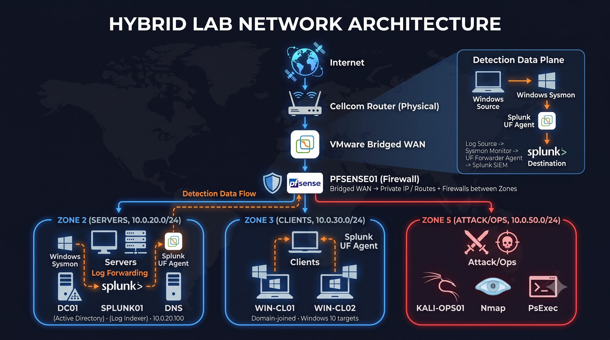

# SOC & Purple Team Home Lab

## Overview

This repository documents a segmented, enterprise-style home lab used to practice SOC operations, adversary simulation, SIEM engineering, and detection validation. It demonstrates how Windows and network telemetry is collected in Splunk Enterprise, turned into defensible detections, tested in a controlled environment, and investigated with known limitations preserved.

> Core SIEM platform: **Splunk Enterprise**. Suricata is deployed on pfSense; Suricata alert ingestion into Splunk is currently in progress.

## Quick Navigation

- [Architecture](#architecture)
- [Technology Stack](#technology-stack)
- [Detection Engineering](#detection-engineering)
- [Featured Detection Case Studies](#featured-detection-case-studies)
- [Current Status / Known Limitations](#current-status--known-limitations)
- [Roadmap](#roadmap)

## Architecture



pfSense is the only routing path between isolated VMware host-only networks. Its WAN receives a private RFC1918 address from the upstream router; the upstream router, not pfSense's WAN address, provides Internet-facing NAT.

## What I Built

- Active Directory domain services and DNS on Windows Server 2022
- Two domain-joined Windows endpoints with Sysmon and Splunk Universal Forwarder
- pfSense routing, firewall policy, DHCP, and Suricata IDS/IPS across segmented zones
- Splunk Enterprise pipelines for Windows telemetry and pfSense syslog
- Seven documented Splunk detections with attack or traffic-based validation evidence
- CIM-based `tstats` searches for authentication use cases and documented raw-search fallbacks where field mappings are incomplete

## Key Project Highlights

- Validated seven detections spanning authentication, lateral movement, reconnaissance, network activity, and PowerShell execution.
- Identified 759 distinct destination ports touched in one minute during controlled vertical-scan validation.
- Captured 2,651 failed SMB logons against a local Administrator account and documented the Windows RID 500 lockout limitation.
- Investigated stale GeoLite2 results, confirmed the observed hits as false positives, and added VirusTotal enrichment to the existing search workflow.
- Deployed Cowrie in a dedicated DECEPTION zone and resolved a multi-layer Splunk ingestion issue involving filesystem access, temporary monitor configurations, and newline-delimited JSON event breaking; final validation returned 23 individual events with extracted fields.
- Preserved root-cause findings for CIM mapping, Windows log placement, DHCP configuration, timestamps, and WAN stability in [Lab Engineering Notes](docs/lab-engineering-notes.md).

## Technology Stack

| Component | Purpose |
|---|---|
| Windows Server 2022 | Active Directory Domain Services and DNS |
| Windows 10 endpoints | Domain-joined detection targets |
| Splunk Enterprise | Log aggregation, SPL searches, and alerting |
| Splunk Universal Forwarder + Sysmon | Endpoint telemetry collection |
| Splunk CIM Add-on | Authentication data-model normalization |
| pfSense CE 2.8.1 | Routing, firewalling, DHCP, and syslog |
| Suricata | IDS/IPS installed and integrated with pfSense; Splunk ingestion pending |
| Cowrie | SSH/Telnet deception, credential capture, and attacker command/session telemetry |
| Kali Linux | Controlled attack-simulation platform |
| VMware Workstation | Virtualization and network segmentation |

## Network / Security Zones

| Network / zone | Subnet / gateway | pfSense connection | Connected systems | Purpose |
|---|---|---|---|---|
| VMnet0 | WAN / upstream | pfSense WAN | pfSense | Upstream connectivity |
| VMnet3 | `10.0.20.0/24` | pfSense | Rocky Linux 64-bit (Splunk), linux-srv01, DC01 | Servers, infrastructure, and SIEM |
| VMnet4 | `10.0.30.0/24` | pfSense | WIN-CL01, WIN-CL02 | Windows client network |
| VMnet6 | `10.0.50.0/24`; gateway `10.0.50.1` | pfSense OPT2 | Kali Linux, web-app01, FILE-SRV01, WIN-REDTEAM01, C2-SLIVER01 (Planned) | RED_NET and security testing |
| VMnet7 | `10.0.60.0/24`; gateway `10.0.60.1` | pfSense DECEPTION | HONEYPOT01 | DECEPTION zone for isolated honeypot services |

## Lab Systems

| System | Platform | Role / Services | Network | Address | Status |
|---|---|---|---|---|---|
| pfSense | pfSense CE 2.8.1 / FreeBSD | Firewall, routing, segmentation, DHCP, and Suricata | VMnet0, VMnet3, VMnet4, VMnet6, VMnet7 (DECEPTION) | Multiple interfaces | Active |
| Rocky Linux 64-bit (Splunk) | Rocky Linux | Splunk Enterprise Server / SIEM | VMnet3 | `10.0.20.100` | Active |
| linux-srv01 | Ubuntu Server | SSH, Apache, Syslog, Splunk Universal Forwarder | VMnet3 | `10.0.20.x` | Active |
| DC01 | Windows Server 2022 | Active Directory Domain Services and DNS | VMnet3 | TBD (`10.0.20.0/24`) | Active |
| WIN-CL01 | Windows 10 | Domain-joined endpoint / detection target | VMnet4 | TBD (`10.0.30.0/24`) | Active |
| WIN-CL02 | Windows 10 | Domain-joined endpoint / detection target | VMnet4 | TBD (`10.0.30.0/24`) | Active |
| Kali Linux | Kali Linux 2026.2 | Primary attack workstation | VMnet6 | `10.0.50.60/24` | Active |
| FILE-SRV01 | Windows Server (version TBD) | File server / lab target | VMnet6 | DHCP / TBD | Active |
| web-app01 | Ubuntu Server | Apache, MariaDB, web application target | VMnet6 | DHCP / TBD | Active |
| WIN-REDTEAM01 | Windows 11 Pro | Windows Red Team workstation | VMnet6 | DHCP initially | Installing |
| C2-SLIVER01 | Linux Server | Sliver C2 | VMnet6 | TBD | Planned |
| HONEYPOT01 | Ubuntu Server 24.04 | Cowrie SSH/Telnet deception and attacker-session telemetry | VMnet7 (DECEPTION) | `10.0.60.10/24` | Active |

## Telemetry & Logging Pipeline

```text
Windows Security/System logs + Sysmon
                │
       Splunk Universal Forwarder
                │
                ├──────────────► Splunk Enterprise
                │
linux-srv01 Syslog + Splunk Universal Forwarder ──► Splunk Enterprise

pfSense firewall/system/DHCP ──► UDP 5514 syslog

Suricata on pfSense ──► Splunk ingestion in progress / incomplete

KALI-OPS01 (`10.0.50.60`)
    └─ SSH TCP/2222 ─► HONEYPOT01 / Cowrie (`10.0.60.10`)
                           └─ `cowrie.json` ─► Splunk Universal Forwarder
                                                  └─ TCP/9997 ─► Splunk Enterprise (`10.0.20.100`)
                                                                     `index=honeypot`, `sourcetype=cowrie:json`
```

Windows telemetry is stored in dedicated Splunk indexes. linux-srv01 provides Syslog and Splunk Universal Forwarder telemetry. pfSense forwards firewall, system, and DHCP events for network visibility. Cowrie JSON telemetry is forwarded from HONEYPOT01 to Splunk over TCP/9997. Suricata operates on pfSense, but its alerts are not yet part of the Splunk pipeline.

## Detection Engineering

| ID | Detection | Primary data source | MITRE ATT&CK | Status |
|---|---|---|---|---|
| [DET-001](detections/splunk/DET-001-brute-force-authentication.md) | Brute-force authentication | Windows Security 4625 / CIM Authentication | T1110 | Validated |
| [DET-002](detections/splunk/DET-002-success-after-failures.md) | Success after failures | Windows Security 4624/4625 / CIM Authentication | T1078 | Validated |
| [DET-003](detections/splunk/DET-003-psexec-service-creation.md) | PsExec service creation | Windows System 7045 | T1021.002, T1569.002 | Validated |
| [DET-004](detections/splunk/DET-004-risky-geolocation-traffic.md) | Risky geolocation traffic | pfSense `filterlog` | N/A / Context-dependent | Experimental |
| [DET-005](detections/splunk/DET-005-vertical-port-scan.md) | Vertical port scan | pfSense `filterlog` | T1046 | Validated |
| [DET-006](detections/splunk/DET-006-local-admin-smb-brute-force.md) | Local Administrator SMB brute force | Windows Security 4625 | T1110.001 | Validated |
| [DET-007](detections/splunk/DET-007-encoded-powershell.md) | Encoded PowerShell | Sysmon 1 | T1059.001 | Validated |

See the complete [Splunk Detection Catalog](detections/splunk/README.md).

## Featured Detection Case Studies

- [DET-003 — PsExec Service Creation](detections/splunk/DET-003-psexec-service-creation.md): distinguishes the service's `LocalSystem` account from the SID that installed it and documents why the CIM Change model was not used.
- [DET-005 — Vertical Port Scan](detections/splunk/DET-005-vertical-port-scan.md): validates a network pattern against a controlled 1,000-port scan through pfSense.
- [DET-006 — Local Administrator SMB Brute Force](detections/splunk/DET-006-local-admin-smb-brute-force.md): captures a sustained password-guessing test and records the unresolved CIM `src` mapping gap.

## Repository Structure / Navigation

```text
.
├── README.md
├── detections/
│   └── splunk/                  # Catalog and DET-001 through DET-007
├── docs/
│   ├── cowrie-honeypot-deployment.md
│   ├── lab-engineering-notes.md
│   ├── splunk_index_precedence_EN.md
│   ├── troubleshooting-cowrie-splunk-ingestion.md
│   └── troubleshooting-pfsense-bridged-wan-dhcp-conflict.md
├── splunk/
│   └── cowrie-example-searches.md
└── screenshots/                # Detection and architecture evidence
```

Honeypot documentation: [Cowrie deployment](docs/cowrie-honeypot-deployment.md) · [Splunk ingestion troubleshooting](docs/troubleshooting-cowrie-splunk-ingestion.md) · [Example SPL searches](splunk/cowrie-example-searches.md)

## Current Status / Known Limitations

- Seven detections are documented; none are claimed to be production-ready.
- DET-004 remains Experimental because geo-IP is a weak signal and both validation hits were confirmed as false positives.
- DET-003 remains a raw search because Windows Event 7045 lacks the required CIM Change field extractions in the current configuration.
- DET-006 remains a raw search because the CIM `Authentication.src` override is unresolved.
- Cowrie is operational on HONEYPOT01; SSH deception, JSON logging, Universal Forwarder transport, newline-delimited event parsing, and JSON field extraction have been validated in Splunk.
- Suricata is installed and integrated with pfSense, but Suricata alert ingestion into Splunk is incomplete.
- The pfSense WAN uses a private upstream address and a Wi-Fi bridge; the private address is not publicly routable, and the Wi-Fi uplink has shown stability issues.

## Roadmap

- [ ] Ingest Suricata alerts into Splunk and validate the pipeline
- [ ] Build Suricata-backed detection use cases
- [ ] Resolve DET-006 CIM source-address mapping and assess a `tstats` migration
- [ ] Add horizontal port-scan coverage
- [ ] Replace the Wi-Fi WAN bridge with a dedicated wired adapter
- [ ] Add persistent caching for VirusTotal enrichment
- [ ] Expand detections into persistence, command-and-control, and exfiltration scenarios

## About / Contact

I'm Daniel, a SOC analyst focused on Splunk Enterprise, detection engineering, threat hunting, and blue-team operations.

- [LinkedIn](https://www.linkedin.com/in/danielluchter/)
- [GitHub](https://github.com/DykL57/)
