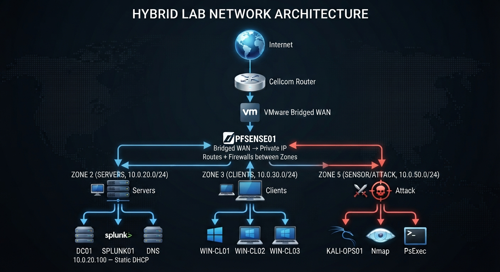
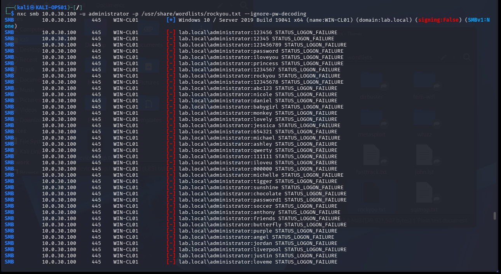
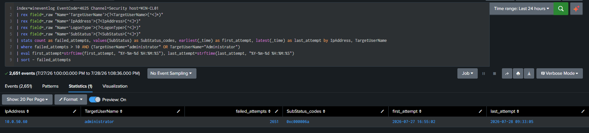
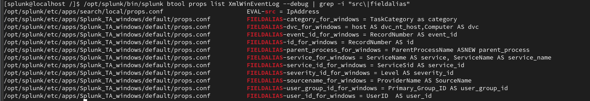

# SOC / Purple Team Home Lab

A self-built enterprise-style Security Operations Center lab — Active Directory, pfSense-segmented networking, Splunk Enterprise Security, and a validated detection-engineering workflow spanning both Red Team (attack simulation) and Blue Team (detection + investigation).

## Why this exists

Built to go beyond "I know what a SIEM is" — this lab documents real detections I wrote, real attacks I ran against my own environment to trigger them, and the actual troubleshooting behind getting an IT network + SIEM pipeline working end to end (including bugs most tutorials skip over, like ZFS boot failures and timezone-induced timestamp corruption).

Splunk
Detection Engineering
MITRE ATT&CK
Active Directory
Sysmon
PowerShell
VMware
pfSense
SOC
Blue Team


## Architecture

```
Zone 2 (SERVERS, 10.0.20.0/24)  ── DC01 (Active Directory, lab.local)
                                  ── SPLUNK01 (Splunk Enterprise, 10.0.20.100 — static DHCP mapping)
Zone 3 (CLIENTS, 10.0.30.0/24)  ── WIN-CL01, WIN-CL02
Zone 5 (SENSOR/ATTACK, 10.0.50.0/24) ── KALI-OPS01 (Red Team platform)
Zone 6 (Gateway)                ── PFSENSE01 (Bridged WAN → rprivate IP from upstream Cellcom router; routes + firewalls between zones)
```

                      🌍 Internet
                             │
                       Cellcom Router
                             │
                     VMware Bridged WAN
                             │
                        🛡️ pfSense
                Firewall • NAT • Routing • DHCP
              ┌──────────────┼──────────────┐
              │              │              │
         🖥️ Servers      💻 Clients      ⚔️ Attack
              │              │              │
            DC01         WIN-CL01          Kali
           Splunk        WIN-CL02       (KALI-OPS01)
                                              │
          AD • DNS      Domain-joined    Hydra • nxc
         Log indexer     Win10 targets   nmap • Impacket
                                          Mimikatz

Enterprise-style segmented SOC lab built on VMware, pfSense and Splunk.


All internal zones are isolated VMware Host-Only networks; pfSense is the only path between them, with explicit firewall rules per zone (deny-by-default). WAN is Bridged directly to a physical Wi-Fi adapter on the host, giving pfSense a real, ISP-routable IP address instead of a NAT-translated one — this was a deliberate change to enable genuine inbound/outbound traffic visibility. This choice has a real downside (see Notable Troubleshooting: Wi-Fi as WAN is less stable than a wired uplink would be). Zone 5 (Kali) was initially isolated with no route to any other zone by design; a dedicated `OPT2` interface and firewall rule were added later specifically to support Rule 5's port-scan simulation.



# Skills Demonstrated

## Skills Demonstrated

**Detection Engineering:** SPL, raw search → tstats migration, CIM normalization, MITRE ATT&CK mapping, false-positive analysis
**SIEM (Splunk):** Data Models, Event Types, Tags, Lookups, Search Macros, Alerts
**Windows Security:** Active Directory, Event Logs, Sysmon, Group Policy, PowerShell
**Network Security:** pfSense, Segmentation, Firewall Rules, Syslog, DHCP/DNS
**Threat Detection:** Brute Force, Lateral Movement, Port Scanning, Geo-IP Monitoring
**Investigation:** Root Cause Analysis, Log Validation, Detection Tuning


## Stack

| Component | Role |
|---|---|
| Windows Server 2022 | Active Directory Domain Services + DNS (DC01) |
| pfSense CE 2.8.1 | Inter-zone routing + firewall, Bridged WAN receiving a private IP directly from the upstream router (not double-NATed) || Splunk Enterprise (Rocky Linux) | SIEM — log aggregation, correlation, alerting |
| Splunk Universal Forwarder + Sysmon | Endpoint telemetry (DC01, WIN-CL01, WIN-CL02) |
| Splunk Common Information Model (CIM) Add-on | Normalizes raw events into standard data models for `tstats`-accelerated searching |
| Splunk `iplocation` (built-in) | Geo-IP enrichment for network-based detections, no add-on required |
| Custom VirusTotal scripted lookup (Python) | Live IP reputation enrichment for Rule 4, reducing reliance on stale geo-IP data |
| Kali Linux | Red Team attack platform |
| VMware Workstation | Virtualization + network segmentation |

## Detection Rules

Each rule below follows the same format: detection logic, SPL, how it was triggered, and proof it fired.

| # | Rule | MITRE ATT&CK | Category | Search Method | Status |
|---|---|---|---|---|---|
| 1 | Brute Force Detection (Authentication) | T1110 | Credential Access | `tstats` (CIM Authentication) | ✅ Validated |
| 2 | Successful Login After Multiple Failures | T1078 | Credential Access / Initial Access | `tstats` (CIM Authentication) | ✅ Validated |
| 3 | Lateral Movement via Remote Service Creation (PsExec) | T1021.002 / T1569.002 | Lateral Movement | Raw search (`rex` extraction) | ✅ Validated |
| 4 | Outbound Traffic to High-Risk Countries | T1071 / TA0011 | Network — Anomalous Outbound Traffic | Raw search + `iplocation` + VirusTotal lookup | ✅ Validated |
| 5 | Port Scan Detection (High Port-Touch Volume) | T1046 | Network — Reconnaissance | Raw search (`rex` + `stats`) | ✅ Validated |
| 6 | Brute Force — Local Administrator Account (SMB) | T1110.001 | Credential Access | Raw search (`rex` extraction) | ✅ Validated |
| 7–50 | See [detection-rules/](detection-rules/) | — | — | — | ⏳ Planned |

### Rule 1 — Brute Force Detection (Authentication)

**Detection logic:** 3+ failed authentication attempts from a single host within a 5-minute window, with severity scored by volume (MEDIUM / HIGH / CRITICAL).

**SPL (tstats, CIM Authentication data model):**
```spl
| tstats count as failed_attempts, dc(Authentication.user) as unique_users 
    from datamodel=Authentication 
    where nodename=Authentication.Failed_Authentication 
    by Authentication.dest, _time span=5m
| where failed_attempts >= 3
| eval severity=case(failed_attempts>=20,"CRITICAL", failed_attempts>=10,"HIGH", true(),"MEDIUM")
| rename Authentication.dest as host
| table _time, host, failed_attempts, unique_users, severity
```

**Original raw-search version** (kept for reference — functionally equivalent, but scans raw events instead of the accelerated summary):
```spl
index=* sourcetype="WinEventLog:Security" EventCode=4625 earliest=-10m
| bin _time span=5m
| stats count as failed_attempts dc(Account_Name) as unique_users by _time, host
| where failed_attempts >= 3
| eval severity=case(failed_attempts>=20,"CRITICAL", failed_attempts>=10,"HIGH", 1=1,"MEDIUM")
| table _time, host, failed_attempts, unique_users, severity
```

**Simulation used to trigger it:**
```powershell
Add-Type @"
using System;
using System.Runtime.InteropServices;
public class LogonTest {
    [DllImport("advapi32.dll", SetLastError = true)]
    public static extern bool LogonUser(string lpszUsername, string lpszDomain, string lpszPassword,
        int dwLogonType, int dwLogonProvider, out IntPtr phToken);
}
"@

1..5 | ForEach-Object {
    $token = [IntPtr]::Zero
    [LogonTest]::LogonUser("Administrator", "LAB", "WrongPass$_", 3, 0, [ref]$token)
    Start-Sleep -Milliseconds 500
}
```

**Result:** 5/5 attempts logged as individual Event 4625 entries, correctly aggregated by the detection query into a single MEDIUM-severity alert.


**What I'd tune in production:** raise the threshold to 5–10 (3 is intentionally low for lab-scale testing); add a lookup-based allowlist for known vulnerability scanners.

---

### Rule 2 — Successful Login After Multiple Failures

**Detection logic:** An account with 5+ failed logon attempts followed by a successful logon within the same 10-minute window — a pattern consistent with brute-force attempts that eventually succeed, or credential guessing against a privileged account.

**SPL (tstats, CIM Authentication data model):**
```spl
| tstats count(eval(Authentication.action="failure")) as fail_count,
         count(eval(Authentication.action="success")) as success_count,
         earliest(_time) as first_seen, latest(_time) as last_seen
    from datamodel=Authentication
    by Authentication.user, _time span=10m
| where fail_count >= 5 AND success_count > 0
| rename Authentication.user as Account_Name
| eval first_seen=strftime(first_seen, "%Y-%m-%d %H:%M:%S"),
       last_seen=strftime(last_seen, "%Y-%m-%d %H:%M:%S")
| table first_seen, last_seen, Account_Name, fail_count, success_count
```

> **Note:** `Source_Network_Address` was dropped in this version — it isn't a standard field in the CIM `Authentication` data model by default. This is a deliberate tradeoff of a small amount of context for a large gain in search performance. If source-IP correlation is needed in production, either add a custom field extension to the data model or fall back to the raw-search version below for that specific investigation step.

**Original raw-search version** (kept for reference, and for cases where `Source_Network_Address` is needed):
```spl
index=wineventlog sourcetype=WinEventLog:Security (EventCode=4625 OR EventCode=4624)
| eval status=if(EventCode=4625, "failure", "success")
| bin _time span=10m
| stats count(eval(status="failure")) as fail_count, 
        count(eval(status="success")) as success_count,
        values(Source_Network_Address) as src_ips,
        earliest(_time) as first_seen,
        latest(_time) as last_seen
        by Account_Name, _time
| where fail_count >= 5 AND success_count > 0
| eval first_seen=strftime(first_seen, "%Y-%m-%d %H:%M:%S"),
       last_seen=strftime(last_seen, "%Y-%m-%d %H:%M:%S")
| table first_seen, last_seen, Account_Name, fail_count, success_count, src_ips
| sort -last_seen
```

**Simulation used to trigger it (run locally on DC01):**
```powershell
$domain = "lab.local"
$user   = "simtest"
$badPassword = "<INTENTIONALLY_INVALID_PASSWORD>"
$goodPassword = Read-Host "Enter the lab account password" -AsSecureString

# 5 failed attempts
1..5 | ForEach-Object {
    $securePwd = ConvertTo-SecureString $badPassword -AsPlainText -Force
    $cred = New-Object System.Management.Automation.PSCredential("$domain\$user", $securePwd)
    Start-Process cmd.exe -Credential $cred -ArgumentList "/c exit" -ErrorAction SilentlyContinue
    Start-Sleep -Seconds 2
}

# Final successful logon
$securePwd = ConvertTo-SecureString $goodPassword -AsPlainText -Force
$cred = New-Object System.Management.Automation.PSCredential("$domain\$user", $securePwd)
Start-Process cmd.exe -Credential $cred -ArgumentList "/c exit"
```

**Result:** 5 consecutive failed logon events followed by a single successful logon for the `simtest` account, correctly correlated by the detection query into one alert.


**What I'd tune in production:** exclude known noisy service accounts (`NOT Authentication.user IN ("svc_*", "krbtgt")`); raise the fail-count threshold in high-turnover/shared-workstation environments.

---

### Rule 3 — Lateral Movement via Remote Service Creation (PsExec)

**Detection logic:** Detects installation of a new Windows service (Event 7045) on a domain-joined host — the mechanism PsExec and PsExec-style tools use to execute code remotely after obtaining valid credentials on another host. An attacker uses SMB admin shares (`ADMIN$`/`C$`) to drop a binary, then remotely creates and starts a service to run it.

**SPL:**
```spl
index=wineventlog sourcetype=WinEventLog:System EventCode=7045
| rex field=_raw "Service Name:\s+(?<ServiceName>\S+)"
| rex field=_raw "Service File Name:\s+(?<ServiceFileName>.+?)\s+Service Type:"
| rex field=_raw "Service Account:\s+(?<ServiceAccount>\S+)"
| search ServiceName="PSEXESVC" OR ServiceFileName="*PSEXESVC*"
| table _time, ComputerName, ServiceName, ServiceFileName, ServiceAccount, Sid
```

**Deliberately kept as a raw search, not converted to `tstats`.** Investigated converting this to the CIM `Change` data model and hit a real limitation worth documenting: the `All_Changes` node's constraint only requires `tag=change`, so I created a narrow, dedicated event type (`windows_service_installed`, scoped to `EventCode=7045` only — critically *not* the broader `windows_endpoint_services` event type, which also covers noisy EventCode 7036 service state-change events at ~1,500 events vs. 53 for 7045) and tagged it `change`. The tag applied successfully, but `tstats` against the model still returned 0 results when filtered to the actual service name (`PSEXESVC`) — confirmed via `All_Changes.object`. Broader querying showed the model was populated almost entirely with `object_category=user` events (account creation/logoff/modification, ~5,700 events) and an `unknown` bucket, with no `service` category present at all. Conclusion: a `Settings → Tags` entry alone tags the *event*, but the CIM `Change` model also requires field-level extraction (`object`, `object_category`, `dvc`, etc.) that the standard Windows TA doesn't provide for Service Control Manager events out of the box — that would require `props.conf`/`transforms.conf`-level field extraction work, not just tagging. Given the raw-search version already works reliably, this was judged not worth the additional TA-level configuration for a lab environment, and the rule stays as a raw search.

**Simulation used to trigger it (WIN-CL01 → DC01, using Sysinternals PsExec):**
```powershell
# On DC01 — disposable test account + required rights
New-ADUser -Name "sim.lateral" -SamAccountName "simlateral" `
  -AccountPassword (ConvertTo-SecureString "<TestAccountPassword>" -AsPlainText -Force) `
  -Enabled $true -PasswordNeverExpires $true
Add-ADGroupMember -Identity "Domain Admins" -Members "simlateral"
# Grant "Log on as a service" to simlateral/Domain Admins via
# Default Domain Controllers Policy → User Rights Assignment, then gpupdate /force

# On WIN-CL01 — remote execution
.\PsExec.exe \\DC01 -u lab.local\simlateral -p "<TestAccountPassword>" cmd.exe /c "whoami"
```

**Result:** PsExec authenticated as `simlateral`, installed `PSEXESVC.exe` as a service on DC01, executed `whoami` remotely (returned `lab\simlateral`), and cleaned up automatically. The detection query correctly captured all service-installation events, extracting `ServiceName`, `ServiceFileName`, `ServiceAccount` (`LocalSystem`), and the installing account's `Sid` from raw event text.

**Notable finding:** the service always runs as `LocalSystem` regardless of who launched it — the `Sid` field, not `ServiceAccount`, is what identifies the actual installer. This matters for triage: `ServiceAccount=LocalSystem` alone is not suspicious, since nearly all legitimate services also run that way.


**What I'd tune in production:** allowlist known legitimate remote-deployment accounts/hosts (SCCM, help desk tooling); use the broader `ServiceName`-agnostic version of the query, since real attackers rename the binary; pair with Sysmon Event ID 1 and Event 5145 (admin share access) for a full kill-chain view in one notable event.

---

### Rule 4 — Outbound Traffic to High-Risk Countries

**Detection logic:** Flags outbound connections from the lab network to public IPs geolocated in a configurable list of high-risk countries (e.g., countries associated with known APT activity against Israeli critical infrastructure — Iran, Russia, North Korea, Syria, China). Uses Splunk's built-in `iplocation` command (bundled MaxMind GeoLite2 database — no add-on install required) against pfSense's `filterlog` firewall events, then enriches each flagged IP with live reputation data via a custom VirusTotal scripted lookup.

**SPL:**
```spl
index=pfsense "filterlog"
| dedup _raw
| rex field=_raw "filterlog\s+\d+\s+-\s+-\s+(?<rule>[^,]*),(?<sub>[^,]*),(?<anchor>[^,]*),(?<tracker>[^,]*),(?<iface>[^,]*),(?<reason>[^,]*),(?<action>[^,]*),(?<direction>[^,]*),(?<ipver>[^,]*),"
| where ipver="4" AND direction="out"
| rex field=_raw "(?<src_ip>\d{1,3}\.\d{1,3}\.\d{1,3}\.\d{1,3}),(?<dst_ip>\d{1,3}\.\d{1,3}\.\d{1,3}\.\d{1,3})"
| where dst_ip!="127.0.0.1" AND NOT match(dst_ip, "^10\.") AND NOT match(dst_ip, "^192\.168\.")
| iplocation dst_ip
| search Country IN ("Iran", "Russia", "North Korea", "Syria", "China")
| dedup dst_ip
| lookup vt_ip_reputation dst_ip
| stats count, values(dst_ip) as dest_ips, values(vt_malicious) as vt_malicious, values(vt_country) as vt_country, earliest(_time) as first_seen, latest(_time) as last_seen by src_ip, Country
| eval first_seen=strftime(first_seen, "%Y-%m-%d %H:%M:%S"), last_seen=strftime(last_seen, "%Y-%m-%d %H:%M:%S")
| table first_seen, last_seen, src_ip, Country, count, dest_ips, vt_malicious, vt_country
```

**Field extraction note:** pfSense's `filterlog` sourcetype arrives as unstructured, positional CSV inside the syslog message, with no default Splunk TA field extraction. Rather than parsing by fixed column position (which breaks across TCP/UDP/ICMP, since each logs a different number of fields), this query extracts the fixed-position header fields (rule, interface, action, direction, ipver) with one `rex`, then matches the `src_ip,dst_ip` pattern directly as two adjacent dotted-quad values with a second `rex` — robust regardless of protocol. `dedup _raw` was added defensively after discovering pfSense duplicates some syslog event types at the source (see Notable Troubleshooting) — investigation confirmed `filterlog` itself was not actually affected, but the safeguard is kept in place.

**Live reputation enrichment:** a custom Python scripted lookup (`scripts/vt_ip_lookup.py`) queries the VirusTotal API for every geo-flagged IP and returns `vt_malicious`, `vt_suspicious`, `vt_reputation`, `vt_country` directly in the search results. Registered as an External lookup in Splunk (`vt_ip_reputation`). The API key is stored in a separate, local-only file (`vt_api_key.txt`, `chmod 600`, never committed) next to the script, so the script itself is safe to share while the credential stays server-side. `| dedup dst_ip` runs before the lookup, since VirusTotal's free tier is rate-limited to 4 requests/minute — querying once per unique IP per run, not once per matching event, is required to stay within that limit.

**Result:** Validated against ~8,300 real, organic outbound events (DNS resolution, Windows Update, telemetry, etc.) collected over several hours of normal lab operation. The query correctly aggregated hits by source IP and country, surfacing 4 connections geolocated to Iran and 2 to Russia.

**Known limitation — both flagged IPs confirmed as false positives, now auto-detected:** both the Iran- and Russia-geolocated IPs were manually checked against VirusTotal and found to be legitimate infrastructure, not actually associated with either country. This isn't a statement that Iran/Russia are the wrong countries to monitor — both remain valid entries given known APT activity against Israeli critical infrastructure — it's a statement about Splunk's bundled MaxMind GeoLite2 database misattributing these two specific IPs. Root cause: the free database is a point-in-time snapshot that isn't automatically kept current, and IP block ownership/geolocation changes frequently (RIR reassignment, cloud/CDN churn). The VirusTotal enrichment now surfaces `vt_malicious=0` for both directly in the alert output, meaning an analyst no longer has to manually check external threat-intel sites to recognize these as likely false positives — the geo-IP signal is weak on its own, but it's no longer the *only* signal.


**What I'd tune in production:** replace the script's in-memory cache with a persistent lookup table (KV Store) so previously-checked IPs aren't re-queried across separate runs; add AbuseIPDB as a second reputation source; move to a paid VirusTotal tier or batched API usage if match volume grows past the free tier's limits; build a maintained allowlist for known-legitimate infrastructure (root DNS servers, major cloud/CDN ASNs); correlate with destination port/protocol, since outbound HTTPS to a flagged country is far less notable than traffic on an unusual port; track ASN alongside country, since ASN ownership tends to be more stable than country-level geolocation.

---

### Rule 5 — Port Scan Detection (High Port-Touch Volume)

**Detection logic:** Flags a single source IP touching an unusually high number of distinct destination ports on the same destination host within a 1-minute window — the classic signature of a port scan. Deliberately does **not** filter on `action="block"` — the rule detects the pattern of many-ports-from-one-source regardless of whether pfSense's firewall rules pass or block the traffic, since a permissive rule (or a scan against an open service range) would otherwise hide a real scan from a block-only detection.

**SPL:**
```spl
index=pfsense "filterlog"
| dedup _raw
| rex field=_raw "filterlog\s+\d+\s+-\s+-\s+(?<rule>[^,]*),(?<sub>[^,]*),(?<anchor>[^,]*),(?<tracker>[^,]*),(?<iface>[^,]*),(?<reason>[^,]*),(?<action>[^,]*),(?<direction>[^,]*),(?<ipver>[^,]*),"
| where ipver="4"
| rex field=_raw "(?<src_ip>\d{1,3}\.\d{1,3}\.\d{1,3}\.\d{1,3}),(?<dst_ip>\d{1,3}\.\d{1,3}\.\d{1,3}\.\d{1,3}),(?<src_port>\d+),(?<dst_port>\d+)"
| bin _time span=1m
| stats dc(dst_port) as unique_ports_tried, count as attempts by src_ip, dst_ip, _time
| where unique_ports_tried >= 10
| stats sum(attempts) as total_attempts, max(unique_ports_tried) as max_ports_per_min, earliest(_time) as first_seen, latest(_time) as last_seen by src_ip, dst_ip
| eval first_seen=strftime(first_seen, "%Y-%m-%d %H:%M:%S"), last_seen=strftime(last_seen, "%Y-%m-%d %H:%M:%S")
| table first_seen, last_seen, src_ip, dst_ip, max_ports_per_min, total_attempts
```

**Simulation used to trigger it:** required extending the lab topology to allow this test — `KALI-OPS01` (Zone 5, `10.0.50.0/24`) had no route to Zone 2 prior to this rule, by design (pfSense deny-by-default). Added a 4th virtual NIC on `PFSENSE01` bridged to Kali's VMnet, a new `OPT2` interface (`10.0.50.1/24`), a deliberately permissive firewall rule (`Pass`, any protocol, source Any, destination `10.0.20.0/24`) to test detection regardless of block/pass, and a default route on Kali.
```bash
nmap -sS -p 1-1000 10.0.20.1
```

**Result:** nmap reported 3 open ports (53/domain, 80/http, 443/https — pfSense's own resolver and WebGUI) and 997 filtered against `10.0.20.1`. The detection query correctly identified the scan: **759 unique destination ports touched by `10.0.50.60` against `10.0.20.1`** within a single one-minute window, with 2,266 total connection attempts across the scan — far exceeding the 10-port threshold.


**What I'd tune in production:** raise the threshold significantly (the lab's `>= 10` is deliberately sensitive for validation; production typically uses 15–50+ depending on baseline); allowlist known vulnerability scanner infrastructure (Nessus/OpenVAS/Qualys will trigger this identically to a malicious scan); correlate with whether scanned ports actually returned open/closed/filtered, since a scan against a mostly-filtered host is a stronger anomaly than one against a host with many legitimately open services; add a companion horizontal-scan detection (many hosts, few ports each) since this rule only catches vertical scans.

---

### Rule 6 — Brute Force: Local Administrator Account (SMB)

**Detection logic:** Detects sustained password-guessing attempts against the **built-in local `administrator` account** via SMB, aggregating failed logon events (Event 4625) by source IP and target user, with a failure-code breakdown to confirm the pattern is genuine password guessing rather than username enumeration.

**SPL:**
```spl
index=wineventlog EventCode=4625 Channel=Security host=WIN-CL01
| rex field=_raw "Name='TargetUserName'>(?<TargetUserName>[^<]*)"
| rex field=_raw "Name='IpAddress'>(?<IpAddress>[^<]+)"
| rex field=_raw "Name='LogonType'>(?<LogonType>[^<]+)"
| rex field=_raw "Name='SubStatus'>(?<SubStatus>[^<]+)"
| stats count as failed_attempts, values(SubStatus) as SubStatus_codes, earliest(_time) as first_attempt, latest(_time) as last_attempt by IpAddress, TargetUserName
| where failed_attempts > 10 AND (TargetUserName="administrator" OR TargetUserName="Administrator")
| eval first_attempt=strftime(first_attempt, "%Y-%m-%d %H:%M:%S"), last_attempt=strftime(last_attempt, "%Y-%m-%d %H:%M:%S")
| sort - failed_attempts
```

**Kept as a raw search, not converted to `tstats` — see CIM `src` investigation below.**

**Simulation used to trigger it (KALI-OPS01 → WIN-CL01, using NetExec):**
```bash
nxc smb 10.0.30.100 -u administrator -p /usr/share/wordlists/rockyou.txt --ignore-pw-decoding
```



**Result:** 2,651 failed logon attempts from `10.0.50.60` (KALI-OPS01) against the local `administrator` account on WIN-CL01, spanning roughly 16.5 hours (`2026-07-27 16:55:02` → `2026-07-28 09:33:05`), all with `SubStatus=0xc000006a` (`STATUS_WRONG_PASSWORD`) — confirming the target username was valid and constant throughout, i.e. genuine password guessing against a single known account rather than username enumeration.



**Notable finding:** the built-in local **Administrator** account (RID 500) is **exempt from account lockout policy by default** on Windows — this is why 2,651 failed attempts accumulated without the account ever locking, unlike a standard domain user. This is a hardening recommendation in its own right: rename or disable the built-in Administrator account, or enforce lockout against it explicitly via GPO. Separately, NetExec's connection banner also flagged `signing:False` and `SMBv1:None` on WIN-CL01 — SMB Signing being disabled is an unrelated finding that enables NTLM relay attacks.

**CIM `src` field — investigated, not resolved, documented as a known limitation.** Attempted to migrate this rule to `tstats` against the `Authentication` data model for performance. An `EXTRACT-ipaddress` in `props.conf` correctly pulled `IpAddress` from the raw XML, but `Authentication.src` resolved to the source **WorkstationName** (`KALI-OPS01`) rather than the IP itself — a `Splunk_TA_windows` CIM-mapping behavior. Attempted to override this with both `FIELDALIAS-src_ip = IpAddress AS src` and, after that had no effect, a direct `EVAL-src = IpAddress` — neither populated `src`. Ruled out LOOKUP, TRANSFORMS, and REPORT stanzas as the cause via `btool props list XmlWinEventLog --debug`, none of which reference `src`. An identically-structured `EVAL` under a different field name (`EVAL-attacker_ip = IpAddress`) worked immediately on the same input, confirming the extraction logic itself was correct — `src` specifically did not take the override, for a reason not fully root-caused. This rule uses raw `rex`/`stats` on `IpAddress` as a documented workaround; a future rule may adopt the working `attacker_ip` custom field for `tstats`-based detections instead of fighting `src` directly.



**What I'd tune in production:** exclude the built-in Administrator account from being SMB-reachable at all where possible (LAPS + disabled remote use of the local admin account is the actual fix, not just detecting attempts against it); correlate with `LogonType` and `signing`/`SMBv1` status to also surface the NTLM-relay exposure in the same alert; resolve the `Authentication.src` mapping gap so this rule (and future ones) can run on `tstats` instead of raw search.

---

## Network Traffic Monitoring

pfSense forwards Firewall, System, and DHCP events to Splunk via syslog (UDP 5514), indexed separately from Windows telemetry (`index=pfsense`, sourcetype `pfsense:firewall`). This gives visibility into real inbound/outbound traffic at the network edge — allow/block decisions, source/destination IPs and ports, and (via Rule 4) geo-IP + live reputation context — complementing the Windows-endpoint-focused detections in Rules 1–3. Getting this pipeline working end-to-end (WAN topology, DHCP, and forwarding) surfaced a substantial troubleshooting exercise; see below.

A device inventory lookup (built from an `nmap -sn` sweep of the local network) enriches traffic queries with device names/types instead of raw IPs — e.g. `| lookup device_inventory.csv ip AS src_ip OUTPUT hostname AS device_name`.

**Next planned detections built on this data:**
- Outbound connections to unusual/non-standard ports (possible C2 or data exfiltration)
- Horizontal port scan (many hosts, low ports-per-host) as a companion to Rule 5's vertical scan detection

## CIM / tstats Migration

Rules 1 and 2 were converted from raw `index=` searches to `tstats` against Splunk's Common Information Model (CIM), for two reasons: `tstats` searches an accelerated summary rather than scanning raw events, and it's the standard, portable approach Splunk Enterprise Security itself relies on for correlation searches.

**What this involved:**
1. Installed the **Splunk Common Information Model (CIM) Add-on** (`Splunk_SA_CIM`) — my lab initially only had Splunk's built-in sample data models, not `Authentication`/`Change`/etc.
2. Constrained the `Authentication` and `Change` data models to my actual index (`index=wineventlog`) via their `cim_Authentication_indexes` / `cim_Change_indexes` search macros (`Settings → Advanced Search → Search Macros`) — not by editing the data model's own constraints directly, which define CIM's field-tagging logic and shouldn't be touched.
3. Verified the Windows TA was correctly tagging events into CIM fields:
   ```spl
   | tstats count from datamodel=Authentication where nodename=Authentication.Failed_Authentication by Authentication.dest, Authentication.user
   ```
   This returned real results (181 events across 7 accounts/hosts, matching data from Rules 1–3 testing) — confirming the standard Windows TA's tagging was working correctly, despite one individual event initially showing `tag=error` instead of `tag=authentication` during investigation.
4. Rewrote Rules 1 and 2's SPL to use `tstats` (shown above); kept the original raw-search versions in the docs for reference and for the one field (`Source_Network_Address`) that CIM's default `Authentication` model doesn't expose.

**Rule 3 was investigated and deliberately left as a raw search.** Unlike Authentication, mapping Event 7045 into the CIM `Change` model required more than a `Settings → Tags` entry — the standard Windows TA doesn't extract the field-level data (`object`, `object_category`, `dvc`) that model needs, only tagging gets an event *considered*, not correctly categorized. Confirmed this by creating a narrow, correctly-scoped event type for just EventCode 7045, tagging it `change`, and finding `tstats` still returned 0 results when filtered to the actual installed service name — the model was populated by unrelated `object_category=user` events instead. Fixing this properly would mean editing `props.conf`/`transforms.conf` for the TA, which was judged out of scope for a working, validated raw-search rule in a lab context. Full detail in Rule 3's write-up above.

## Notable troubleshooting (worth reading if you're building something similar)

- **pfSense wouldn't boot after install (`No /boot/loader`)** — root cause was FreeBSD's ZFS bootloader misbehaving on a BIOS-mode VMware VM. Fixed by reinstalling with UFS instead of ZFS.
- **Splunk showed 0 events for "Last 7 days" despite data existing under "All time"** — DC01's timezone was set to Pacific Time by default instead of Israel Standard Time, causing Windows Event Log timestamps to be logged with the wrong UTC offset. Fixing the timezone alone wasn't enough — the underlying system clock also needed to be corrected (`Set-Date`), since changing timezone only reinterprets the same UTC instant, it doesn't fix a clock that was already wrong.
- **VMs on different Host-Only networks (VMnet3/VMnet4) couldn't reach each other by design** — this is intentional VMware network isolation, not a bug; solved by building pfSense as the router between zones, with explicit per-zone firewall rules (deny-by-default).
- **PsExec failed with "the user has not been granted the requested logon type at this computer," even with correct credentials and Domain Admin membership** — turned out to be the wrong GPO right entirely. PsExec's default mode installs and runs a remote service *as* the target account (Logon Type 5, service logon), which requires the "Log on as a service" right — a completely different setting from "Access this computer from the network" (network logon, Type 3), which was the first (wrong) place I checked. Confirmed via Event 4625's `Sub_Status 0xC000015B` alongside `Logon_Type 5` in the raw event — the sub-status/logon-type pair is the fastest way to identify exactly which User Rights Assignment setting is actually missing, instead of guessing.
- **Event 7045 (service installation) returned 0 results when searched under `sourcetype=WinEventLog:Security`** — Service Control Manager events log to the **System** event log, not Security. Also, once found under `WinEventLog:System`, the relevant fields (`ServiceName`, `ServiceFileName`, `ServiceAccount`) weren't auto-extracted by the default Windows TA the way Security log fields are — required `rex` against `_raw` to pull them out manually.
- **New CIM data models showed "no explicit index constraint" warnings, and editing the Data Model's own Constraints box didn't fix it** — the constraint box referenced a macro (`` `cim_Authentication_indexes` ``) rather than a literal index name. The actual fix was editing the macro's *definition* under `Settings → Advanced Search → Search Macros`, not the data model's constraint field itself.
- **Migrating pfSense's WAN from NAT (VMnet8) to Bridged broke GUI access, syslog delivery to Splunk, and host-to-LAN DHCP — all from one adapter change, with the true root cause only surfacing days later.** Moving WAN off the NAT network removed pfSense's only route to the subnet where the Splunk server lived, which silently broke syslog forwarding with no error on either side; fixed by relocating the Splunk server into pfSense's own LAN network. That relocation then hit a DHCP failure (APIPA fallback) that looked like VMware's built-in DHCP service competing with pfSense's — disabling it was a correct hygiene fix but turned out to be coincidental, not the actual cause. The real root cause, found only when the identical symptom recurred on a second, unrelated host (the Splunk server itself): pfSense's DHCP **Address Pool Range was misconfigured to `192.168.1.x`, entirely unrelated to the LAN's actual `10.0.20.0/24` subnet** — meaning the DHCP server could never hand out a lease to anyone on that interface, regardless of client or VMware settings. Corrected the pool to `10.0.20.101–200`, added a static DHCP mapping for the Splunk server (`10.0.20.100`) to keep its address permanent for the forwarders and syslog target that reference it by IP. Full writeup: [troubleshooting-pfsense-bridged-wan-dhcp-conflict.md](docs/troubleshooting-pfsense-bridged-wan-dhcp-conflict.md)
- **CIM `Change` data model tagging looked successful but `tstats` still returned nothing usable for Rule 3** — see Rule 3's write-up and the CIM/tstats Migration section above. Root cause: `Settings → Tags` only tags an *event*; the CIM `Change` model separately requires field-level extraction (`object`, `object_category`) that the standard Windows TA doesn't provide for Service Control Manager events, so a correctly-tagged event still lands in the model without the fields needed to actually filter for it.
- **Kali (`KALI-OPS01`, Zone 5) had no route to any other lab zone** — this was intentional pfSense isolation, not a bug, but had to be deliberately undone to validate Rule 5's port-scan simulation. Required adding a 4th NIC to `PFSENSE01`, a new `OPT2` interface, and an explicit firewall rule, since pfSense's deny-by-default posture blocks inter-zone traffic until a rule is added — the same principle documented earlier for VMnet3/VMnet4 isolation.
- **pfSense's `dpinger` (WAN gateway monitor) syslog events arrive duplicated in Splunk — and the message content itself turned out to be a real signal, not just noise.** Initially investigated purely as a duplication/logging problem (identical `_raw`, identical microsecond timestamp) and dismissed as low-priority since it didn't affect Rule 4/5's `filterlog` data. **Correction, found later:** the actual message content — `sendto error: 64` — is FreeBSD's `EHOSTDOWN` errno, meaning `dpinger` was correctly reporting a real, recurring failure to reach the WAN gateway the whole time. This had been dismissed as uninteresting log noise for most of the project, when it was actually an early warning sign of the WAN stability issue described in the next entry. **Lesson: investigate what a duplicated/noisy log message actually says before concluding it's safe to ignore** — the duplication and the content are separate questions, and this project initially only asked the first one.
- **The entire lab's outbound internet access failed while setting up the VirusTotal scripted lookup — root cause was Wi-Fi-as-WAN instability, not the new script.** The VT lookup script failed with a DNS resolution error (`Name or service not known`); investigation ruled out the script, the API key, pfSense's NAT rules (Automatic mode, correctly configured with existing traffic counters proving it had worked before), and the LAN firewall rules (also correctly configured, with historical pass-through traffic logged) — before finding `pfSense → Status → Gateways` showing `WAN_DHCP: Offline, 100% packet loss`, despite the WAN interface itself reporting `Status: Up`. A direct ping from pfSense's own WAN interface to the Cellcom gateway confirmed 100% loss at the link level. Root cause: the host's Wi-Fi adapter (bridged to pfSense's WAN per the earlier NAT→Bridged migration) had disconnected — a known risk of using Wi-Fi, rather than wired Ethernet, for a WAN uplink expected to run unattended, since Windows power management, roaming behavior, and general Wi-Fi instability can drop the link with no obvious symptom on the host itself. Fixed short-term by reconnecting Wi-Fi and disabling adapter/Windows power-saving settings; the durable fix (not yet implemented) is a dedicated USB-Ethernet adapter for pfSense's WAN, isolating it from the host's own network usage and from Wi-Fi's inherent instability entirely.

## Lab Hygiene

Every simulation follows the same pattern: snapshot both VMs before testing, create a disposable, clearly-named test account (`simtest`, `simlateral`) for the simulation, and remove both the account and any elevated group membership immediately after validation is complete and screenshots are captured. No test account is left provisioned longer than the testing session that needed it.

**Secrets handling:** the VirusTotal API key used by Rule 4's enrichment script is stored in a local-only file on the Splunk server (`vt_api_key.txt`, `chmod 600`), never committed to this repository, and never hardcoded in the script itself.

## Roadmap

- [x] Active Directory (DC01) + 2 domain-joined endpoints
- [x] pfSense inter-zone routing
- [x] Splunk + Universal Forwarder + Sysmon pipeline
- [x] Rule 1 (Brute Force Detection) — validated end-to-end, converted to `tstats`
- [x] Rule 2 (Successful Login After Multiple Failures) — validated end-to-end, converted to `tstats`
- [x] Rule 3 (Lateral Movement via PsExec) — validated end-to-end
- [x] Rule 4 (Outbound Traffic to High-Risk Countries) — validated end-to-end, false-positive limitation documented and mitigated with live VirusTotal enrichment
- [x] Rule 5 (Port Scan Detection) — validated end-to-end, required extending lab topology to Zone 5
- [x] Rule 6 (Brute Force — Local Administrator Account, SMB) — validated end-to-end; CIM `Authentication.src` mapping gap investigated and documented as a known limitation
- [x] CIM Add-on installed, Authentication/Change data models configured and verified
- [x] pfSense WAN migrated from VMware NAT to Bridged mode, receiving a private IP directly from the upstream Cellcom router
- [x] pfSense syslog → Splunk integration (Firewall/System/DHCP events)
- [x] pfSense DHCP root cause fixed (Address Pool Range corrected); static mapping added for Splunk server
- [x] Device inventory lookup built from nmap sweep, integrated into traffic queries
- [x] Rule 3 `tstats`/CIM `Change` conversion investigated — deliberately kept as raw search (TA field-extraction gap documented)
- [x] Zone 5 (Kali) connected to Zone 2 via new pfSense interface, for controlled attack-simulation testing
- [x] Live IP reputation lookup (VirusTotal) added to Rule 4 via custom scripted lookup
- [x] Investigated Shodan InternetDB as a free IP-enrichment source — coverage too sparse for arbitrary IPs (confirmed working correctly against known IPs like `8.8.8.8`, but returned no data for both the lab's own public IP and Rule 4's flagged IPs); pivoted to VirusTotal instead
- [ ] Diagnose root cause of pfSense `dpinger` syslog duplication (non-blocking — message content now understood and separately addressed via WAN stability fix, but the duplication itself is still unexplained)
- [ ] Root-cause why `Authentication.src` specifically won't take a `FIELDALIAS`/`EVAL` override on `XmlWinEventLog`, despite an identical `EVAL` under a different field name working immediately (Rule 6); migrate Rule 6 to `tstats` once resolved
- [ ] Replace Wi-Fi WAN uplink with dedicated wired Ethernet adapter for pfSense, for long-term stability
- [ ] Horizontal port scan detection (companion to Rule 5)
- [ ] Persistent cache (KV Store) for VirusTotal lookup results, replacing in-memory cache
- [ ] Rules 6–10 (Authentication / Lateral Movement / Network category)
- [ ] Rules 11–40 (Exfil/C2, Malware, Persistence)
- [ ] Full attack scenarios (phishing → lateral movement → exfil)
- [ ] IBM QRadar (next SIEM platform after Splunk)


## About Me

Hi, I'm Daniel.

I'm a SOC Analyst with hands-on experience designing, building and maintaining SIEM environments and detection logic.

This repository documents my personal Detection Engineering portfolio and enterprise lab, where every detection is built, validated, investigated and documented end-to-end.

Current focus:

• Splunk Enterprise
• Detection Engineering
• Threat Hunting
• Google Security Operations
• Blue Team Operations
• Enterprise SOC

LinkedIn: https://www.linkedin.com/in/danielluchter/

GitHub: https://github.com/DykL57/


