# DET-021 — Suspicious Encoded PowerShell Execution — Elastic Defend

## Overview

DET-021 documents a controlled validation in which Elastic Agent and Elastic Defend collected PowerShell process activity from WIN-EDR01 and Elastic Security generated a suspicious PowerShell alert. Separate telemetry validation also confirmed that encoded PowerShell execution was visible in Elastic.

The evidence supports endpoint visibility and alert generation. It does not prove that the execution was prevented or blocked, that the activity was malicious outside the authorized simulation, or that the detection is production-ready.

## Detection Summary

| Field | Value |
|---|---|
| Detection ID | DET-021 |
| Detection name | Suspicious Encoded PowerShell Execution — Elastic Defend |
| Status | Validated / Lab-specific |
| Detection platform | Elastic Security / Elastic Defend |
| Primary data source | Elastic Endpoint process telemetry |
| Validated endpoint | WIN-EDR01 (`10.0.50.111`) |
| Analysis platform | ELASTIC-SRV01 (`10.0.20.50`) |
| Validated alert | `Suspicious Windows Powershell Arguments` |
| Alert severity / risk | Medium / 47 |
| MITRE ATT&CK | T1059.001 — PowerShell |

## Detection Objective

Identify suspicious PowerShell command-line behavior, including encoded-command execution, on the controlled WIN-EDR01 endpoint and preserve sufficient process and alert context for analyst investigation in Elastic Security.

## Validated Architecture

```text
WIN-EDR01 (`10.0.50.111`, VMnet6)
    └─ Elastic Agent / Elastic Defend endpoint telemetry
           └─► ELASTIC-SRV01 (`10.0.20.50`, VMnet3)
                    └─ Elastic Security / Kibana detection and investigation
```

Elastic is an additional detection and analysis platform in this lab. No Splunk-to-Elastic integration is represented or required by DET-021.

## Telemetry, Protection, and Detection Boundaries

1. **Endpoint telemetry collection:** Elastic Agent collected endpoint events from WIN-EDR01, including process, PowerShell, network, and file activity.
2. **Elastic Defend visibility:** The Elastic Defend integration and endpoint were healthy and provided endpoint-security telemetry and investigation context.
3. **Elastic Security alerting:** Elastic Security generated the validated `Suspicious Windows Powershell Arguments` alert from the collected endpoint data.
4. **Controlled simulation:** PowerShell and encoded PowerShell activity was executed only as an authorized home-lab test.
5. **Investigation evidence:** Alert and event views preserved host, process, command-line, rule, severity, and timing context.

These layers are related but not interchangeable. Healthy telemetry does not itself prove a detection fired, and an alert does not itself prove prevention, compromise, or malicious intent.

## Detection Logic

DET-021 relies on Elastic Security rule logic applied to Elastic Endpoint process telemetry. The validated alert was named `Suspicious Windows Powershell Arguments` and identified `powershell.exe` activity on WIN-EDR01.

The exact rule query was not supplied as version-controlled evidence and is therefore not reconstructed here. This document records the observed rule behavior and validation result without inventing KQL, EQL, threshold logic, or exception settings.

## Validation Methodology

### 1. Collection and integration health

- Confirmed Fleet Server health on ELASTIC-SRV01.
- Confirmed the Elastic Agent policy included Elastic Defend.
- Confirmed WIN-EDR01 had a healthy Elastic Agent and healthy Elastic Defend endpoint.

### 2. Endpoint telemetry validation

- Confirmed general process telemetry from WIN-EDR01.
- Confirmed ordinary PowerShell telemetry before evaluating suspicious behavior.
- Confirmed encoded PowerShell command-line telemetry.
- Confirmed network telemetry between WIN-EDR01 and ELASTIC-SRV01 on TCP/8220.
- Confirmed controlled file-creation telemetry associated with `powershell.exe`.

### 3. Detection validation

A controlled suspicious PowerShell test generated a Medium-severity Elastic Security alert named `Suspicious Windows Powershell Arguments`. The alert details associated the activity with WIN-EDR01 and `powershell.exe` and retained process arguments for investigation.

The exact encoded payload and simulation command are intentionally not recreated from the screenshots. The evidence validates visibility and alerting, not preventive enforcement.

## Evidence

### Platform and endpoint health

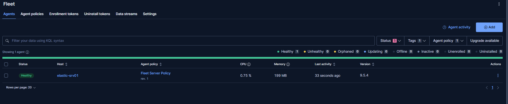

*Fleet Server is shown healthy on ELASTIC-SRV01.*

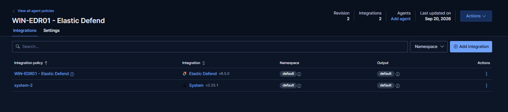

*The endpoint policy includes Elastic Defend and the supporting System integration.*

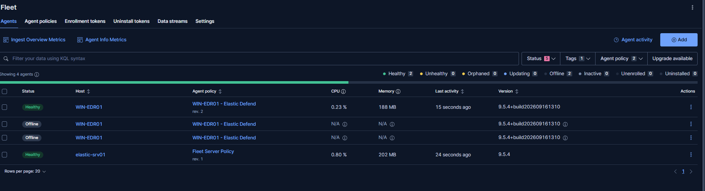

*The current WIN-EDR01 Elastic Agent record is healthy; historical/offline records visible in the view are not presented as current endpoint health.*

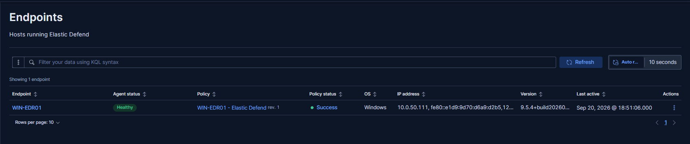

*Elastic Defend reports the WIN-EDR01 endpoint as healthy.*

### Telemetry collection

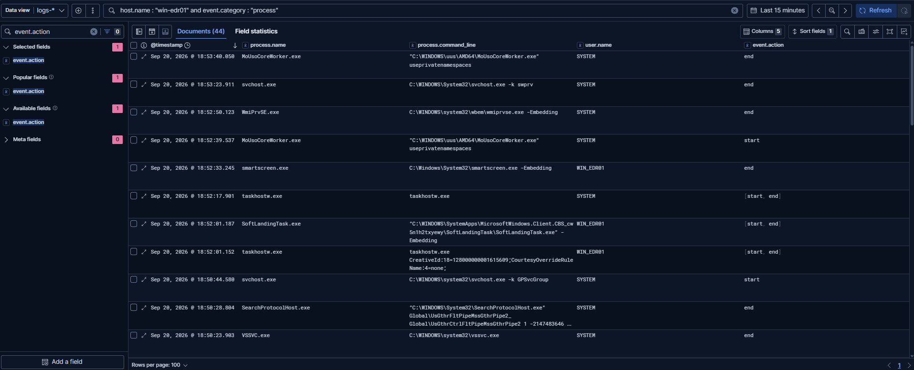

*Process events from WIN-EDR01 are visible in Elastic.*

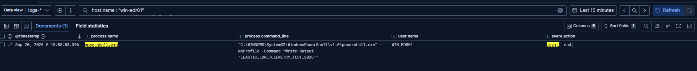

*A controlled PowerShell command produced searchable endpoint telemetry.*

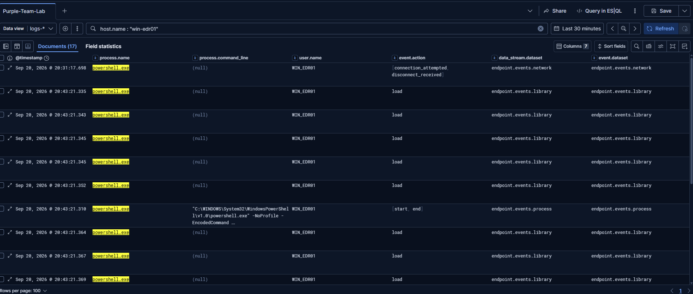

*Encoded-command execution is visible in the process command-line telemetry.*

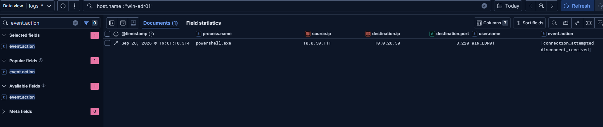

*Network events show WIN-EDR01 communicating with ELASTIC-SRV01 on TCP/8220 during controlled validation.*

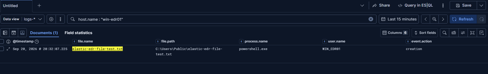

*A controlled file-creation test generated Elastic Defend file telemetry.*

### Alert and investigation

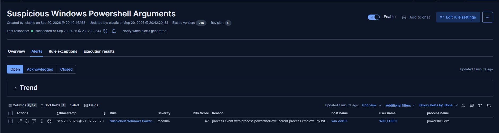

*Elastic Security generated the Medium-severity `Suspicious Windows Powershell Arguments` alert for WIN-EDR01.*

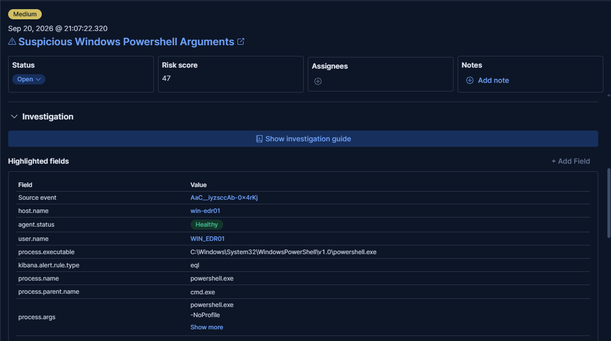

*The alert details preserve host, process, arguments, rule, severity, and source-event context for investigation.*

## Expected Result

An analyst should be able to identify the affected endpoint and PowerShell process, review the observed arguments and surrounding endpoint activity, and pivot to related process, network, and file events. The result is an investigation lead and requires contextual review.

## Investigation Workflow

1. Confirm the affected host, user context, process name, and event time.
2. Review the complete PowerShell command line and parent-process context.
3. Determine whether encoded content is expected administrative automation or requires decoding and escalation.
4. Pivot to adjacent process, network, and file events on WIN-EDR01.
5. Review the Elastic Security rule name, severity, risk score, and source event.
6. Compare the activity with approved lab testing and known administrative workflows.
7. Escalate only when command content, execution chain, related activity, and environment context collectively support suspicious intent.

## Potential False Positives

- Legitimate administrative or deployment scripts that use encoded PowerShell.
- Software-management tooling that launches PowerShell with unusual arguments.
- Security testing, lab validation, and automation frameworks.
- Encoded content used to avoid quoting or transport problems rather than to evade analysis.

## Limitations

- The exact Elastic rule query and full rule-export configuration were not supplied, so this repository does not claim a portable custom rule implementation.
- The validation is specific to WIN-EDR01 and this controlled lab environment.
- Process visibility and alert generation were validated; prevention or blocking was not.
- An encoded command is not inherently malicious and requires analyst review.
- The screenshots do not establish compromise, persistence, or follow-on attacker objectives.
- Elastic and Splunk operate as separate lab platforms; DET-021 does not depend on an integration between them.
- The detection is not represented as production-ready.

## MITRE ATT&CK

- [T1059.001 — Command and Scripting Interpreter: PowerShell](https://attack.mitre.org/techniques/T1059/001/)

This mapping is limited to the demonstrated PowerShell execution behavior. No additional ATT&CK technique is inferred without supporting evidence.

## Detection Engineering Lessons Learned

- Validate collection health before evaluating detection outcomes.
- Keep telemetry, endpoint protection, alert generation, and prevention claims separate.
- Preserve normal and suspicious telemetry examples so analysts can compare behavior.
- Record the exact platform rule name observed without reconstructing unavailable rule logic.
- Treat encoded PowerShell as a high-value investigation signal, not proof of malicious execution by itself.

## Related Documentation

- [ELASTIC-SRV01 and WIN-EDR01 Deployment and Telemetry](../../docs/elastic-srv01-win-edr01-deployment-and-telemetry.md)
- [Elastic Detection Catalog](README.md)

## Status

**Validated / Lab-specific** — Elastic Agent and Elastic Defend collected endpoint telemetry from WIN-EDR01, encoded PowerShell activity was visible, and Elastic Security generated the validated suspicious PowerShell alert. Prevention, compromise, and production readiness are not claimed.
