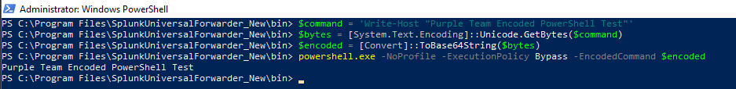
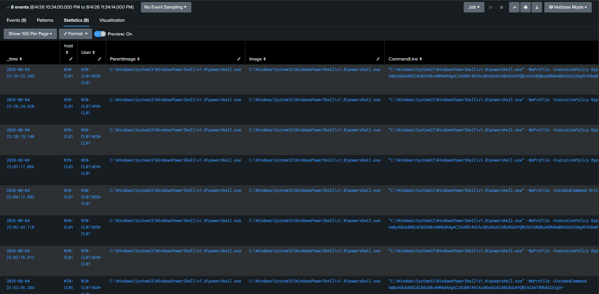

# DET-007 — Encoded PowerShell

## Overview

Detects PowerShell process creation containing at least two suspicious command-line behaviors and assigns a weighted risk score.

## Threat Behavior

Attackers commonly combine encoded commands, execution-policy bypass, hidden execution, dynamic evaluation, and download behavior to obscure PowerShell activity.

## Data Sources

- Sysmon Event 1 process creation from WIN-CL01

## MITRE ATT&CK

- T1059.001 — PowerShell

## Detection Logic

Normalize process and command-line fields, score seven behavioral indicators, require at least two indicators, and derive severity from cumulative risk.

## SPL

```spl
index=sysmon host="WIN-CL01" EventCode=1
| eval process_image=lower(coalesce(Image, ProcessName, New_Process_Name))
| eval cmd=lower(coalesce(CommandLine, Process_Command_Line, _raw))
| where like(process_image,"%\\powershell.exe") OR like(process_image,"%\\pwsh.exe")
| eval encoded=if(match(cmd,"(?i)(^|\\s)-(enc|encodedcommand)(\\s|:|$)"),1,0)
| eval execution_policy_bypass=if(match(cmd,"(?i)(executionpolicy\\s+bypass|-ep\\s+bypass)"),1,0)
| eval no_profile=if(match(cmd,"(?i)(-noprofile|-nop)(\\s|$)"),1,0)
| eval hidden_window=if(match(cmd,"(?i)(windowstyle\\s+hidden|-w\\s+hidden)"),1,0)
| eval dynamic_execution=if(match(cmd,"(?i)(invoke-expression|\\biex\\b)"),1,0)
| eval download_activity=if(match(cmd,"(?i)(invoke-webrequest|\\biwr\\b|downloadstring|downloadfile|webclient)"),1,0)
| eval base64_decode=if(match(cmd,"(?i)frombase64string"),1,0)
| eval indicator_count=encoded+execution_policy_bypass+no_profile+hidden_window+dynamic_execution+download_activity+base64_decode
| eval risk_score=(encoded*40)+(execution_policy_bypass*20)+(no_profile*10)+(hidden_window*20)+(dynamic_execution*25)+(download_activity*30)+(base64_decode*20)
| where indicator_count>=2
| eval severity=case(risk_score>=80,"CRITICAL", risk_score>=60,"HIGH", risk_score>=40,"MEDIUM", true(),"LOW")
| table _time host User ParentImage Image CommandLine indicator_count risk_score severity ProcessGuid
```

## Validation

A Base64-encoded PowerShell command was executed with `-EncodedCommand`, `-ExecutionPolicy Bypass`, and `-NoProfile`, generating genuine Sysmon Event 1 telemetry.

## Attack Simulation

The repository contains screenshot evidence of the controlled encoded-command execution; the exact payload is not documented.



## Detection Result

The search matched the simulated executions and returned indicator counts, risk scores, and severity values.



## False Positives

Administrative automation, deployment platforms, configuration management, and legitimate encoded scripts may match.

## Investigation Steps

Review the user, parent process, complete command, execution context, network connections, downloaded content, child processes, and normal behavior for the host.

## Tuning Recommendations

Allowlist approved automation, correlate with PowerShell 4104 and Sysmon network/process events when available, throttle duplicates, and baseline normal PowerShell use.

## Known Limitations

The search is scoped to WIN-CL01 and requires multiple indicators. PowerShell Script Block Logging and outbound-network correlation are recommendations, not evidenced as part of this detection.

## Evidence

- [Attack simulation](../../screenshots/det-007-01-attack-simulation.png)
- [Detection result](../../screenshots/det-007-02-detection-results.png)

## Status

**Validated** — validated in the lab; not represented as production-ready.
