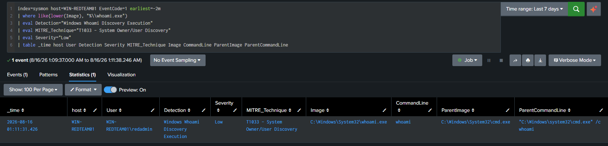

# DET-008 — Windows Whoami User Discovery

## Overview

Detects execution of the Windows `whoami.exe` utility through Sysmon process-creation telemetry. The detection is assigned Low severity because the utility is legitimate and requires surrounding context to determine intent.

## Threat Behavior

An actor may execute `whoami.exe` to identify the user account associated with the current session before choosing privilege-escalation, credential-access, or lateral-movement actions.

## Data Sources

* Sysmon Event ID 1 — Process Creation, indexed in Splunk under `index=sysmon`

## MITRE ATT&CK

- T1033 — System Owner/User Discovery

## Detection Logic

Search Sysmon process-creation events for an image path ending in `whoami.exe`, then return the user, command line, parent process, and integrity context required for investigation.

## SPL

```spl
index=sysmon EventCode=1
| where like(lower(Image), "%\\whoami.exe")
| table _time host User Image CommandLine ParentImage ParentCommandLine IntegrityLevel
```

## Validation

The simulation was executed on WIN-REDTEAM01 and successfully detected in Splunk through Sysmon Event 1 telemetry.

## Attack Simulation

```cmd
cmd.exe /c whoami
```

The directly validated process relationship was `cmd.exe` → `whoami.exe`.

## Detection Result

The Splunk search returned the simulated `whoami.exe` execution with its process, user, command-line, parent-process, and integrity-level fields available for review.

## False Positives

Administrators, troubleshooting activity, inventory scripts, and management tools may legitimately execute `whoami.exe`.

## Investigation Steps

Review the parent process, user, command line, integrity level, and surrounding process activity. Determine whether the execution aligns with expected administration or forms part of a broader discovery sequence.

## Tuning Recommendations

Baseline expected administrative and management-tool usage. Prioritize executions with unusual parents, elevated integrity, unexpected users, or adjacent discovery and credential-access activity rather than suppressing all legitimate use globally.

## Known Limitations

The detection identifies execution of `whoami.exe` but does not independently establish malicious intent. Renamed binaries, equivalent commands, or user-discovery methods that do not invoke `whoami.exe` are outside this search's coverage.

## Evidence

- Tested host: WIN-REDTEAM01
- Directly validated process relationship: `cmd.exe` → `whoami.exe`



*The screenshot shows the successful detection of `whoami.exe` on WIN-REDTEAM01 using Sysmon Event ID 1 in `index=sysmon`.*

## Status

**Validated** — successfully detected in the lab; not represented as production-ready.
