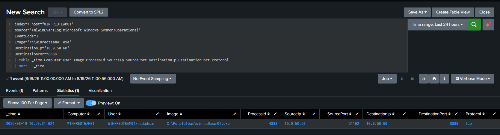
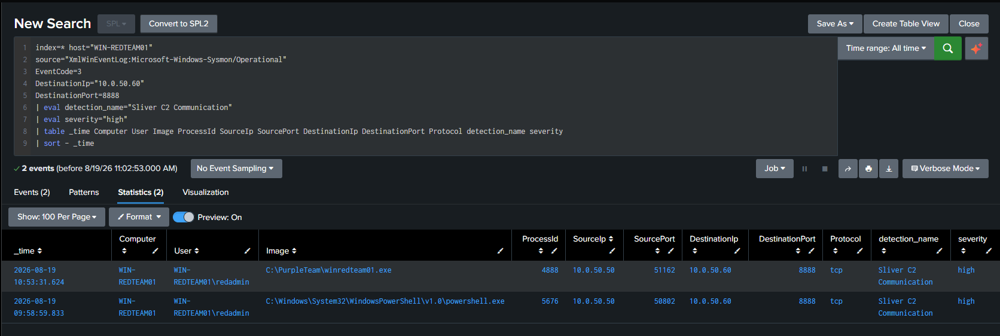
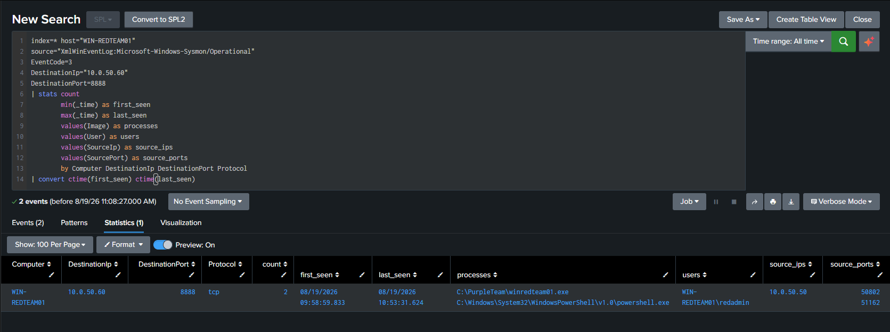
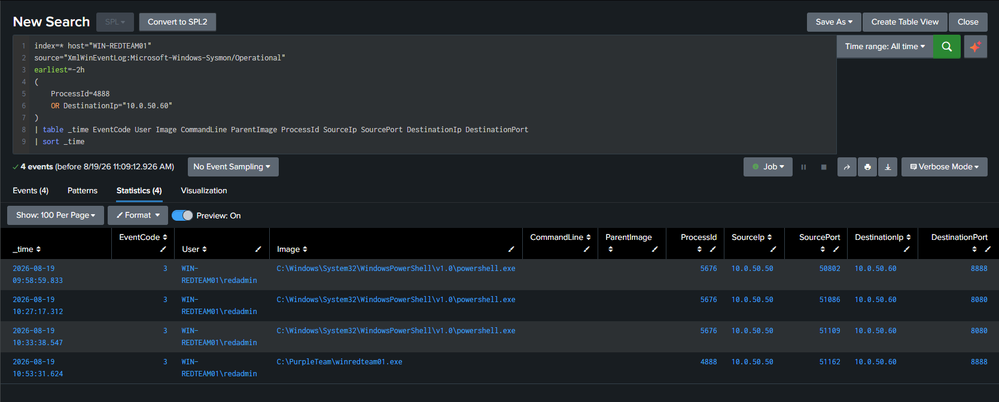

# DET-009 — Sliver C2 Communication

## Overview

Detects network communication from a monitored Windows endpoint to the known Sliver C2 infrastructure used in the lab. The detection uses Sysmon Event ID 3 network-connection telemetry and is assigned High severity because successful communication with the lab C2 endpoint represents validated command-and-control activity.

## Threat Behavior

An attacker who has established execution on a compromised endpoint may use a command-and-control framework to maintain interactive access, receive tasking, and return execution results.

In this lab, a Sliver implant running on WIN-REDTEAM01 established an mTLS session with C2-SLIVER01 over TCP port 8888.

## Data Sources

- Sysmon Event ID 3 — Network Connection
- Windows endpoint telemetry forwarded to Splunk
- Lab C2 endpoint: `10.0.50.60:8888`

## MITRE ATT&CK

- T1071 — Application Layer Protocol

The ATT&CK mapping reflects the validated C2 scenario. The SPL itself identifies network communication with the known lab C2 endpoint and does not independently determine the application-layer protocol.

## Detection Logic

Identify Sysmon network-connection events from WIN-REDTEAM01 to the known C2 endpoint `10.0.50.60:8888`, then aggregate the activity to provide process, user, source-port, and first/last-seen context for analyst triage.

## SPL

```spl
index=* host="WIN-REDTEAM01"
source="XmlWinEventLog:Microsoft-Windows-Sysmon/Operational"
EventCode=3
DestinationIp="10.0.50.60"
DestinationPort=8888
| stats count
        min(_time) as first_seen
        max(_time) as last_seen
        values(Image) as processes
        values(User) as users
        values(SourceIp) as source_ips
        values(SourcePort) as source_ports
        by Computer DestinationIp DestinationPort Protocol
| convert ctime(first_seen) ctime(last_seen)
```

## Validation

The detection was validated on WIN-REDTEAM01 after establishing a Sliver mTLS session with C2-SLIVER01.

Validated endpoint communication:

`10.0.50.50 → 10.0.50.60:8888`

Validated implant process:

`C:\PurpleTeam\winredteam01.exe`

## Attack Simulation

A Sliver Windows implant was generated on C2-SLIVER01 and executed on WIN-REDTEAM01 inside the isolated Purple Team lab.

The implant established an mTLS session to:

`10.0.50.60:8888`

The C2 server confirmed an active session from the Windows endpoint using the mTLS transport.

## Detection Result

Splunk successfully identified Sysmon Event ID 3 telemetry for the Sliver implant communication.

The validated event included:

- Source host: `WIN-REDTEAM01`
- Source IP: `10.0.50.50`
- Destination IP: `10.0.50.60`
- Destination port: `8888`
- Protocol: TCP
- Process: `C:\PurpleTeam\winredteam01.exe`

Additional PowerShell connections to the same endpoint were also observed during lab testing.

The final detection distinguished the actual implant connection from earlier PowerShell connectivity tests by correlating the destination with the process responsible for the network connection.

## False Positives

This detection uses a known lab C2 destination and therefore has low expected false-positive volume inside this environment.

Possible benign matches may occur if another approved application or test process intentionally communicates with `10.0.50.60:8888`.

The destination port alone should not be considered sufficient evidence of Sliver activity.

## Investigation Steps

Review the process responsible for the connection, associated user, source and destination addresses, source port, and surrounding Sysmon telemetry.

Correlate the alert with:

- Process creation activity
- Additional Sysmon network connections
- Parent process context
- pfSense firewall telemetry
- Active Sliver sessions
- Related PowerShell or file-transfer activity

Determine whether the communication is part of an authorized Purple Team exercise or represents unexpected C2 behavior.

## Tuning Recommendations

For this lab, retain the known C2 IP and port as deterministic validation criteria.

For broader detection engineering, replace hard-coded lab infrastructure with contextual controls such as:

- Known C2 infrastructure lists
- Network-zone context
- Unusual destination ports
- Rare process-to-destination relationships
- Allowlisting of approved applications and services

Do not treat TCP port 8888 alone as a universal Sliver indicator.

## Known Limitations

This detection is intentionally scoped to the lab C2 endpoint and does not identify arbitrary Sliver infrastructure.

Changing the C2 IP, port, transport, or endpoint configuration may bypass this specific search.

Sysmon Event ID 3 must also be configured to include the relevant process and connection.

During validation, the Sysmon configuration was updated to explicitly capture network connections generated by:

`C:\PurpleTeam\winredteam01.exe`

This allowed Splunk to identify the implant itself rather than only the PowerShell processes used during connectivity testing.

## Lab Architecture Context

The validated communication path was:

`WIN-REDTEAM01 (10.0.50.50) → C2-SLIVER01 (10.0.50.60:8888)`

Both systems were operated inside the isolated Purple Team lab environment.

WIN-REDTEAM01 provided Windows endpoint telemetry through Sysmon, while Splunk was used to collect and analyze the resulting events.

## Evidence

- C2 server: `C2-SLIVER01`
- C2 IP: `10.0.50.60`
- Endpoint: `WIN-REDTEAM01`
- Endpoint IP: `10.0.50.50`
- Transport: mTLS
- Destination port: TCP/8888
- Validated process: `C:\PurpleTeam\winredteam01.exe`
- Telemetry source: Sysmon Event ID 3
- SIEM: Splunk

### Splunk Event ID 3 Detection



*Splunk returned the Sysmon Event ID 3 generated by `C:\PurpleTeam\winredteam01.exe` connecting from `10.0.50.50` to the lab C2 endpoint at `10.0.50.60:8888`.*

### DET-009 Detection Result



*The deterministic lab search identified connections to the known C2 endpoint and retained the responsible process, user, source port, and severity context.*

### Aggregation Result



*The aggregation summarizes the event count, first and last seen times, processes, users, source IPs, and source ports for the known lab C2 destination.*

### Analyst Triage



*The analyst timeline distinguishes the final implant connection from earlier PowerShell connectivity and controlled file-transfer activity.*

## Detection Summary

| Field | Value |
|---|---|
| Detection ID | DET-009 |
| Detection Name | Sliver C2 Communication |
| Severity | High |
| Endpoint | WIN-REDTEAM01 |
| Source IP | 10.0.50.50 |
| C2 Server | C2-SLIVER01 |
| Destination IP | 10.0.50.60 |
| Destination Port | TCP/8888 |
| Transport | mTLS |
| Process | C:\PurpleTeam\winredteam01.exe |
| Data Source | Sysmon Event ID 3 |
| Status | Validated |

## Status

**Validated** — successfully detected in the lab; not represented as production-ready.
