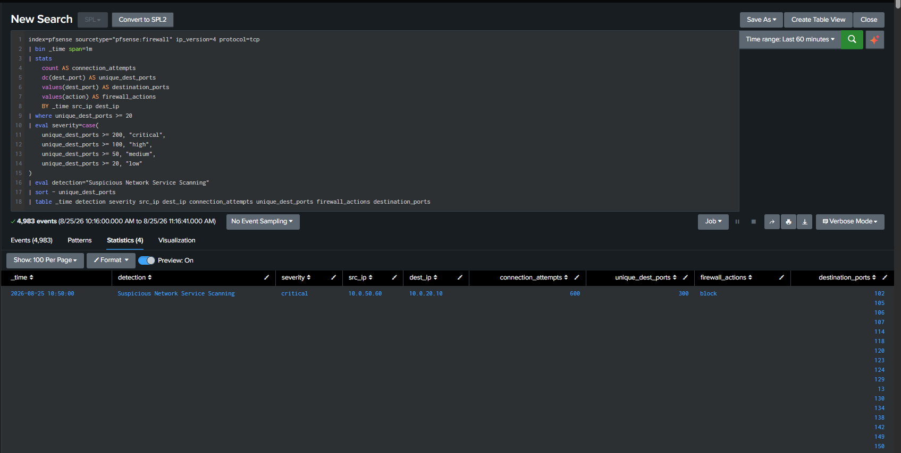
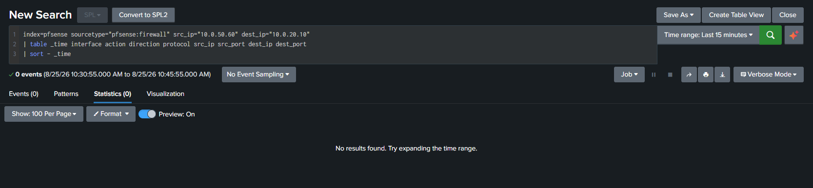
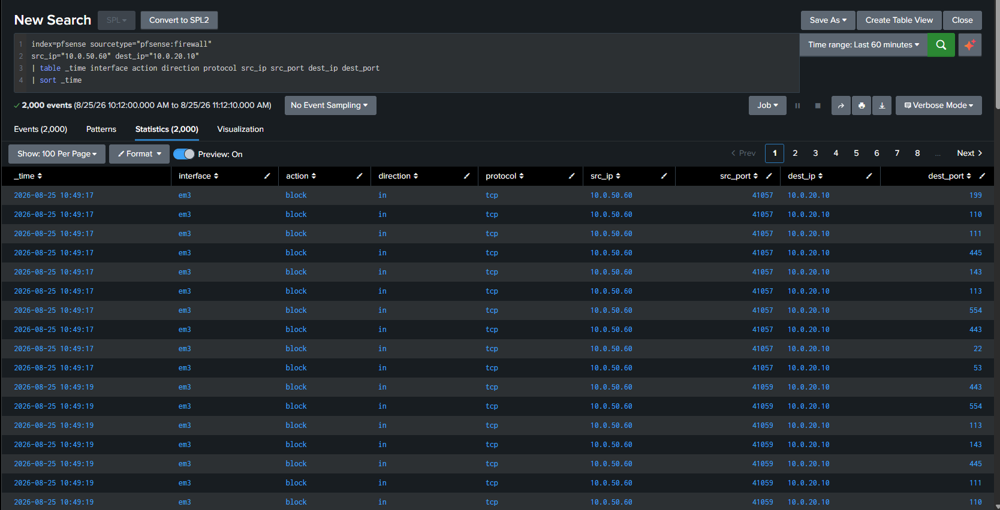
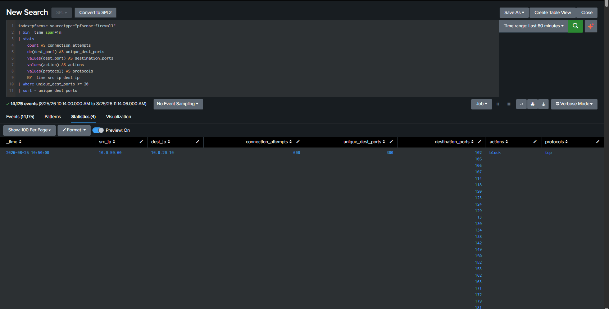
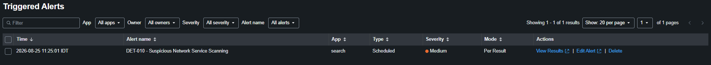
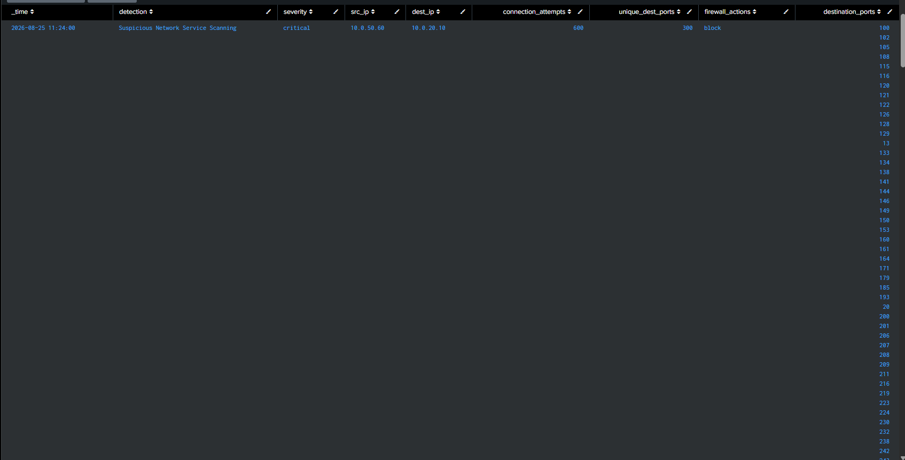

# DET-010 — Suspicious Network Service Scanning

## Overview

Detects unusually broad network-service probing from one source across many TCP destination ports on a single destination system within one minute, using pfSense firewall telemetry.

High port-touch volume warrants investigation but does not, by itself, prove malicious intent, successful access, or compromise.

## Threat Behavior

Attackers may probe multiple ports and network services to identify exposed services before attempted exploitation, lateral movement, or other follow-on activity. Approved security assessment, discovery, monitoring, and troubleshooting can produce similar telemetry.

## Data Sources

- pfSense firewall telemetry in `index=pfsense` with `sourcetype="pfsense:firewall"`.
- Validated fields: `_time`, `ip_version`, `protocol`, `src_ip`, `dest_ip`, `dest_port`, and `action`.

## MITRE ATT&CK

- T1046 — Network Service Discovery

The mapping reflects broad probing of destination ports. It does not establish attacker intent or show that any destination service was reachable.

## Detection Logic

The validated search filters to IPv4 TCP firewall events, groups activity into one-minute buckets for each source/destination pair, and calculates both the event count and distinct destination-port count. Results require at least 20 unique destination ports. The search assigns a result severity according to the observed breadth:

- 200 or more unique ports: `critical`
- 100–199 unique ports: `high`
- 50–99 unique ports: `medium`
- 20–49 unique ports: `low`

## SPL

```spl
index=pfsense sourcetype="pfsense:firewall" ip_version=4 protocol=tcp
| bin _time span=1m
| stats
    count AS connection_attempts
    dc(dest_port) AS unique_dest_ports
    values(dest_port) AS destination_ports
    values(action) AS firewall_actions
    BY _time src_ip dest_ip
| where unique_dest_ports >= 20
| eval severity=case(
    unique_dest_ports >= 200, "critical",
    unique_dest_ports >= 100, "high",
    unique_dest_ports >= 50, "medium",
    unique_dest_ports >= 20, "low"
)
| eval detection="Suspicious Network Service Scanning"
| sort - unique_dest_ports
| table _time detection severity src_ip dest_ip connection_attempts unique_dest_ports firewall_actions destination_ports
```



*The validated SPL returns the source, destination, event count, distinct-port count, firewall actions, destination ports, and calculated severity.*

## Validation

The controlled lab activity produced the following validated result:

| Field | Validated value |
|---|---|
| Source system | KALI-OPS01 |
| `src_ip` | `10.0.50.60` |
| Destination system | DC01 |
| `dest_ip` | `10.0.20.10` |
| `connection_attempts` | `600` |
| `unique_dest_ports` | `300` |
| `firewall_actions` | `block` |
| Calculated result severity | `critical` |

Before the controlled activity, the scoped KALI-OPS01-to-DC01 search returned no events in the displayed baseline window.



*The pre-validation query returned no matching events for the displayed source/destination pair.*

pfSense then recorded blocked TCP activity from `10.0.50.60` to `10.0.20.10` across multiple destination ports.



*Raw pfSense events show blocked TCP attempts from KALI-OPS01 to DC01 across multiple destination ports.*

The one-minute aggregation produced 600 connection attempts across 300 unique destination ports.



*The grouped result confirms the validated source, destination, counts, protocol, and blocked action.*

## Attack Simulation

Network-service scanning activity was generated from KALI-OPS01 during controlled lab validation against DC01. The supplied evidence does not show the exact simulation command, so no command is represented here.

## Detection Result

The Splunk alert was saved as:

```text
DET-010 - Suspicious Network Service Scanning
```

Triggered Alerts shows a scheduled, Per Result alert with the alert object's severity configured as `Medium`.



*Triggered Alerts confirms the saved alert name, Scheduled type, Medium alert severity, and Per Result mode.*

The triggered result retained `10.0.50.60` as the source, `10.0.20.10` as the destination, 600 connection attempts, 300 unique destination ports, the `block` action, and a calculated result severity of `critical`.



*The alert result preserves the detection fields and validated aggregation values.*

The `Medium` alert-object severity and the SPL-generated `critical` result field are separate settings. The screenshots support both values; this document does not imply they were synchronized during validation.

## False Positives

- Authorized vulnerability scanners.
- Approved network discovery or security assessments.
- Infrastructure monitoring and inventory systems.
- Administrative troubleshooting.

## Investigation Steps

1. Identify and validate the source and destination assets.
2. Review the destination ports, one-minute time bucket, connection count, distinct-port count, and firewall actions.
3. Determine whether the source is an approved scanner, monitoring platform, administrator system, or assessment host.
4. Review neighboring firewall activity for additional destinations, protocols, or repeated scanning windows.
5. Correlate with endpoint or IDS telemetry where available, especially activity on the destination around the same time.
6. Confirm whether the activity was authorized before escalation.

## Tuning Recommendations

- Allowlist only verified scanner and monitoring sources.
- Tune distinct-port thresholds and aggregation windows against normal traffic.
- Restrict detection scope to unexpected source networks or protected destinations.
- Correlate with endpoint or IDS evidence to increase confidence.
- Align the configured alert-object severity with the SPL-calculated severity if operational consistency is required.

These are recommendations; the supplied evidence does not show that they were implemented.

## Known Limitations

- Legitimate tools can generate high port-touch volume.
- Firewall telemetry alone does not establish attacker intent.
- Blocked connections do not prove that a destination service was reachable.
- Detection depends on pfSense logging visibility and correct Splunk field extraction.
- A one-minute bucket may split activity across adjacent boundaries.
- The rule covers broad IPv4 TCP probing and does not represent complete network-discovery coverage.

## Evidence

- [Baseline with no scoped events](../../screenshots/DET-010-01-baseline-no-events-kali-to-dc01.png)
- [Raw pfSense scan events](../../screenshots/DET-010-02-pfsense-nmap-scan-events.png)
- [One-minute port aggregation](../../screenshots/DET-010-03-pfsense-port-scan-aggregation.png)
- [Final validated detection query](../../screenshots/DET-010-04-final-detection-query.png)
- [Triggered Alert validation](../../screenshots/DET-010-06-triggered-alert-validation.png)
- [Triggered Alert result details](../../screenshots/DET-010-07-triggered-alert-result-details.png)

## Status

**Validated** — the controlled lab activity produced pfSense firewall telemetry, the final SPL returned the confirmed aggregation, and the saved Splunk alert triggered successfully. It is not represented as production-ready.
