# DET-011 — Suspicious Write to Sensitive SMB Share

## Overview

Detects Windows Security Event ID 5145 write activity against the sensitive `IT` or `Finance` SMB shares on FILE-SRV01. The detection returns the authenticated account, source address, share, relative target, requested access, and access mask for analyst review.

The validated event represents a controlled file write. Event 5145 with write access is not, by itself, proof of malicious activity, lateral movement, remote execution, malware transfer, or compromise.

## Detection Objective

Identify successful write operations against designated sensitive SMB shares and provide enough identity, source, object, and access context for an analyst to determine whether the activity was authorized.

## Lab Context

| Component | Validated value |
|---|---|
| File server | FILE-SRV01 — `10.0.50.105` — `lab.local` |
| Source client | WIN-CL01 — `10.0.30.100` |
| Domain controller | DC01 — `10.0.20.10` |
| Splunk Enterprise | `10.0.20.100` |
| Validated account | `LAB\daniel.it` |
| Validated group | `GG_FS_IT_RW` |
| Sensitive shares | `IT`, `Finance` |
| Validated target | `\\10.0.50.105\IT` |

FILE-SRV01 exposed the `IT` and `Finance` shares, and the required File Share and Detailed File Share auditing was enabled before validation.

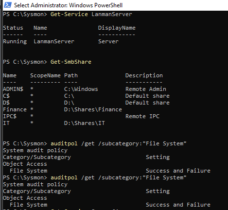

*FILE-SRV01 shows the sensitive shares and the file-system audit baseline.*

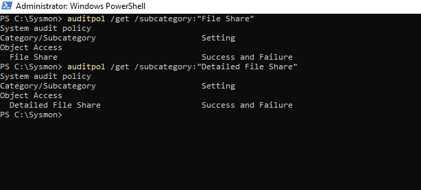

*File Share and Detailed File Share auditing are configured for Success and Failure.*

## Data Sources

### Primary telemetry

- Windows Security Event ID 5145 — detailed file-share access check.

### Supporting telemetry

- Windows Security Event ID 5140 — network share access.
- Windows Security Event ID 4625 — failed authentication during initial troubleshooting.
- pfSense firewall telemetry — blocked FILE-SRV01-to-DC01 Active Directory traffic.

## MITRE ATT&CK

**N/A / Context-dependent.** The directly observed telemetry is an authenticated write request to a sensitive SMB share. Event ID 5145 does not independently establish an ATT&CK technique or malicious intent. Any scenario-level mapping would require additional evidence describing what was transferred, why it was written, and what activity preceded or followed the write.

## Detection Logic

Search FILE-SRV01 Event ID 5145 telemetry for the `IT` or `Finance` share and require `WriteData` in the access list. Assign the lab detection name and High severity, normalize the working source-address field to `src_ip`, and retain the account, share, target, access, and mask fields needed for triage.

Normal access values such as `READ_CONTROL` and `SYNCHRONIZE` were observed during validation. Those values alone do not satisfy the write condition and should not trigger DET-011.

## SPL

```spl
index=windows host="FILE-SRV01" EventCode=5145
(Share_Name="*\\IT" OR Share_Name="*\\Finance")
Accesses="*WriteData*"
| eval detection="Suspicious Write to Sensitive SMB Share"
| eval severity="high"
| rename Source_Address AS src_ip
| table _time detection severity Account_Name Account_Domain src_ip
        Share_Name Relative_Target_Name Accesses Access_Mask
| sort - _time
```

## Field Mapping

During engineering validation, the expected source client address was not populated in `Source_Network_Address` for the relevant Event ID 5145 results. The working extracted field was `Source_Address`:

```text
Source_Address = 10.0.30.100
```

The final search therefore uses:

```spl
| rename Source_Address AS src_ip
```

This is an environment-specific field-mapping finding and must be revalidated if the Windows input, sourcetype, extraction configuration, or Technology Add-on changes.

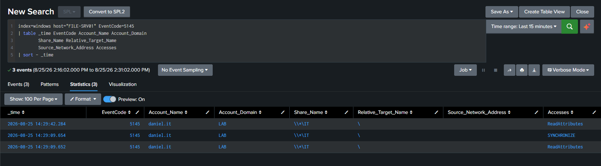

*Initial Event ID 5145 validation showed that `Source_Network_Address` did not contain the source client value.*

## Controlled Simulation

WIN-CL01 established an authenticated connection to the `IT` share using the validated domain account:

```cmd
net use \\10.0.50.105\IT /user:LAB\daniel.it *
```

The password was entered interactively and is not included in this repository.

The controlled write was then generated with:

```powershell
"DET-011 write test" | Out-File \\10.0.50.105\IT\DET-011-write-test.txt
```

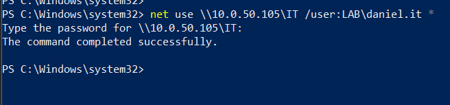

*The authenticated SMB connection from WIN-CL01 to the `IT` share completed successfully.*

## Validation

FILE-SRV01 generated Event ID 5145 telemetry after the controlled write, and Splunk returned the expected file-write record.

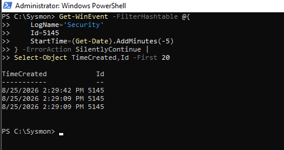

*Local validation on FILE-SRV01 confirmed new Security Event ID 5145 records.*

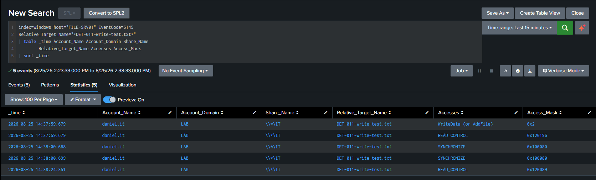

*Splunk shows the validated `daniel.it` write to `DET-011-write-test.txt`, alongside non-write access checks that do not independently trigger the detection.*

The final detection result contained:

| Field | Validated value |
|---|---|
| `Account_Name` | `daniel.it` |
| `Account_Domain` | `LAB` |
| `src_ip` | `10.0.30.100` |
| `Share_Name` | `\\*\IT` |
| `Relative_Target_Name` | `DET-011-write-test.txt` |
| `Accesses` | `WriteData (or AddFile)` |
| `Access_Mask` | `0x2` |
| `detection` | `Suspicious Write to Sensitive SMB Share` |
| `severity` | `high` |

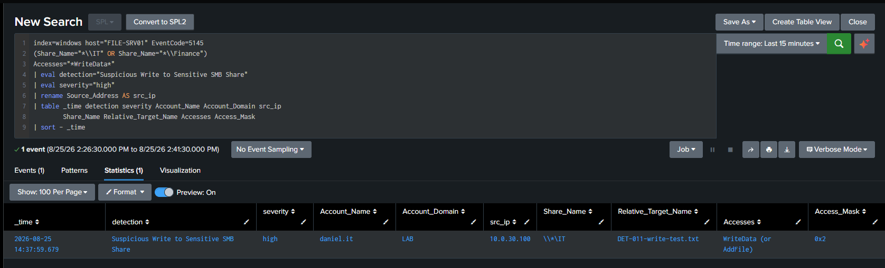

*The final SPL returns the normalized source IP and the complete write context for analyst triage.*

## Alert Configuration

| Setting | Validated value |
|---|---|
| Alert name | `DET-011 - Suspicious Write to Sensitive SMB Share` |
| Type | Scheduled |
| Schedule | Every 5 minutes |
| Cron | `*/5 * * * *` |
| Trigger condition | Number of Results > 0 |
| Trigger mode | Once / Digest |
| Throttle | Disabled during validation |
| Severity | High |
| Action | Add to Triggered Alerts |

Triggered Alerts recorded the scheduled High-severity alert at `2026-08-25 15:00:02 IDT`, validating the complete path:

```text
WIN-CL01
    → authenticated SMB write
FILE-SRV01
    → Windows Security Event ID 5145
Splunk
    → DET-011 scheduled search
Triggered Alerts
    → High-severity Digest alert
```

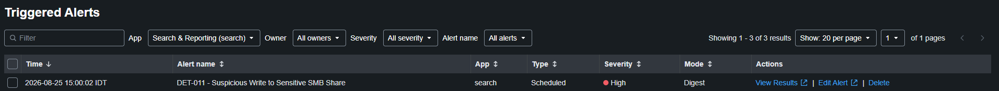

*Splunk Triggered Alerts shows the scheduled DET-011 alert with High severity and Digest mode.*

## Investigation Workflow

1. Confirm the account, source address, share, target name, access type, and access mask.
2. Determine whether the account is expected to write to the sensitive share and whether the source host is approved.
3. Review adjacent Event IDs 5140 and 5145 for the same account, source, and share.
4. Correlate with authentication events, endpoint process telemetry, and pfSense network activity.
5. Inspect the written object's type, path, origin, hash, and subsequent access where available.
6. Check for related writes to other sensitive shares or unusual destinations.
7. Confirm whether the activity matches approved administration, backup, deployment, synchronization, or application behavior before escalation.

## Troubleshooting / Root Cause

### Initial authentication failure

The first authenticated SMB connection attempt failed with System error 1311, reporting that the domain was unavailable. Windows Event ID 4625 was also observed. The investigation showed that FILE-SRV01 could not complete required communication with DC01 because pfSense segmentation blocked Active Directory dependencies between:

```text
FILE-SRV01 10.0.50.105
    →
DC01 10.0.20.10
```

The investigated core services included DNS 53, Kerberos 88, RPC Endpoint Mapper 135, LDAP 389, and SMB 445. A pfSense alias named `AD_DC_CORE_PORTS` and a restricted FILE-SRV01-to-DC01 rule were created for the required services.

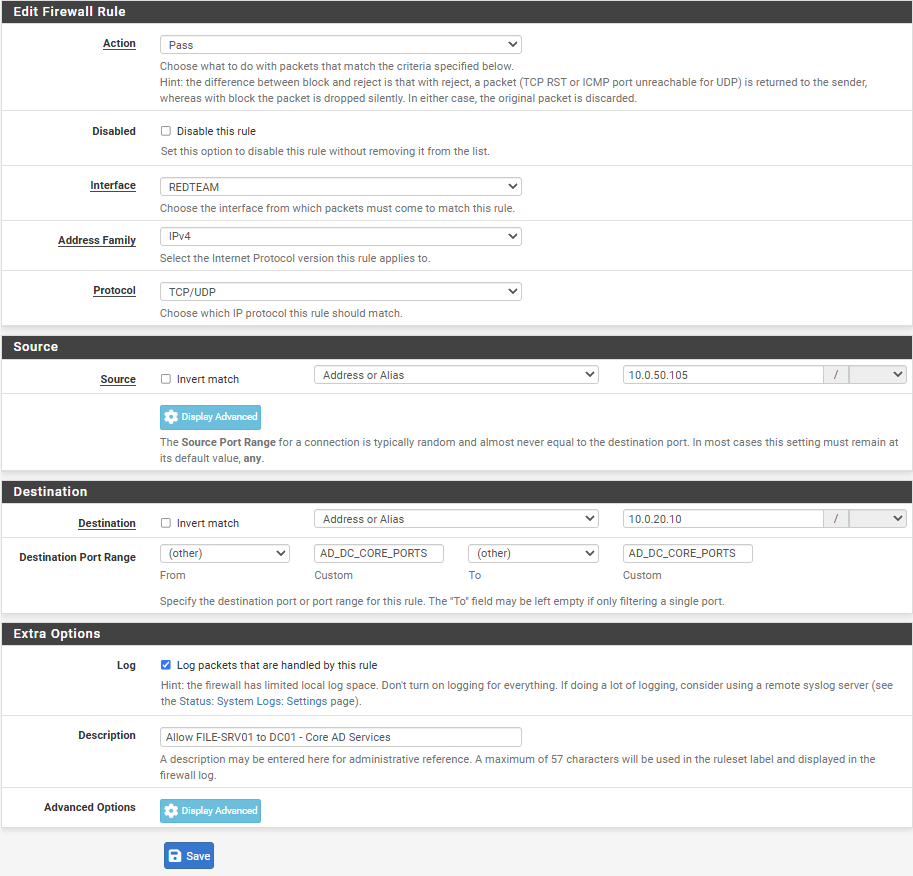

*The core rule is restricted to FILE-SRV01 as source and DC01 as destination; it is not a broad inter-zone allow rule.*

### Dynamic RPC discovery

Authentication still stalled after the core ports were addressed. pfSense telemetry showed repeated blocked TCP connections to destination port 49668. The port was investigated rather than opened blindly.

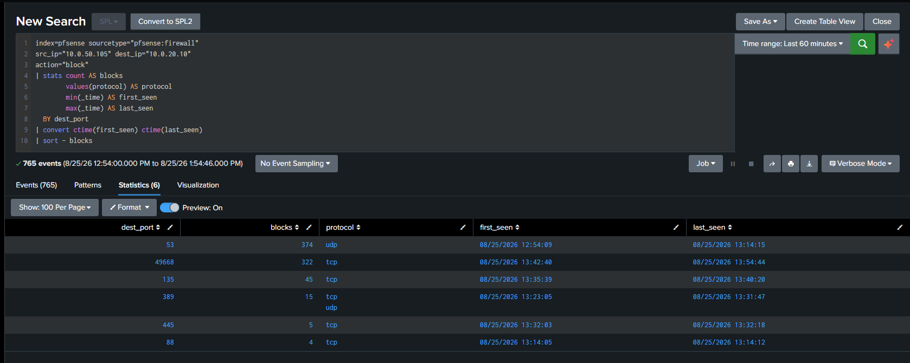

*pfSense telemetry identifies blocked TCP/49668 activity from FILE-SRV01 to DC01 among the required AD communications.*

On DC01, `Get-NetTCPConnection` showed TCP/49668 in the Listen state with owning process 748. The process was validated as `lsass.exe`; `tasklist /svc` associated it with domain-related services including Kdc, KeyIso, Netlogon, NTDS, and SamSs.

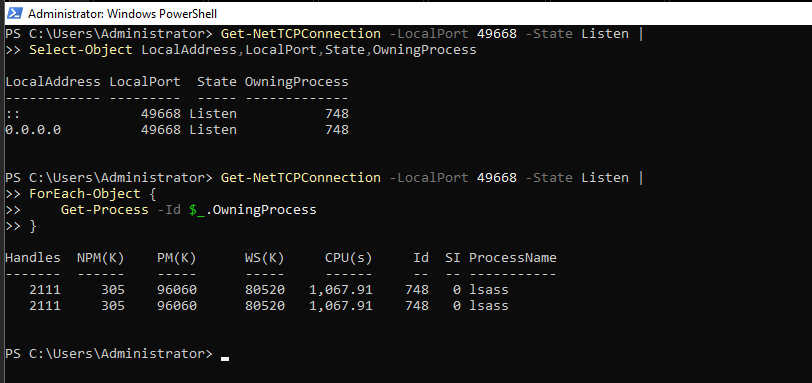

*DC01 shows TCP/49668 owned by the LSASS process during the investigation.*

The current Windows TCP and UDP dynamic port configuration was then checked:

```text
Start Port: 49152
Number of Ports: 16384
Range: 49152–65535
```

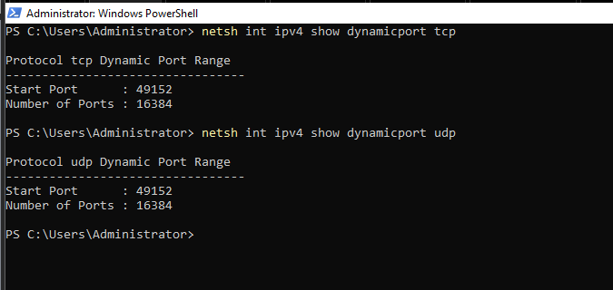

*The default Windows dynamic port range was verified; the operating-system configuration was not modified.*

pfSense was configured with the `AD_RPC_DYNAMIC` alias for `49152:65535` and a TCP rule restricted only to FILE-SRV01 (`10.0.50.105`) communicating with DC01 (`10.0.20.10`). The range was not opened broadly. After the change, `Test-NetConnection 10.0.20.10 -Port 49668` returned `TcpTestSucceeded : True`, and domain-authenticated SMB access succeeded.

## False Positives

- Authorized administrators writing approved files.
- Backup and recovery systems.
- Software deployment and patch-management platforms.
- File-synchronization tools.
- Approved automation and administrative scripts.
- Legitimate applications writing business data.

## Tuning Recommendations

- Maintain an explicit lookup or configuration list for sensitive shares rather than expanding the SPL with unmanaged literals.
- Baseline expected writers, source hosts, service accounts, file types, and operating hours.
- Allowlist only verified administrative, backup, deployment, synchronization, and application workflows.
- Prioritize unusual account-to-share, process-to-share, or source-to-share relationships.
- Add file-extension, filename-pattern, write-volume, and time-of-day context where telemetry supports it.
- Correlate with process creation, authentication, endpoint, and network evidence before raising confidence.
- Revalidate the `Source_Address` mapping after data-source or extraction changes.

## Known Limitations

- The search is scoped to FILE-SRV01 and the `IT` and `Finance` shares.
- Event ID 5145 depends on Detailed File Share auditing and relevant share access being logged.
- A matching write may be legitimate and requires analyst context.
- The search identifies a requested write access value; it does not prove malicious content, execution, compromise, or impact.
- Renamed or newly created sensitive shares require detection-list maintenance.
- Source-address field availability depends on the current Splunk Windows field extractions.
- Throttling was disabled during validation and requires production-specific tuning.

## Evidence

The main narrative embeds 12 screenshots selected from the final 29-file evidence set. All 29 DET-011 screenshots are preserved in the repository's `screenshots/` directory.

Additional supporting screenshots preserved but not embedded include authentication-failure field validation, pre-validation searches, audit-policy checks, blocked DNS/core-port evidence, alias and rule configuration, DNS/Kerberos/LDAP/SMB connectivity checks, secure-channel and account/group validation, RPC 135 evidence, LSASS service association, and intermediate Splunk searches.

## Detection Summary

| Field | Value |
|---|---|
| Detection ID | DET-011 |
| Detection name | Suspicious Write to Sensitive SMB Share |
| Severity | High |
| Status | Validated |
| Primary data source | Windows Security Event ID 5145 |
| Supporting data | Windows 5140, Windows 4625, pfSense firewall telemetry |
| Target host | FILE-SRV01 — `10.0.50.105` |
| Source host | WIN-CL01 — `10.0.30.100` |
| Sensitive shares | `IT`, `Finance` |
| Validated account | `LAB\daniel.it` |
| Validated object | `DET-011-write-test.txt` |
| Alert type | Scheduled, every 5 minutes |
| Triggered Alert | High severity, Digest, validated |
| MITRE ATT&CK | N/A / Context-dependent |

## Status

**Validated** — the controlled write generated Event ID 5145, Splunk returned the normalized detection result, and the scheduled High-severity alert appeared in Triggered Alerts. The detection is validated in the lab and is not represented as production-ready or as independent proof of malicious activity.
