# DET-012 — PowerShell Download Activity

## Overview

Detects `powershell.exe` or `pwsh.exe` process-creation events whose command line contains `Invoke-WebRequest` or the `iwr` alias. The lab validation used a benign text file and demonstrates suspicious download behavior, not malware execution or compromise.

## Detection Objective

Identify PowerShell processes using the validated web-request syntax and return the user, process, parent process, command line, process identifiers, and host needed for analyst review.

## Data Sources / Telemetry

- Sysmon Event ID 1 — Process Creation; primary detection source.
- Sysmon Event ID 3 — Network Connection; supporting validation telemetry.
- Sysmon Event ID 11 — File Creation; supporting validation telemetry.

Sysmon telemetry availability on WIN-REDTEAM01 was confirmed before testing.

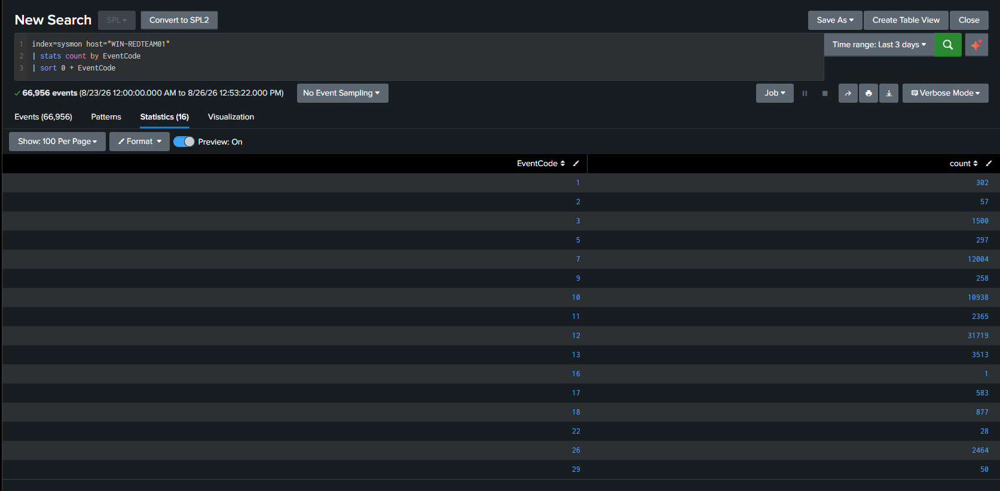

*The baseline search confirms multiple Sysmon event types, including Events 1, 3, and 11, in `index=sysmon`.*

## Lab Architecture / Systems

| Component | Validated role and value |
|---|---|
| Source endpoint | WIN-REDTEAM01 — `10.0.50.50` |
| Web server | WEB-APP01 — `10.0.50.102` |
| Test service | Python HTTP server on TCP/8080 |
| Served artifact | `DET-012-test.txt` — benign text file |
| Correlated downloaded artifact | `C:\Users\Public\DET-012-test2.txt` |

Basic reachability from WIN-REDTEAM01 to WEB-APP01 was verified before the HTTP test.

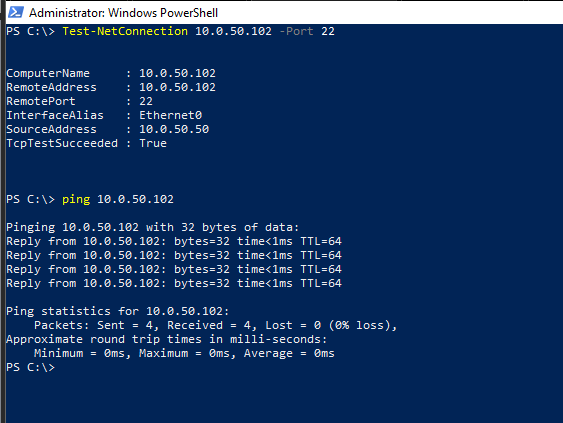

*WIN-REDTEAM01 successfully reached WEB-APP01 over ICMP and TCP/22.*

The Python HTTP service was then confirmed listening on all interfaces on TCP/8080.

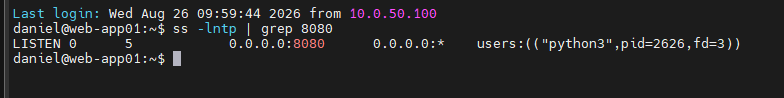

*WEB-APP01 shows the Python process listening on `0.0.0.0:8080`.*

## MITRE ATT&CK

- T1059.001 — Command and Scripting Interpreter: PowerShell

The mapping reflects the directly observed PowerShell execution. The benign validation does not establish malware delivery or execution.

## Detection Logic

Search Sysmon Event ID 1 for the Windows PowerShell or PowerShell 7 executable and require either the directly validated `Invoke-WebRequest` string or its `iwr` alias in the command line. Assign a High severity label and retain process and identity context for triage.

The lab evidence directly validates `Invoke-WebRequest`. The query includes `iwr` as an explicit alias condition, but the supplied validation event used the full cmdlet name. Other download methods are outside this detection's validated scope.

## SPL

```spl
index=sysmon EventCode=1
(Image="*\\powershell.exe" OR Image="*\\pwsh.exe")
(CommandLine="*Invoke-WebRequest*" OR CommandLine="*iwr *")
| eval detection="PowerShell Download Activity"
| eval severity="high"
| table _time detection severity host User Image ParentImage CommandLine ProcessId ProcessGuid
| sort - _time
```

## Controlled Simulation

WEB-APP01 served the benign file from TCP/8080. Its access log recorded successful HTTP GET requests for `/DET-012-test.txt` with status 200.

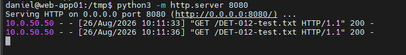

*WEB-APP01 recorded successful requests from `10.0.50.50` for the benign test file.*

The correlated validation run on WIN-REDTEAM01 used:

```powershell
powershell.exe -NoProfile -Command "Invoke-WebRequest -Uri 'http://10.0.50.102:8080/DET-012-test.txt' -OutFile 'C:\Users\Public\DET-012-test2.txt'"
```

A separate interactive check also confirmed that PowerShell could download and read the benign test content.

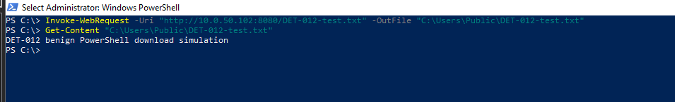

*PowerShell successfully downloaded the benign text file and displayed its harmless validation content.*

## Validation Results

### Sysmon Event ID 1 — Process Creation

Sysmon captured `powershell.exe`, the `Invoke-WebRequest` command line, the executing user, parent image, process ID, and ProcessGuid.

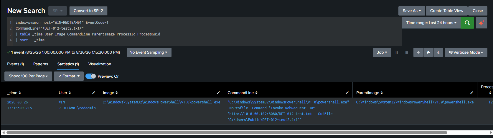

*Event ID 1 contains the PowerShell process and complete validated download command.*

### Sysmon Event ID 3 — Network Connection

The same PowerShell ProcessGuid was associated with a connection from `10.0.50.50` to `10.0.50.102:8080`.

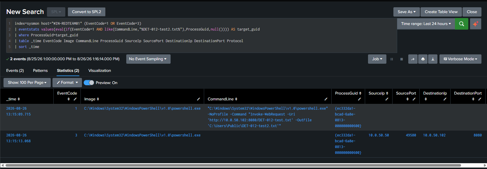

*Event IDs 1 and 3 correlate the PowerShell process with the validated HTTP destination.*

### Sysmon Event ID 11 — File Creation

Sysmon recorded creation of `C:\Users\Public\DET-012-test2.txt` by the same PowerShell process.

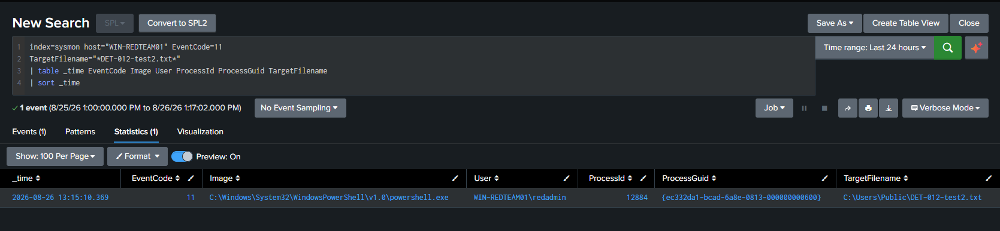

*Event ID 11 records the downloaded validation artifact and matching ProcessGuid.*

### ProcessGuid Correlation and Clean Timeline

The ProcessGuid joined the process creation, file creation, and network connection into one three-event chain:

```text
Sysmon 1  — PowerShell process with Invoke-WebRequest
Sysmon 11 — C:\Users\Public\DET-012-test2.txt created
Sysmon 3  — 10.0.50.50 → 10.0.50.102:8080
```

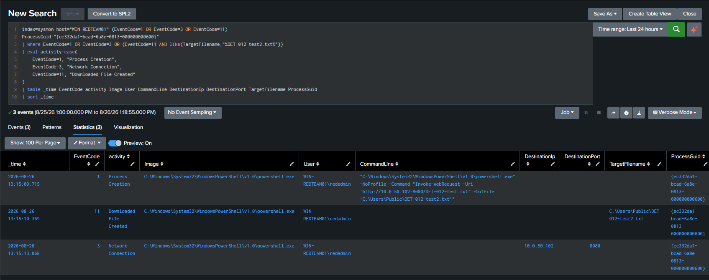

*The clean timeline shows all three event types associated with the same PowerShell ProcessGuid.*

## Detection Result

The final detection returned one expected event with the validated PowerShell command and High severity.

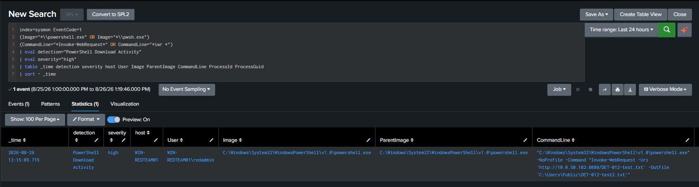

*The final SPL identifies the controlled `Invoke-WebRequest` activity on WIN-REDTEAM01.*

## Seven-Day Baseline

The same search over the displayed seven-day range returned only the lab validation event. This is a lab observation, not a production prevalence baseline.

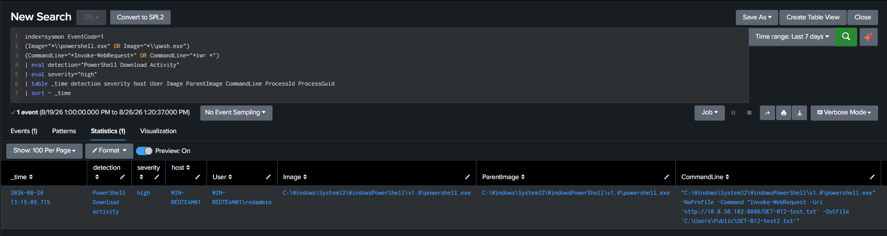

*The seven-day search returned one result: the controlled validation event.*

## Scheduled Alert Validation

| Setting | Evidence-supported value |
|---|---|
| Alert title | `DET-012 - PowerShell Download Activity` |
| Type | Scheduled |
| Severity | High |
| Mode | Per Result |

Triggered Alerts confirmed that DET-012 fired successfully.

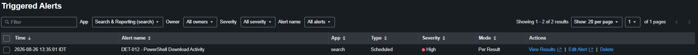

*Triggered Alerts shows the DET-012 scheduled alert with High severity and Per Result mode.*

The lab intended to use a five-minute scheduled window, but the supplied screenshots do not prove the final cron or search time range. A five-minute schedule with an aligned five-minute search window is therefore a recommendation, not a validated configuration claim.

## Troubleshooting

Initial TCP/8080 connectivity from WIN-REDTEAM01 to WEB-APP01 failed even though basic host connectivity worked and the Python process was listening.

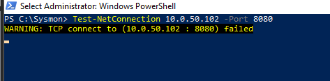

*The initial `Test-NetConnection` to WEB-APP01 TCP/8080 failed.*

UFW was active with default-deny incoming policy, and its displayed allow rules did not include TCP/8080. After the firewall issue was addressed, TCP/8080 connectivity succeeded.

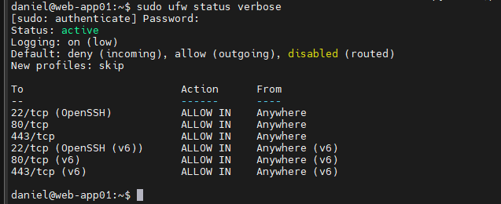

*The UFW baseline shows an active firewall, default deny for incoming traffic, and no displayed 8080 allow rule.*

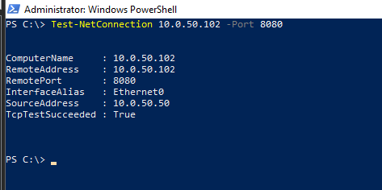

*WIN-REDTEAM01 subsequently reached WEB-APP01 on TCP/8080 successfully.*

An initial scoped Event ID 1 search also returned no results before the final validation event was generated. The search criteria and time range were reviewed during validation rather than treating the absence of results as a telemetry failure.

## False Positives

- Approved administration and troubleshooting.
- Automation and configuration-management scripts.
- Software installers, deployment tooling, and update workflows.
- Security testing and incident-response collection scripts.

## Investigation Guidance

1. Review `User`, `host`, `Image`, `ParentImage`, `CommandLine`, `ProcessId`, and `ProcessGuid`.
2. Determine whether the URL, destination, output path, and downloaded filename are expected.
3. Correlate the ProcessGuid with Sysmon Events 3 and 11 to identify network and file activity.
4. Inspect the downloaded file's type, hash, reputation, origin, and subsequent execution where available.
5. Review adjacent authentication, PowerShell, endpoint, DNS, proxy, firewall, and IDS telemetry.
6. Confirm whether the activity belongs to an approved administrative or automation workflow before escalation.

## Tuning Recommendations

- Allowlist only well-understood administrative scripts, users, parent processes, destinations, and output paths.
- Prioritize encoded or obfuscated commands, unusual parents, public destinations, uncommon users, and suspicious file types.
- Add URL/domain reputation and file-hash context where available.
- Correlate process, network, and file telemetry using ProcessGuid.
- Tune `iwr` matching carefully to avoid unrelated substrings.

## Known Limitations

- `Invoke-WebRequest` and `iwr` are legitimate PowerShell functionality.
- The detection identifies command-line intent; it does not prove a successful download, malware, execution, persistence, or compromise.
- Direct validation covers `Invoke-WebRequest`, not WebClient, curl, wget, Start-BitsTransfer, certutil, or other transfer methods.
- Event ID 1 depends on Sysmon process telemetry and complete command-line collection.
- Network and file confirmation require supporting Events 3 and 11 and compatible Sysmon configuration.
- ProcessGuid correlation is host-local and depends on consistent field extraction.
- The five-minute alert window was intended but is not proven by the supplied alert-configuration screenshot.

## Security / Safety Note

The test artifact was a benign text file containing a validation string. No malware was downloaded or executed, and the evidence must not be interpreted as a real compromise.

## Evidence

All 22 supplied DET-012 screenshots are preserved under `screenshots/`. The primary narrative embeds 15; the remaining evidence is retained without making unsupported claims.

Supporting screenshots preserved but not embedded:

- `DET-012-02-process-creation-fields.png`
- `DET-012-03-network-connection-fields.png`
- `DET-012-04-file-creation-fields.png`
- `DET-012-05-http-server-start.png`
- `DET-012-09a-initial-search-no-results.png`
- `DET-012-16-full-chain.png`
- `DET-012-21-alert-configuration.png`

## Status

**Validated** — the final SPL returned the controlled PowerShell process event, supporting Sysmon telemetry established the process/network/file chain, and the scheduled High-severity alert appeared in Triggered Alerts. This lab detection is not represented as production-ready.
