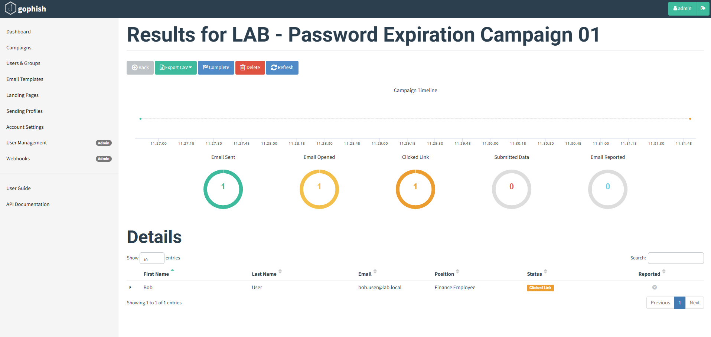
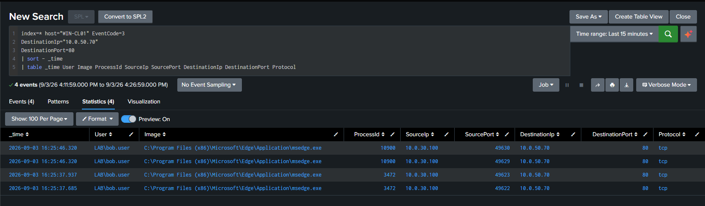
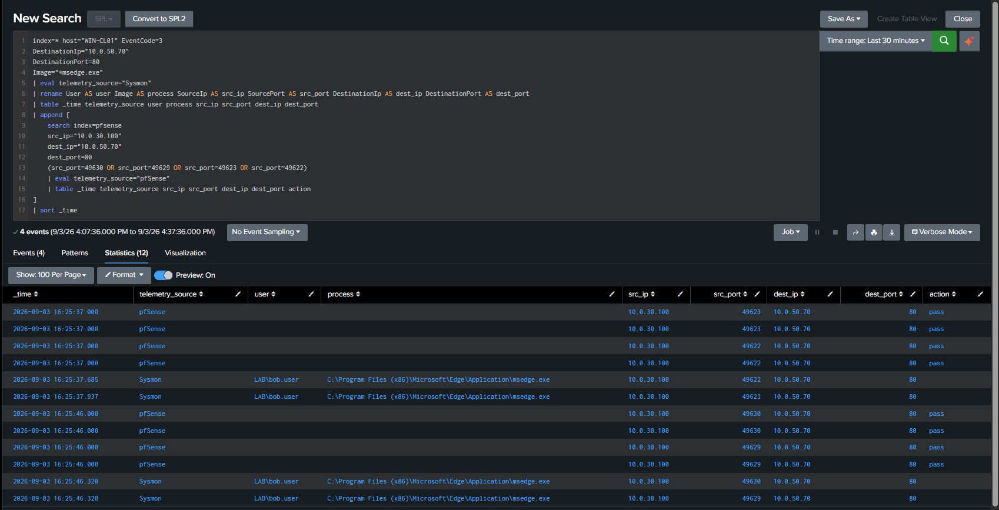

# DET-013 — Browser Connection to Known Phishing Infrastructure

## Overview

Detects Microsoft Edge network communication from the monitored lab endpoint to the known internal GoPhish server at `10.0.50.70:80`. The detection uses Sysmon Event ID 3 as its primary source and pfSense firewall telemetry as independent investigation evidence.

This is a deterministic, lab-specific detection. The Sysmon connection alone does not prove phishing, user deception, credential collection, or compromise. GoPhish campaign telemetry provides the scenario ground truth for the validated exercise.

## Detection Objective

Identify a monitored browser connecting to the known internal phishing-simulation destination and retain the user, process, source port, destination, and time context needed to correlate the endpoint event with network telemetry.

## Data Sources / Telemetry

### Primary telemetry

- Sysmon Event ID 3 — Network Connection from WIN-CL01.

### Supporting telemetry

- pfSense firewall events with extracted source/destination address and port fields.
- GoPhish campaign results as controlled-simulation ground truth.
- Postfix mail telemetry as supporting delivery evidence.

## Lab Architecture / Validated Scope

| Field | Validated value |
|---|---|
| Source endpoint | WIN-CL01 — `10.0.30.100` |
| Test user | `LAB\bob.user` |
| Validated process | `msedge.exe` |
| Known destination | PHISH-GOPHISH — `10.0.50.70` |
| Destination service | HTTP — TCP/80 |
| Validated source ports | `49622`, `49623`, `49629`, `49630` |
| Primary data source | Sysmon Event ID 3 |
| Supporting data source | pfSense firewall telemetry |

## MITRE ATT&CK

- T1566.002 — Phishing: Spearphishing Link

The mapping reflects the controlled GoPhish scenario in which the recipient followed a link from the delivered simulation email. Event ID 3 by itself records a network connection and does not establish that the connection originated from a phishing message. The scenario mapping depends on GoPhish ground truth and the documented end-to-end workflow.

## Detection Logic

Search WIN-CL01 Sysmon Event ID 3 telemetry for Microsoft Edge connecting to the known lab GoPhish address on TCP/80. Retain identity, process, source, destination, and protocol fields for analyst review.

## SPL

```spl
index=* host="WIN-CL01" EventCode=3
DestinationIp="10.0.50.70"
DestinationPort=80
Image="*\\msedge.exe"
| eval detection="Browser Connection to Known Phishing Infrastructure"
| eval severity="medium"
| table _time detection severity host User Image ProcessId
        SourceIp SourcePort DestinationIp DestinationPort Protocol
| sort - _time
```

This SPL is intentionally restricted to the validated lab destination. It is not a generic phishing-link detector.

## Controlled Simulation

GoPhish sent a benign password-expiration simulation through MAIL-SRV01 to the lab mailbox used by `LAB\bob.user`. Thunderbird displayed the message on WIN-CL01, and Microsoft Edge opened the internal GoPhish URL.

The landing page did not collect credentials. The final campaign result recorded:

- Email Sent: 1
- Email Opened: 1
- Clicked Link: 1
- Submitted Data: 0



*GoPhish provides application-level ground truth for the controlled sent, opened, and clicked sequence with zero submitted-data events.*

## Telemetry Coverage Troubleshooting

The initial click was confirmed by GoPhish and pfSense, but the expected Microsoft Edge Event ID 3 was absent from Sysmon telemetry.

The active configuration used selective collection:

```xml
<NetworkConnect onmatch="include">
```

Microsoft Edge was not covered by the include rules. The active configuration was identified and backed up, the XML was validated, and a targeted rule was added:

```xml
<Image condition="image">msedge.exe</Image>
```

After the configuration was reloaded and its effective state verified, a fresh link interaction generated the expected Event ID 3 records. Sysmon does not create network events retroactively.

> Absence of telemetry is not evidence of absence of activity.

This investigation validated sensor coverage rather than inferring user behavior from a silent endpoint source.

## Validation Result

The final Sysmon search returned four Microsoft Edge network events for the known destination, using source ports `49622`, `49623`, `49629`, and `49630`.



*Sysmon Event ID 3 provides the lab user, Edge process, source address and ports, and known GoPhish destination.*

## Endpoint and Network Correlation

The investigation correlated Sysmon and pfSense using:

```text
Source IP
+ Source Port
+ Destination IP
+ Destination Port
+ time proximity
```

The validation used this investigation search to present both sources in one time-ordered result:

```spl
index=* host="WIN-CL01" EventCode=3
DestinationIp="10.0.50.70"
DestinationPort=80
Image="*msedge.exe"
| eval telemetry_source="Sysmon"
| rename User as user Image as process SourceIp as src_ip SourcePort as src_port
         DestinationIp as dest_ip DestinationPort as dest_port
| table _time telemetry_source user process src_ip src_port dest_ip dest_port
| append [
    search index=pfsense
    src_ip="10.0.30.100"
    dest_ip="10.0.50.70"
    dest_port=80
    (src_port=49630 OR src_port=49629 OR src_port=49623 OR src_port=49622)
    | eval telemetry_source="pfSense"
    | table _time telemetry_source src_ip src_port dest_ip dest_port action
]
| sort _time
```



*The final investigation view aligns process-attributed Sysmon events with matching permitted pfSense flows.*

pfSense recorded more than one row for some source ports because the same traffic can be logged across interfaces or directions. Firewall event count is not a phishing click count.

## Detection Result

The final SPL criteria match the validated Microsoft Edge connections to `10.0.50.70:80`. No scheduled Splunk alert is evidenced or claimed for DET-013.

## False Positives

Expected matches can include:

- Authorized Purple Team and security-awareness simulations.
- Administrative testing of the GoPhish landing page.
- Browser health checks or deliberate connectivity tests to the lab service.
- Repeated browser requests for one user interaction.

Inside this lab, the destination is intentionally controlled. In a broader environment, a hard-coded private address has no general phishing meaning.

## Investigation Guidance

1. Confirm the source endpoint, user, browser path, destination, and time.
2. Determine whether an authorized GoPhish campaign was active.
3. Compare Sysmon and pfSense records using the complete network tuple and time proximity.
4. Review Postfix delivery telemetry and the GoPhish campaign timeline.
5. Do not infer click count from the number of browser or firewall events.
6. Determine whether submitted data was captured; the validated lab campaign recorded zero.
7. Review adjacent browser process, DNS, authentication, and endpoint telemetry before escalating.

## Tuning Recommendations

- Store known simulation destinations in a managed lookup rather than hard-coding them in multiple searches.
- Scope the detection to approved exercise windows or campaign identifiers where safe metadata is available.
- Add other validated browsers only after confirming their Sysmon coverage.
- Deduplicate repeated connections by source, destination, process, user, and a short time bucket when operational alerting is introduced.
- Keep the primary detection separate from the broader cross-source investigation search.
- If adapted to real phishing infrastructure, use threat intelligence, URL/proxy/DNS context, browser ancestry, rarity, and reputation rather than a lab IP alone.

## Known Limitations

- The query detects only the known lab destination `10.0.50.70:80` and `msedge.exe`.
- A different IP, port, browser, redirect, proxy, or encrypted path is outside its validated scope.
- Sysmon Event ID 3 must be enabled and the browser must match the active include rules.
- Network telemetry proves a connection, not the source email or user intent.
- Multiple HTTP connections can result from one browser interaction.
- pfSense can log one flow more than once across interfaces or directions.
- The MITRE mapping relies on the controlled GoPhish scenario, not on Event ID 3 alone.
- No credential collection, malware execution, compromise, or impact was demonstrated.
- No scheduled Splunk alert is evidenced or claimed.

## Security / Safety Note

This activity was authorized and performed only on lab-owned systems. The landing page did not collect credentials. Public evidence excludes GoPhish passwords, tracking identifiers, session tokens, private keys, credentials, and unrelated endpoint traffic.

## Related Documentation

- [MAIL-SRV01 and GoPhish Internal Phishing Simulation](../../docs/mail-srv01-gophish-phishing-simulation.md)
- [Splunk Detection Catalog](README.md)

## Detection Summary

| Field | Value |
|---|---|
| Detection ID | DET-013 |
| Detection name | Browser Connection to Known Phishing Infrastructure |
| Severity | Medium |
| Status | Validated / lab-specific |
| Primary data source | Sysmon Event ID 3 |
| Supporting data | pfSense and GoPhish campaign telemetry |
| Source endpoint | WIN-CL01 — `10.0.30.100` |
| Validated user | `LAB\bob.user` |
| Validated process | `msedge.exe` |
| Known destination | PHISH-GOPHISH — `10.0.50.70:80` |
| MITRE ATT&CK | T1566.002 — scenario-dependent |
| Scheduled alert | Not evidenced / not claimed |

## Status

**Validated / lab-specific** — the final Sysmon query returned Microsoft Edge connections to the known internal GoPhish destination, and matching pfSense flows independently confirmed the network activity. GoPhish supplied the phishing-simulation ground truth. This detection is not represented as production-ready.
