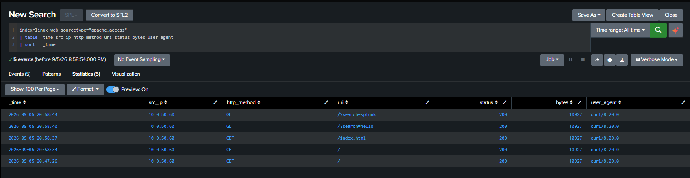
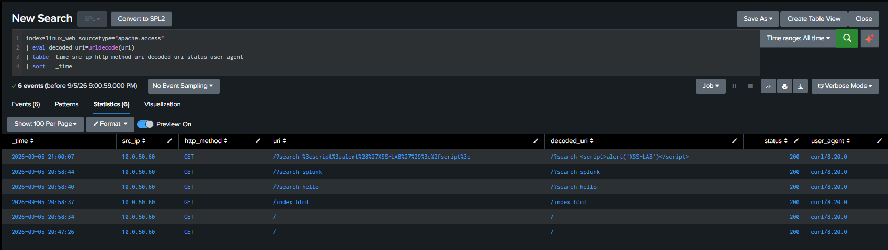
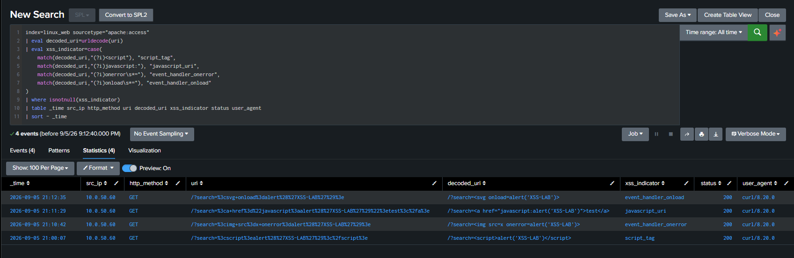
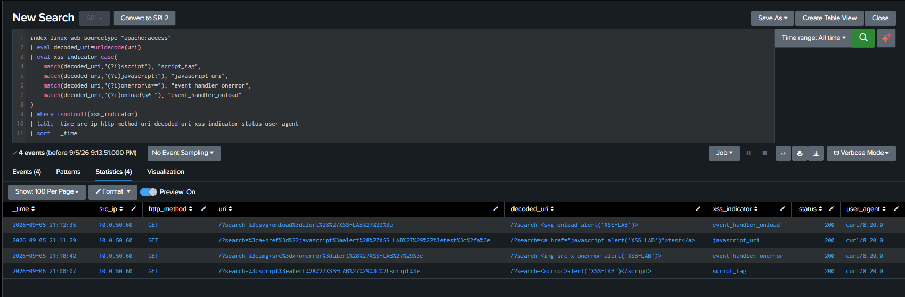
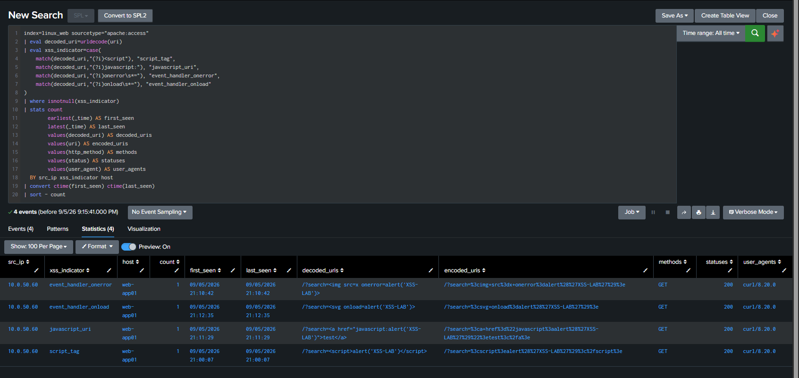
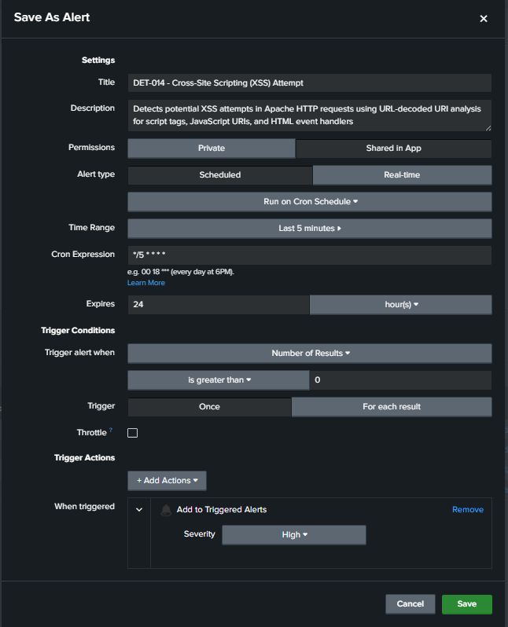
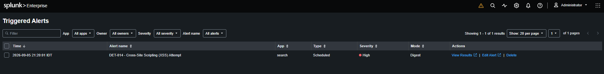

# DET-014 — Cross-Site Scripting (XSS) Attempt

## Overview

Detects selected Cross-Site Scripting (XSS)-like patterns in Apache HTTP requests by URL-decoding the extracted URI and classifying four validated indicator families.

The evidence validates detection of XSS-like HTTP requests in a controlled, authorized lab scenario. It does not prove JavaScript execution, successful XSS exploitation, session theft, application compromise, persistence, or impact.

## Detection Objective

Identify encoded or decoded XSS-like content in WEB-APP01 Apache access telemetry and retain the source, indicator, target, request, response, user-agent, count, and time context needed for analyst triage.

## Data Sources / Telemetry

| Field | Validated value |
|---|---|
| Data source | Apache HTTP access logs |
| Host | `web-app01` |
| Log path | `/var/log/apache2/access.log` |
| Index | `linux_web` |
| Sourcetype | `apache:access` |
| Transport | Splunk Universal Forwarder to Splunk Enterprise over TCP/9997 |

The detection depends on the search-time fields provided by the versioned [`web_lab`](../../splunk/web_lab/) Splunk app.

## Validated Lab Scope

| Field | Validated value |
|---|---|
| Test source | KALI-OPS01 — `10.0.50.60` |
| Destination | WEB-APP01 — `10.0.50.102` |
| Service | HTTP TCP/80 |
| HTTP method observed | `GET` |
| HTTP status observed | `200` |
| Splunk Enterprise | Rocky Linux 64-bit — `10.0.20.100` |

```text
KALI-OPS01
  -> HTTP TCP/80
WEB-APP01
  -> /var/log/apache2/access.log
  -> Splunk Universal Forwarder
  -> Splunk Enterprise 10.0.20.100 TCP/9997
  -> index=linux_web sourcetype=apache:access
  -> DET-014
  -> Triggered Alerts
```

## Field Extraction Dependency

The detection uses these extracted Apache fields:

- `src_ip`
- `http_method`
- `uri`
- `http_version`
- `status`
- `bytes`
- `referer`
- `user_agent`

The active configuration is documented in [WEB-APP01 Deployment and Apache Telemetry](../../docs/web-app01-deployment-and-telemetry.md). A before/after comparison preserves the troubleshooting history.


## Detection Logic

1. Search `linux_web` Apache access telemetry.
2. URL-decode the extracted `uri`.
3. Classify selected XSS-like patterns in the decoded URI.
4. Remove events without one of the selected indicators.
5. Aggregate by source IP, indicator, and target host.
6. Retain encoded and decoded URIs, method, status, user agent, count, and first/last seen.

## SPL

```spl
index=linux_web sourcetype="apache:access"
| eval decoded_uri=urldecode(uri)
| eval xss_indicator=case(
    match(decoded_uri,"(?i)<script"), "script_tag",
    match(decoded_uri,"(?i)javascript:"), "javascript_uri",
    match(decoded_uri,"(?i)onerror\s*="), "event_handler_onerror",
    match(decoded_uri,"(?i)onload\s*="), "event_handler_onload"
)
| where isnotnull(xss_indicator)
| stats count
        earliest(_time) AS first_seen
        latest(_time) AS last_seen
        values(decoded_uri) AS decoded_uris
        values(uri) AS encoded_uris
        values(http_method) AS methods
        values(status) AS statuses
        values(user_agent) AS user_agents
  BY src_ip xss_indicator host
| convert ctime(first_seen) ctime(last_seen)
| sort - count
```

## Controlled Validation

Normal HTTP requests from KALI-OPS01 established that WEB-APP01 telemetry and the extracted fields were available before the XSS-like test cases were evaluated.



The URI-decoding check showed that percent-encoded request content was normalized into `decoded_uri` for matching.



Four controlled indicator families were then generated and classified:

- `script_tag`
- `javascript_uri`
- `event_handler_onerror`
- `event_handler_onload`



Benign lookalike searches containing terms such as `javascript`, `script`, `onerror`, and `onload` were also generated. The result set remained limited to the four XSS-like attempts in the test set.



## Final Detection Result

The exact final SPL returned one aggregated result for each of the four validated indicator families from `10.0.50.60` against `web-app01`.



The result establishes that selected XSS-like request strings were detected in Apache telemetry. An HTTP `200` response does not establish that the application executed the supplied content or that exploitation succeeded.

## Alert Configuration

| Setting | Validated value |
|---|---|
| Alert name | `DET-014 - Cross-Site Scripting (XSS) Attempt` |
| Type | Scheduled |
| Cron | `*/5 * * * *` |
| Search window | Last 5 minutes |
| Condition | Number of Results > 0 |
| Trigger | Once |
| Action | Add to Triggered Alerts |
| Severity | High |



The scheduled High-severity alert subsequently appeared in Triggered Alerts.



## MITRE ATT&CK

- Tactic: Initial Access
- Technique: T1190 — Exploit Public-Facing Application
- Mapping: Scenario-dependent

The mapping represents the controlled web-attack scenario. WEB-APP01 is an internal lab target, and the evidence validates detection of XSS-like requests rather than successful exploitation of a public-facing application.

## False Positives

Potential matches can include:

- Authorized security testing and vulnerability scanning.
- QA or application testing that intentionally submits HTML or JavaScript-like strings.
- Documentation examples carried in request parameters.
- Applications that legitimately accept HTML or script-like input.

## Investigation Guidance

1. Review `src_ip`, `host`, encoded and decoded URIs, and `xss_indicator`.
2. Confirm the request method, HTTP status, user agent, count, and first/last seen.
3. Review related requests from the same source and surrounding application and server logs.
4. Determine whether the activity belongs to approved testing or QA.
5. Inspect application behavior separately before concluding that code executed or exploitation succeeded.
6. Correlate relevant endpoint, firewall, proxy, WAF, and IDS telemetry where available.

## Tuning Recommendations

- Scope exclusions narrowly to approved scanners, sources, applications, and testing windows.
- Extend pattern coverage only after validating additional encodings or obfuscation families.
- Preserve both encoded and decoded URI values for triage.
- Consider application route, response size, recurrence, and source behavior when prioritizing results.
- Keep detection of suspicious input separate from proof of application execution or impact.

## Known Limitations

- The logic covers four selected patterns and does not represent every XSS encoding, obfuscation, or payload family.
- Apache access logs show HTTP requests and responses, not browser-side JavaScript execution.
- HTTP status `200` does not prove successful exploitation.
- Legitimate testing or applications that accept HTML-like input can match.
- Search-time detection depends on the `web_lab` extraction and the availability of the required fields.
- T1190 is a scenario-dependent mapping; WEB-APP01 is not claimed to be Internet-facing.
- Suricata alert ingestion into Splunk remains pending and is not part of this validation.

## Security / Safety Note

The activity was authorized and performed only on lab-owned systems. Public evidence contains no credentials, tokens, cookies, session identifiers, private keys, or Internet-facing service details.

The separate [network-isolation validation](../../docs/evidence/WEB-APP01-network-isolation-validation.txt) documents the final infrastructure state. It is not DET-014 detection evidence.

## Related Documentation

- [WEB-APP01 Deployment and Apache Telemetry](../../docs/web-app01-deployment-and-telemetry.md)
- [Splunk Detection Catalog](README.md)

## Detection Summary

| Field | Value |
|---|---|
| Detection ID | DET-014 |
| Detection name | Cross-Site Scripting (XSS) Attempt |
| Severity | High |
| Status | Validated / Lab-specific |
| Data source | Apache HTTP access logs |
| Index / sourcetype | `linux_web` / `apache:access` |
| Test source | KALI-OPS01 — `10.0.50.60` |
| Destination | WEB-APP01 — `10.0.50.102:80` |
| MITRE ATT&CK | T1190 — Scenario-dependent |
| Scheduled alert | Validated |

## Status

**Validated / Lab-specific** — the final SPL detected and classified all four controlled XSS-like HTTP request families, and the scheduled High-severity alert appeared in Triggered Alerts. Successful XSS exploitation, JavaScript execution, compromise, persistence, and impact were not demonstrated. This detection is not represented as production-ready.
