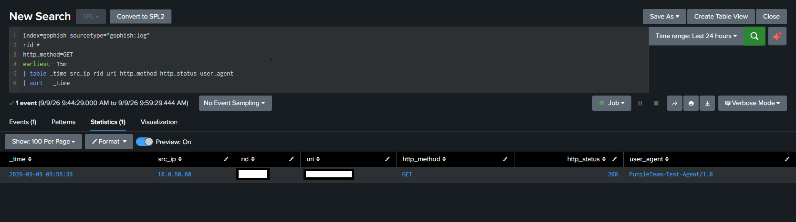
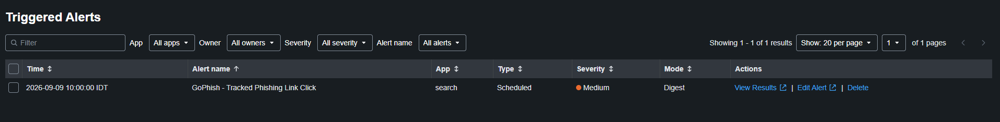
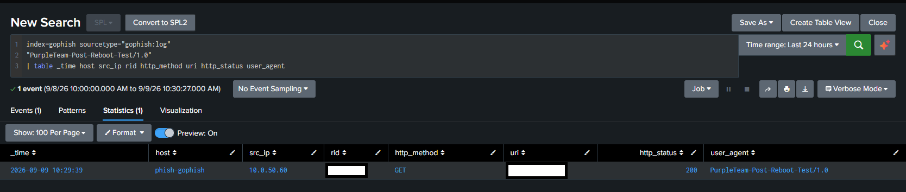

# DET-015 — GoPhish Tracked Phishing Link Click

## Overview

Detects GoPhish application-log events for tracked HTTP GET requests containing a parsed GoPhish RID. DET-015 provides application-layer visibility and is distinct from [DET-013](DET-013-browser-connection-to-known-phishing-infrastructure.md), which observes browser communication through endpoint and network telemetry.

A match does not by itself prove successful phishing, credential submission, compromise, malicious intent, or one unique human.

## Detection Objective

Identify tracked GoPhish HTTP GET activity and retain source IP, tracking identifier, URL, response status, user agent, count, and first/last observation time for analyst review.

## Data Sources / Telemetry

| Field | Validated value |
|---|---|
| Data source | GoPhish application log |
| Host | `phish-gophish` |
| Log path | `/var/log/gophish/gophish.log` |
| Index / sourcetype | `gophish` / `gophish:log` |
| Transport | Splunk Universal Forwarder to Splunk Enterprise over TCP/9997 |

## Validated Lab Scope

| Field | Validated value |
|---|---|
| GoPhish host | PHISH-GOPHISH — `10.0.50.70` |
| Validated test source | KALI-OPS01 — `10.0.50.60` |
| Listener / method | HTTP TCP/80 / `GET` |
| HTTP status observed | `200` |
| Splunk Enterprise | Rocky Linux 64-bit — `10.0.20.100:9997` |

```text
Tracked HTTP GET
  -> PHISH-GOPHISH TCP/80
  -> /var/log/gophish/gophish.log
  -> Splunk Universal Forwarder
  -> Splunk Enterprise 10.0.20.100 TCP/9997
  -> index=gophish sourcetype=gophish:log
  -> DET-015 -> Triggered Alerts
```

## Field Extraction Dependency

DET-015 depends on the validated `src_ip`, `http_method`, `uri`, `rid`, `http_version`, `http_status`, `bytes`, and `user_agent` fields. Ingestion and extraction are documented in [PHISH-GOPHISH Deployment and Telemetry](../../docs/phish-gophish-deployment-and-telemetry.md).

## Detection Logic

1. Search `gophish:log` telemetry in `index=gophish`.
2. Require a parsed RID and HTTP GET.
3. Aggregate by source IP and RID.
4. Retain first/last observation time.
5. Preserve URL, HTTP status, user-agent, and count context.

## SPL

```spl
index=gophish sourcetype="gophish:log"
rid=*
http_method=GET
| stats count AS click_count
        min(_time) AS firstTime
        max(_time) AS lastTime
        values(uri) AS url
        values(http_status) AS http_status
        values(user_agent) AS user_agent
  BY src_ip rid
| convert ctime(firstTime) ctime(lastTime)
| sort - lastTime
```

The expression `rid=*` is part of the validated logic and does not expose a tracking value.

## Validation Result

The final search returned a tracked HTTP GET with parsed source, RID, URI, status, and user-agent context.



The RID and URI were intentionally redacted before publication and must not be reconstructed.

## Alert Configuration

| Setting | Validated value |
|---|---|
| Alert name | `GoPhish - Tracked Phishing Link Click` |
| Type | Scheduled |
| Cron | `*/5 * * * *` |
| Search window | Last 6 minutes |
| Condition | Number of Results > 0 |
| Trigger mode | Once / Digest |
| Severity | Medium |
| Action | Add to Triggered Alerts |

The alert fired successfully and appeared in Triggered Alerts.



## Reboot Persistence Validation

After reboot, GoPhish and Splunk Universal Forwarder returned automatically, the listeners returned, startup entries appeared, and a new request from `10.0.50.60` reached Splunk with working extraction.



The result shows `host=phish-gophish`, `src_ip=10.0.50.60`, `http_method=GET`, `http_status=200`, and `user_agent=PurpleTeam-Post-Reboot-Test/1.0`; RID and URI are redacted.

## Detection Semantics

A match proves that GoPhish telemetry recorded an HTTP GET containing a parsed RID and that its source IP and HTTP context were observable. It does not by itself prove successful phishing, Initial Access, credential submission or theft, compromise, malicious user intent, or one unique human.

## MITRE ATT&CK

- Tactic: Initial Access
- Technique: T1566.002 — Phishing: Spearphishing Link
- Mapping: Scenario-dependent

The mapping reflects the controlled phishing-link scenario. DET-015 observes the tracked link interaction at the application layer; it does not alone prove that the request came from a deceptive message or that Initial Access succeeded. Scenario context is required.

## False Positives

- Synthetic validation requests.
- Authorized Purple Team or awareness exercises.
- Administrative testing of a tracked URL.
- Repeated requests generated by one browser interaction.
- Automated link inspection or security tooling.

## Investigation Guidance

1. Review `src_ip`, RID, URL, status, user agent, count, and first/last time.
2. Confirm whether an authorized campaign or validation was active.
3. Correlate with protected campaign/recipient metadata and MAIL-SRV01 delivery telemetry.
4. Use Sysmon and pfSense when endpoint and network attribution are required.
5. Do not interpret application event count as unique-human count.
6. Determine separately whether data submission or compromise occurred.

## Tuning Recommendations

- Exclude known test user agents or source IPs only after preserving a validation path.
- Consider first-seen logic per `src_ip` and RID.
- Correlate with protected campaign and recipient metadata.
- Account for repeated browser requests before interpreting `click_count`.

These are future options and are not implemented in the validated SPL.

## Known Limitations

- Synthetic validation requests and browser activity both match the current baseline.
- RID establishes tracked-request context, not identity or intent.
- Repeated requests can share one RID and need not represent different people.
- Campaign and recipient metadata are not joined by the current SPL.
- T1566.002 is scenario-dependent.
- No credential collection, successful phishing, compromise, persistence, or impact is demonstrated.
- The lab-specific detection is not represented as production-ready.

## Security / Safety Note

Public evidence excludes real RID values, passwords, credentials, authentication/session data, cookies, tokens, private keys, database contents, and unsanitized configuration. The field name `rid` and safe expression `rid=*` remain.

## Related Documentation

- [PHISH-GOPHISH Deployment and Telemetry](../../docs/phish-gophish-deployment-and-telemetry.md)
- [MAIL-SRV01 and GoPhish Internal Phishing Simulation](../../docs/mail-srv01-gophish-phishing-simulation.md)
- [DET-013 — Browser Connection to Known Phishing Infrastructure](DET-013-browser-connection-to-known-phishing-infrastructure.md)
- [Splunk Detection Catalog](README.md)

## Detection Summary

| Field | Value |
|---|---|
| Detection ID | DET-015 |
| Detection name | GoPhish Tracked Phishing Link Click |
| Severity | Medium |
| Status | Validated / Lab-specific |
| Data source | GoPhish application log |
| Index / sourcetype | `gophish` / `gophish:log` |
| Validated source | KALI-OPS01 — `10.0.50.60` |
| Destination | PHISH-GOPHISH — `10.0.50.70:80` |
| MITRE ATT&CK | T1566.002 — Scenario-dependent |
| Scheduled alert | Validated |

## Status

**Validated / Lab-specific** — the final SPL matched tracked GoPhish HTTP GET telemetry, the scheduled Medium-severity alert appeared in Triggered Alerts, and ingestion and extraction remained functional after reboot. The result does not prove successful phishing, credential submission, compromise, or Initial Access.
