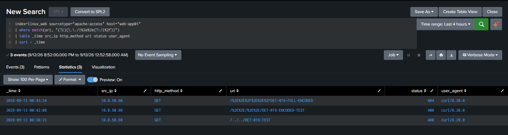
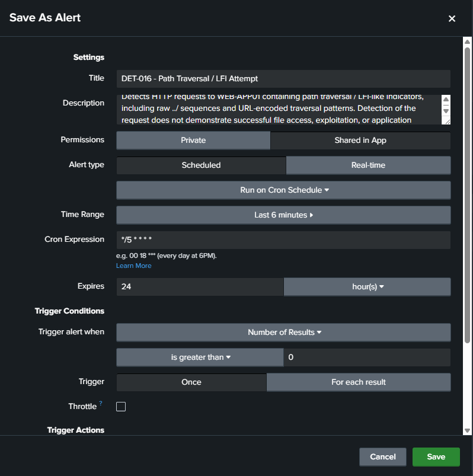
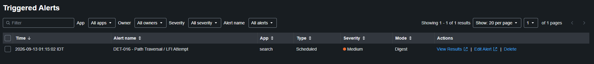
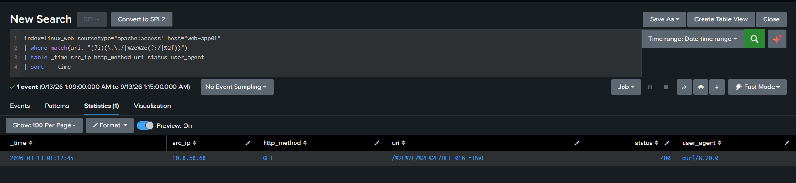

# DET-016 — Path Traversal / LFI Attempt

## Overview

Detects Apache HTTP requests to WEB-APP01 whose extracted URI contains a literal or percent-encoded parent-directory traversal sequence.

The evidence validates detection of path traversal / Local File Inclusion (LFI)-like request indicators in a controlled, authorized lab scenario. Detection of the request does not demonstrate successful file access, exploitation, or application compromise.

## Detection Objective

Identify path traversal / LFI-like request patterns in WEB-APP01 Apache access telemetry while retaining the source, method, URI, response status, and user-agent context required for analyst triage.

## Data Source and Telemetry Flow

| Field | Validated value |
|---|---|
| Data source | Apache HTTP access logs |
| Host | `web-app01` |
| Log path | `/var/log/apache2/access.log` |
| Index | `linux_web` |
| Sourcetype | `apache:access` |
| Transport | Splunk Universal Forwarder to Splunk Enterprise |

```text
KALI-OPS01
  -> HTTP
WEB-APP01
  -> /var/log/apache2/access.log
  -> Splunk Universal Forwarder
  -> Splunk Enterprise
  -> index=linux_web sourcetype=apache:access
  -> web_lab search-time field extraction
  -> scheduled alert
```

## Search-Time Field Extraction

The versioned [`web_lab`](../../splunk/web_lab/) Splunk app provides the fields used by DET-016 for sourcetype `apache:access`.

`props.conf`:

```ini
[apache:access]
REPORT-apache-access-fields = apache_access_fields
```

`transforms.conf`:

```ini
[apache_access_fields]
REGEX = ^(\S+)\s+\S+\s+\S+\s+\[[^\]]+\]\s+"(\S+)\s+(\S+)\s+(HTTP/\d\.\d)"\s+(\d{3})\s+(\S+)\s+"([^"]*)"\s+"([^"]*)"
FORMAT = src_ip::$1 http_method::$2 uri::$3 http_version::$4 status::$5 bytes::$6 referer::$7 user_agent::$8
```

The app metadata exports both configuration objects:

```ini
[props]
export = system

[transforms]
export = system
```

Splunk `btool` validation confirmed that the configuration was loaded. Functional searches confirmed the extracted `src_ip`, `http_method`, `uri`, `http_version`, `status`, `bytes`, `referer`, and `user_agent` fields.

The WEB-APP01 Universal Forwarder input is:

```ini
[monitor:///var/log/apache2/access.log]
disabled = false
index = linux_web
sourcetype = apache:access
```

The Universal Forwarder was also validated to start automatically after boot.

## Detection Logic

1. Scope events to WEB-APP01 Apache access telemetry.
2. Match a literal `../` sequence or a percent-encoded parent-directory sequence in `uri`, case-insensitively.
3. Present the request and response context in reverse chronological order.

The detection does not require a particular response status, source IP, user agent, test marker, or successful file retrieval.

## Final Production SPL

```spl
index=linux_web sourcetype="apache:access" host="web-app01"
| where match(uri, "(?i)(\.\./|%2e%2e(?:/|%2f))")
| table _time src_ip http_method uri status user_agent
| sort - _time
```

## Positive Validation

Three controlled request variants were generated from KALI-OPS01 and recorded by WEB-APP01:

| Test | Request indicator | Observed status |
|---|---|---|
| Literal traversal | `/../../DET-016-TEST` | `400` |
| Encoded traversal | `/%2E%2E/%2E%2E/DET-016-ENCODED-TEST` | `400` |
| Fully encoded separators | `/%2E%2E%2F%2E%2E%2FDET-016-FULL-ENCODED` | `404` |

All three controlled positive cases matched the detection.



## Negative Validation

Three normal requests were generated from the same KALI-OPS01 source. None matched the final detection logic. This confirmed that the result was driven by the URI pattern rather than the source system alone.

## Alert Configuration

| Setting | Validated value |
|---|---|
| Alert name | `DET-016 - Path Traversal / LFI Attempt` |
| Type | Scheduled |
| Cron | `*/5 * * * *` |
| Search window | Last 6 minutes |
| Condition | Number of Results > 0 |
| Trigger mode | Once / Digest |
| Severity | Medium |
| Sharing | App |
| State | Enabled |



## Final Alert Validation

A final controlled request containing `/%2E%2E/%2E%2E/DET-016-FINAL` generated a matching Apache event with these validated fields:

- `src_ip=10.0.50.60`
- `http_method=GET`
- `status=400`
- `user_agent=curl/8.20.0`

The scheduled alert triggered successfully.





## Interpretation

DET-016 detects HTTP requests containing path traversal / LFI-like indicators. Detection of the request does not demonstrate successful file access, exploitation, or application compromise.

The observed HTTP `400` and `404` responses document how the server handled the controlled requests. They are not proof of file disclosure, successful LFI, code execution, initial access, or compromise. No access to `/etc/passwd` or another sensitive file is claimed.

## MITRE ATT&CK

- Tactic: Initial Access
- Technique: [T1190 — Exploit Public-Facing Application](https://attack.mitre.org/techniques/T1190/)
- Mapping: Scenario-dependent

The mapping represents a controlled web-application attack scenario. WEB-APP01 is an internal lab target, and the evidence validates suspicious request detection rather than exploitation of an Internet-facing application or successful initial access.

## Potential False Positives

- Authorized vulnerability scanners and penetration tests.
- Application security or QA testing.
- URLs that legitimately contain traversal-like strings as data.
- Security products or monitoring probes that test server handling.
- Encoded application parameters whose decoded meaning is benign.

## Known Limitations

- The expression covers the validated literal and percent-encoded traversal forms, not every encoding, double-encoding, normalization, separator, or obfuscation technique.
- Apache access logs show requests and response metadata, not whether a target file was opened or returned.
- The rule does not inspect response bodies or application-internal file operations.
- Search-time detection depends on the `web_lab` extraction and availability of the required fields.
- T1190 is scenario-dependent because WEB-APP01 is not claimed to be public-facing.
- A matching request does not establish exploitation, compromise, persistence, or impact.

## Triage Guidance

1. Review `src_ip`, `http_method`, `uri`, `status`, `user_agent`, and event time.
2. Decode and normalize the URI safely to understand the intended path without replaying it against a production system.
3. Check adjacent requests from the same source for reconnaissance, encoding changes, and repeated targets.
4. Confirm whether the source, user agent, and time window belong to authorized testing.
5. Correlate Apache error logs, application logs, WAF/IDS events, endpoint telemetry, and file-access auditing where available.
6. Treat file access or compromise as a separate conclusion requiring additional evidence.

## Evidence

1. [Positive detection results](../../screenshots/DET-016-path-traversal-detection-results.png)
2. [Scheduled alert configuration](../../screenshots/DET-016-path-traversal-alert-configuration.png)
3. [Triggered alert validation](../../screenshots/DET-016-final-alert-trigger-validation.png)
4. [Triggered alert results](../../screenshots/DET-016-final-alert-trigger-results.png)

## Related Documentation

- [WEB-APP01 Deployment and Apache Telemetry](../../docs/web-app01-deployment-and-telemetry.md)
- [Splunk `web_lab` configuration](../../splunk/web_lab/)
- [Splunk Detection Catalog](README.md)

## Detection Summary

| Field | Value |
|---|---|
| Detection ID | DET-016 |
| Detection name | Path Traversal / LFI Attempt |
| Severity | Medium |
| Status | Validated / Lab-specific |
| Data source | Apache HTTP access logs |
| Index / sourcetype | `linux_web` / `apache:access` |
| Test source | KALI-OPS01 — `10.0.50.60` |
| Destination | WEB-APP01 — `10.0.50.102` |
| MITRE ATT&CK | T1190 — Scenario-dependent |
| Scheduled alert | Validated |

## Status

**Validated / Lab-specific** — all three controlled positive cases matched, all three normal comparison requests were excluded, and the scheduled Medium-severity alert fired during final validation. Successful LFI, file access, exploitation, compromise, and initial access were not demonstrated. This detection is not represented as production-ready.
