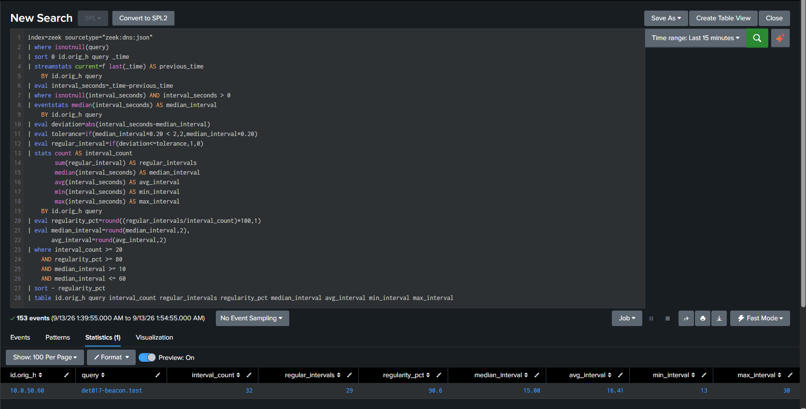
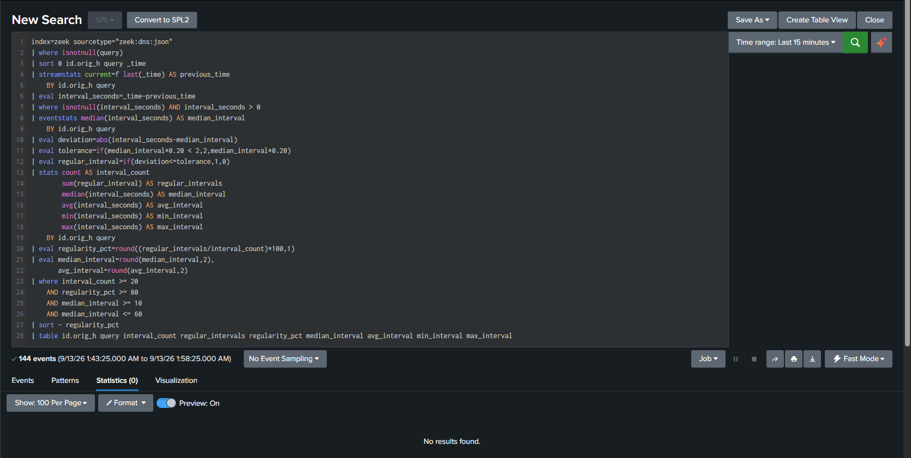
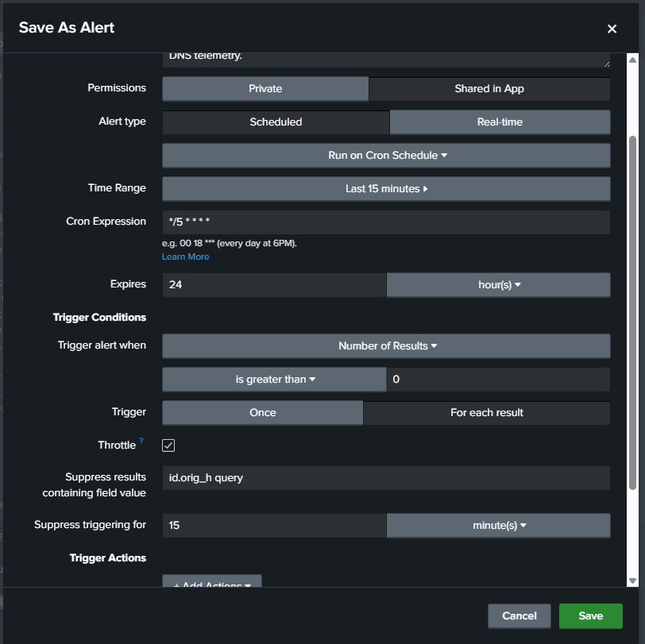
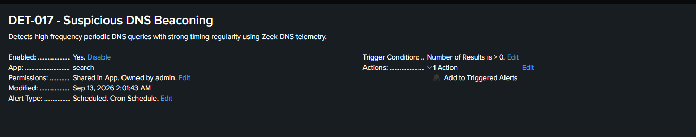
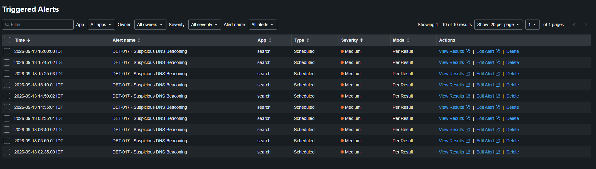
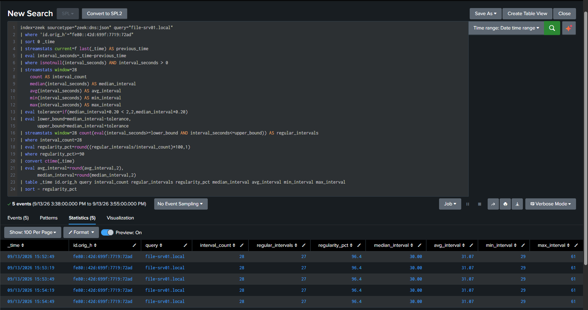
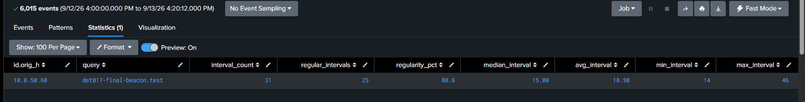

# DET-017 — Suspicious DNS Beaconing

## Overview

Detects high-frequency periodic DNS queries from the same source host to the same fully qualified domain name (FQDN) by measuring timing regularity in Zeek DNS JSON telemetry.

The detection is behavioral. It does not depend on a known-malicious domain or other indicator of compromise, and a matching result does not by itself prove command-and-control activity, malware execution, data exfiltration, or compromise.

## Detection Objective

Identify source-and-domain pairs that produce at least 20 positive query intervals, maintain at least 80% timing regularity, and have a median interval between 10 and 60 seconds. Preserve the interval statistics required for analyst review.

## Data Source

| Field | Validated value |
|---|---|
| Data source | Zeek DNS JSON |
| Splunk index | `zeek` |
| Sourcetype | `zeek:dns:json` |
| Source field | `id.orig_h` |
| Domain field | `query` |
| Validation source | KALI-OPS01 — `10.0.50.60` |
| Final controlled query | `det017-final-beacon.test` |

The telemetry is produced by the passive ZEEK01 sensor and forwarded to Splunk Enterprise. The limitations of that passive collection path are documented in [ZEEK01 Deployment and Telemetry](../../docs/zeek01-deployment-and-telemetry.md).

## Detection Logic

1. Select Zeek DNS events with a populated `query` field.
2. Normalize the query to lowercase for namespace filtering.
3. Exclude `.local` and `.arpa` namespaces, with or without a trailing dot.
4. Sort events for each exact `id.orig_h` and `query` pair.
5. Calculate the positive interval between successive queries.
6. Use the median interval as the timing baseline.
7. Treat an interval as regular when its deviation is within 20% of the median, with a minimum tolerance of two seconds.
8. Aggregate interval count and timing statistics by source and exact FQDN.
9. Return pairs with at least 20 intervals, at least 80% regularity, and a median interval from 10 through 60 seconds.

## Final Production SPL

```spl
index=zeek sourcetype="zeek:dns:json"
| where isnotnull(query)
| eval query_lower=lower(query)
| where NOT (
    like(query_lower,"%.local")
    OR like(query_lower,"%.local.")
    OR like(query_lower,"%.arpa")
    OR like(query_lower,"%.arpa.")
)
| sort 0 id.orig_h query _time
| streamstats current=f last(_time) AS previous_time
    BY id.orig_h query
| eval interval_seconds=_time-previous_time
| where isnotnull(interval_seconds) AND interval_seconds > 0
| eventstats median(interval_seconds) AS median_interval
    BY id.orig_h query
| eval deviation=abs(interval_seconds-median_interval)
| eval tolerance=if(median_interval*0.20 < 2,2,median_interval*0.20)
| eval regular_interval=if(deviation<=tolerance,1,0)
| stats count AS interval_count
        sum(regular_interval) AS regular_intervals
        median(interval_seconds) AS median_interval
        avg(interval_seconds) AS avg_interval
        min(interval_seconds) AS min_interval
        max(interval_seconds) AS max_interval
    BY id.orig_h query
| eval regularity_pct=round((regular_intervals/interval_count)*100,1)
| eval median_interval=round(median_interval,2),
       avg_interval=round(avg_interval,2)
| where interval_count >= 20
    AND regularity_pct >= 80
    AND median_interval >= 10
    AND median_interval <= 60
| sort - regularity_pct
| table id.orig_h query interval_count regular_intervals regularity_pct median_interval avg_interval min_interval max_interval
```

## Tuning and Validation Process

1. An initial baseline showed legitimate periodic DNS traffic.
2. A controlled DNS beacon from KALI-OPS01 validated the timing-based approach.
3. The scheduled alert successfully triggered on `det017-final-beacon.test`.
4. A real false positive was later observed for `file-srv01.local`, with `96.4%` regularity and a 30-second median interval.
5. The production search was tuned to exclude `.local` and `.arpa` namespaces.
6. A 24-hour regression test after tuning returned only the controlled True Positive and removed the observed `.local` false positive.

## Final Scheduled-Alert Validation

The final controlled query produced the following scheduled-alert result:

| Field | Validated result |
|---|---|
| `id.orig_h` | `10.0.50.60` |
| `query` | `det017-final-beacon.test` |
| `interval_count` | `31` |
| `regular_intervals` | `25` |
| `regularity_pct` | `80.6` |
| `median_interval` | `15.00` seconds |
| `avg_interval` | `18.90` seconds |
| `min_interval` | `14` seconds |
| `max_interval` | `46` seconds |

## Alert Configuration

| Setting | Validated value |
|---|---|
| Alert name | `DET-017 - Suspicious DNS Beaconing` |
| Type | Scheduled |
| Cron | `*/5 * * * *` |
| Search window | Last 15 minutes |
| Trigger condition | Number of Results > 0 |
| Trigger mode | For each result |
| Suppression fields | `id.orig_h`, `query` |
| Suppression duration | 15 minutes |
| Severity | Medium |
| Action | Add to Triggered Alerts |

## MITRE ATT&CK

- Tactic: Command and Control
- Technique: [T1071.004 — Application Layer Protocol: DNS](https://attack.mitre.org/techniques/T1071/004/)

The mapping describes behavior that may be consistent with DNS-based command-and-control communication. DET-017 measures query periodicity only; it does not establish that DNS carried C2 instructions or data.

## Analyst Interpretation

A result means that one source repeatedly queried one exact FQDN with timing that met the lab thresholds. Analysts should treat this as a behavioral lead and determine whether the source, domain, query volume, timing, and surrounding activity are expected.

The domain does not need to be a known IOC. Conversely, periodicity does not make a domain malicious, and a controlled validation result does not demonstrate compromise.

## Potential False Positives

- Monitoring, health-check, and service-discovery clients.
- Software update, synchronization, and telemetry agents.
- DNS-based availability checks.
- Authorized security testing and lab simulations.
- Applications that poll a stable service name at fixed intervals.
- Legitimate periodic traffic outside the excluded local namespaces.

## Triage Guidance

1. Review `id.orig_h`, `query`, the interval counts, regularity percentage, and timing distribution.
2. Confirm asset identity, ownership, and whether the application normally performs periodic lookups.
3. Review surrounding Zeek DNS activity for changing query names, unusual record types, failures, or bursts.
4. Correlate Zeek connection telemetry, endpoint process/network events, proxy or firewall logs, and threat-intelligence context where available.
5. Determine whether the activity belongs to an approved test or scheduled service.
6. Escalate only when the periodic behavior and correlated evidence support suspicious communication.

## Known Limitations

- Periodic DNS is not inherently malicious.
- `.local` and `.arpa` are excluded to reduce known local-service and discovery false positives.
- The detection groups by exact FQDN using `id.orig_h` and `query`.
- It does not yet normalize changing or random subdomains to a registered or parent domain.
- Packet loss, resolver behavior, caching, or sensor visibility can affect interval regularity.
- Thresholds are lab-tuned and should be baselined again before use in another environment.
- ZEEK01 has partial passive visibility on VMnet6; Internet return traffic is not consistently visible.
- The detection does not inspect DNS payload semantics or prove a specific C2 protocol.

## Evidence

### 1. Production-Window True Positive Validation

The earlier production-window validation detected the controlled DNS beacon from KALI-OPS01 to `det017-beacon.test` in a 15-minute search window. This screenshot predates the later `det017-final-beacon.test` validation and shows the following result:

| Field | Visible result |
|---|---|
| `id.orig_h` | `10.0.50.60` |
| `query` | `det017-beacon.test` |
| `interval_count` | `32` |
| `regular_intervals` | `29` |
| `regularity_pct` | `90.6%` |
| `median_interval` | `15.00` seconds |
| `avg_interval` | `16.41` seconds |
| `min_interval` | `13` seconds |
| `max_interval` | `30` seconds |



### 2. Negative Validation

Normal DNS telemetry remained available while the DET-017 search returned zero matching results, demonstrating that ordinary DNS presence alone did not satisfy the detection thresholds.



### 3. Scheduled Alert Configuration

The saved search was configured as a scheduled Medium-severity alert using the documented five-minute schedule, 15-minute search window, per-result triggering, and source/query suppression.



### 4. Saved and Enabled Alert

The Splunk alert listing confirms that DET-017 was saved and enabled.



### 5. Triggered Alerts Validation

The controlled beacon caused the scheduled DET-017 alert to appear in Splunk Triggered Alerts.



### 6. False-Positive Discovery

Legitimate periodic DNS activity for `file-srv01.local` satisfied the original timing thresholds with `96.4%` regularity and a 30-second median interval. This observed false positive led to the explicit `.local` and `.arpa` namespace exclusions in the final production search.

The false-positive evidence screenshot shows five overlapping 28-interval windows for this source and query, each with the following statistics:

| Field | Visible result |
|---|---|
| `id.orig_h` | `fe80::42d:699f:7719:72ad` |
| `query` | `file-srv01.local` |
| `interval_count` | `28` |
| `regular_intervals` | `27` |
| `regularity_pct` | `96.4%` |
| `median_interval` | `30.00` seconds |
| `avg_interval` | `31.07` seconds |
| `min_interval` | `29` seconds |
| `max_interval` | `61` seconds |



### 7. Final Tuned 24-Hour Regression Search

The final 24-hour regression search retained `10.0.50.60 -> det017-final-beacon.test` while removing the observed `.local` false positive after the `.local` and `.arpa` exclusions were applied.



## Related Documentation

- [ZEEK01 Deployment and Telemetry](../../docs/zeek01-deployment-and-telemetry.md)
- [DET-018 — Beaconing / C2 Communication](DET-018-beaconing-c2-communication.md)
- [Splunk Detection Catalog](README.md)

## Detection Summary

| Field | Value |
|---|---|
| Detection ID | DET-017 |
| Detection name | Suspicious DNS Beaconing |
| Severity | Medium |
| Status | Validated |
| Data source | Zeek DNS JSON |
| Index / sourcetype | `zeek` / `zeek:dns:json` |
| Validation source | KALI-OPS01 — `10.0.50.60` |
| MITRE ATT&CK | T1071.004 — Application Layer Protocol: DNS |
| Scheduled alert | Validated |

## Status

**Validated** — the timing-based approach detected the controlled DNS beacon, the scheduled alert triggered successfully, the observed `.local` false positive was removed by production tuning, and the 24-hour regression test returned only the controlled True Positive. The result does not by itself prove C2 activity, malware execution, data exfiltration, or compromise. This detection is not represented as production-ready.
