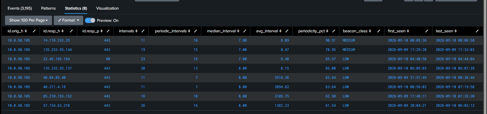
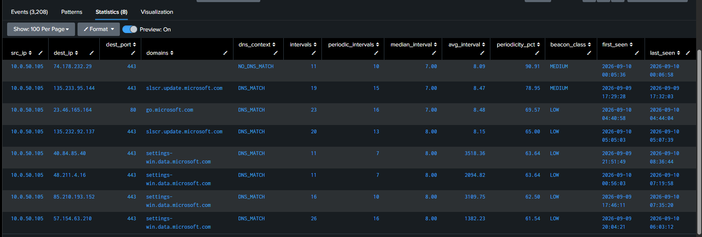
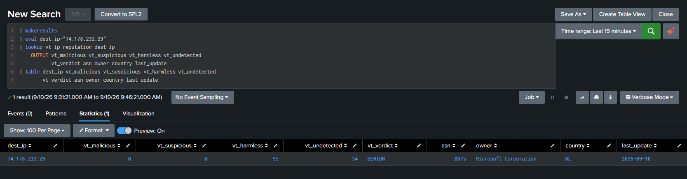
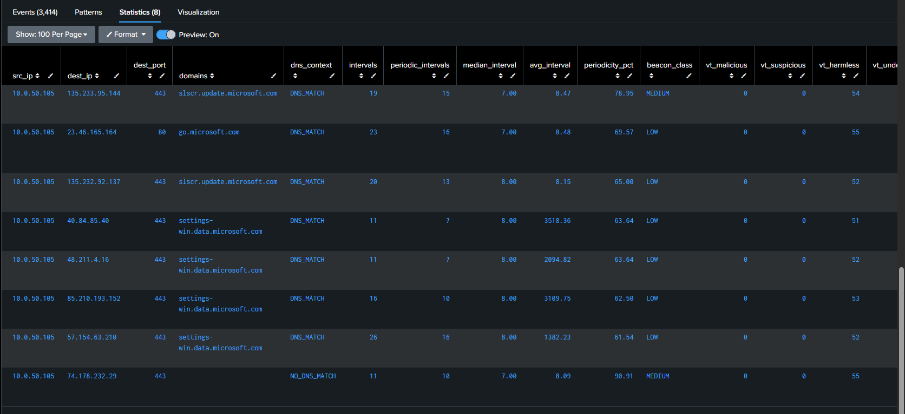
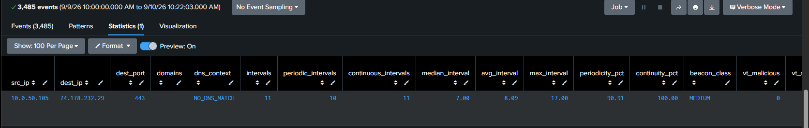
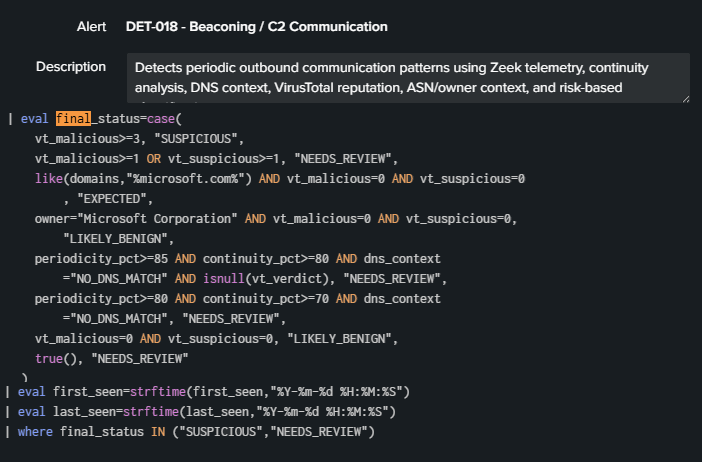

# DET-018 — Beaconing / C2 Communication

## Overview

Detects periodic outbound communication patterns from the RED_NET segment using Zeek connection telemetry in Splunk. The detection measures timing regularity and continuity, adds Zeek DNS context and cached VirusTotal IP reputation, and returns only destinations classified `SUSPICIOUS` or `NEEDS_REVIEW`.

The logic identifies behavior that can be consistent with beaconing. A result does not by itself prove command-and-control activity, a specific C2 protocol, malware execution, or compromise.

## Detection Objective

Identify repeated, regular outbound connections from `10.0.50.0/24` to external destinations and retain the timing, DNS, reputation, ownership, and geographic context required for analyst review.

## Detection Rationale

Beaconing commonly produces repeated communication with relatively stable intervals. DET-018 evaluates two complementary characteristics:

- **Periodicity:** how many intervals fall within ±20% of the median interval.
- **Continuity:** how many intervals remain no greater than three times the median interval.

The median provides a baseline that is less sensitive to isolated timing gaps than the average. DNS and cached VirusTotal context help prioritize candidates, but neither source replaces analyst investigation.

## Data Sources

| Purpose | Splunk source |
|---|---|
| Connection timing | `index=zeek`, `sourcetype=zeek:conn:json` |
| DNS correlation | `index=zeek`, `sourcetype=zeek:dns:json` |
| Cached reputation | `vt_ip_reputation` lookup |
| Monitored source scope | RED_NET — `10.0.50.0/24` |

The reputation lookup provides cached VirusTotal counts, verdict, ASN, owner, country, and last-update context. VirusTotal is contextual enrichment only. A result of `0 malicious / 0 suspicious` does not prove that a destination is benign or safe.

## Final Production SPL

The following is the authoritative validated production SPL:

```spl
index=zeek sourcetype="zeek:conn:json"
| where cidrmatch("10.0.50.0/24",'id.orig_h')
| where NOT cidrmatch("10.0.0.0/8",'id.resp_h')
    AND NOT cidrmatch("172.16.0.0/12",'id.resp_h')
    AND NOT cidrmatch("192.168.0.0/16",'id.resp_h')
    AND NOT cidrmatch("224.0.0.0/4",'id.resp_h')
    AND NOT cidrmatch("127.0.0.0/8",'id.resp_h')
| where NOT ('id.resp_p'=123)
| sort 0 id.orig_h id.resp_h id.resp_p _time
| streamstats current=f last(_time) AS previous_time
    BY id.orig_h id.resp_h id.resp_p
| eval interval_seconds=_time-previous_time
| where isnotnull(interval_seconds)
| eventstats median(interval_seconds) AS median_interval
    BY id.orig_h id.resp_h id.resp_p
| eval tolerance=median_interval*0.20
| eval near_median=if(
    interval_seconds >= median_interval-tolerance
    AND interval_seconds <= median_interval+tolerance,
    1,0
  )
| eval continuity_limit=median_interval*3
| eval continuous_interval=if(
    interval_seconds <= continuity_limit,
    1,0
  )
| stats
    count AS intervals
    sum(near_median) AS periodic_intervals
    sum(continuous_interval) AS continuous_intervals
    median(interval_seconds) AS median_interval
    avg(interval_seconds) AS avg_interval
    max(interval_seconds) AS max_interval
    earliest(_time) AS first_seen
    latest(_time) AS last_seen
    BY id.orig_h id.resp_h id.resp_p
| where intervals >= 10
| eval periodicity_pct=round((periodic_intervals/intervals)*100,2)
| eval continuity_pct=round((continuous_intervals/intervals)*100,2)
| eval median_interval=round(median_interval,2)
| eval avg_interval=round(avg_interval,2)
| eval max_interval=round(max_interval,2)
| where periodicity_pct >= 60
| eval beacon_class=case(
    periodicity_pct>=85 AND continuity_pct>=80 AND intervals>=20, "HIGH",
    periodicity_pct>=70 AND continuity_pct>=60, "MEDIUM",
    true(), "LOW"
  )
| rename id.orig_h AS src_ip id.resp_h AS dest_ip id.resp_p AS dest_port
| join type=left src_ip dest_ip [
    search index=zeek sourcetype="zeek:dns:json"
    | spath path=answers{} output=dns_answer
    | mvexpand dns_answer
    | where match(dns_answer, "^\d{1,3}(\.\d{1,3}){3}$")
    | rename id.orig_h AS src_ip dns_answer AS dest_ip
    | stats values(query) AS domains BY src_ip dest_ip
]
| eval dns_context=if(isnull(domains),"NO_DNS_MATCH","DNS_MATCH")
| lookup vt_ip_reputation dest_ip
    OUTPUT vt_malicious vt_suspicious vt_harmless vt_undetected
           vt_verdict asn owner country last_update
| eval vt_context=case(
    isnull(vt_verdict), "NO_VT_DATA",
    vt_malicious>=3, "VT_MALICIOUS",
    vt_malicious>=1 OR vt_suspicious>=1, "VT_REVIEW",
    vt_malicious=0 AND vt_suspicious=0, "VT_NO_DETECTIONS",
    true(), "VT_UNKNOWN"
  )
| eval final_status=case(
    vt_malicious>=3, "SUSPICIOUS",
    vt_malicious>=1 OR vt_suspicious>=1, "NEEDS_REVIEW",
    like(domains,"%microsoft.com%") AND vt_malicious=0 AND vt_suspicious=0, "EXPECTED",
    owner="Microsoft Corporation" AND vt_malicious=0 AND vt_suspicious=0, "LIKELY_BENIGN",
    periodicity_pct>=85 AND continuity_pct>=80 AND dns_context="NO_DNS_MATCH" AND isnull(vt_verdict), "NEEDS_REVIEW",
    periodicity_pct>=80 AND continuity_pct>=70 AND dns_context="NO_DNS_MATCH", "NEEDS_REVIEW",
    vt_malicious=0 AND vt_suspicious=0, "LIKELY_BENIGN",
    true(), "NEEDS_REVIEW"
  )
| eval first_seen=strftime(first_seen,"%Y-%m-%d %H:%M:%S")
| eval last_seen=strftime(last_seen,"%Y-%m-%d %H:%M:%S")
| where final_status IN ("SUSPICIOUS","NEEDS_REVIEW")
| table
    src_ip
    dest_ip
    dest_port
    domains
    dns_context
    intervals
    periodic_intervals
    continuous_intervals
    median_interval
    avg_interval
    max_interval
    periodicity_pct
    continuity_pct
    beacon_class
    vt_malicious
    vt_suspicious
    vt_harmless
    vt_undetected
    vt_verdict
    vt_context
    asn
    owner
    country
    last_update
    final_status
    first_seen
    last_seen
| sort - periodicity_pct
```

## Detection Logic

1. Select Zeek connection events originating from RED_NET.
2. Exclude RFC1918 destinations, multicast, localhost, and NTP destination port 123.
3. Sort each source/destination/port stream and calculate successive communication intervals.
4. Require at least 10 intervals and a minimum periodicity of 60% before enrichment.
5. Classify timing behavior using periodicity and continuity.
6. Correlate destinations with Zeek DNS answers.
7. Add cached VirusTotal reputation, ASN, owner, country, and update time.
8. Assign a final investigation status.
9. Return only `SUSPICIOUS` and `NEEDS_REVIEW` results.

## Thresholds and Classification

| Classification | Validated threshold |
|---|---|
| HIGH | `periodicity_pct >= 85`, `continuity_pct >= 80`, and `intervals >= 20` |
| MEDIUM | `periodicity_pct >= 70` and `continuity_pct >= 60` |
| LOW | All other candidates passing the preceding filters |

At least 10 calculated intervals are required. These lab thresholds are starting points for investigation and are not universal indicators of malicious traffic.

## Periodicity Logic

For each `src_ip`, `dest_ip`, and `dest_port` tuple, an interval is periodic when it falls between 80% and 120% of the tuple's median interval. `periodicity_pct` is the percentage of qualifying intervals.



## Continuity Logic

An interval is continuous when it is no greater than three times the median interval. `continuity_pct` is the percentage of qualifying intervals. This separate measurement helps distinguish a compact sequence from activity containing long gaps.

The complete validation output is preserved in [beaconing continuity validation](../../screenshots/det-018-beaconing-continuity-validation.csv).

## DNS Enrichment

Zeek DNS answers are expanded and correlated with connection destinations by source and destination IP. A match produces `DNS_MATCH`; absence of a correlated answer produces `NO_DNS_MATCH`. Missing DNS context is a review signal, not proof of maliciousness.



## VirusTotal Enrichment and Cache Behavior

The search uses the local `vt_ip_reputation` lookup rather than making a live API request for every detection run. The cached data includes detection counts, verdict, ASN, owner, country, and `last_update`.

[Cached VirusTotal batch enrichment](../../screenshots/det-018-vt-batch-enrichment.txt)





VirusTotal results are contextual enrichment only. A cached result with zero malicious and zero suspicious detections does not guarantee that an IP address is benign, trustworthy, or safe. Reputation can be incomplete, stale, or unavailable.

## Final Classification Logic

- VirusTotal counts of three or more malicious detections produce `SUSPICIOUS`.
- One or more malicious or suspicious detections produce `NEEDS_REVIEW`.
- Microsoft domains or Microsoft ownership with zero malicious and suspicious counts are classified as expected or likely benign in this lab.
- Highly periodic, continuous traffic without DNS or VT context can produce `NEEDS_REVIEW`.
- Other candidates are classified according to the exact production SPL above.
- Only `SUSPICIOUS` and `NEEDS_REVIEW` reach the final alert result set.

## Alert Configuration

| Setting | Validated value |
|---|---|
| Alert name | `DET-018 - Beaconing / C2 Communication` |
| Type | Scheduled |
| Cron | `*/15 * * * *` |
| Search window | Last 24 hours |
| Trigger condition | Number of Results > 0 |
| Trigger mode | Once |
| Throttle | Disabled |
| Trigger action | None configured |

## Validation Procedure

The clean production query returned zero actionable results because the observed candidates were classified `EXPECTED` or `LIKELY_BENIGN`.

To test the alert path, the known candidate `74.178.232.29` was temporarily forced to `NEEDS_REVIEW`. The functional validation returned one result and demonstrated that the alert search can satisfy the `Number of Results > 0` trigger condition.

The temporary override was removed immediately after validation. It is not present in the production SPL documented above.





## Validation Results

- External RED_NET connection candidates were identified after RFC1918, multicast, localhost, and NTP exclusions.
- Periodicity and continuity calculations produced the expected fields.
- Zeek DNS correlation distinguished matched from unmatched destinations.
- Cached VirusTotal enrichment supplied reputation and ownership context.
- Observed production candidates were classified `EXPECTED` or `LIKELY_BENIGN`.
- The clean production alert query returned zero actionable results.
- Temporary functional validation returned one result.
- The override was removed from production logic.

## False Positives

- Operating-system update and telemetry services.
- Cloud service health checks and synchronization.
- Software agents with regular polling intervals.
- Content-delivery and background application traffic.
- Authorized security tools and lab simulations.
- Automated traffic without a contemporaneous DNS match.

## Tuning Considerations

- Establish normal timing baselines per endpoint, application, and destination.
- Maintain narrow allowlists for verified infrastructure rather than treating ownership alone as dispositive.
- Review threshold behavior across longer windows and different endpoint workloads.
- Monitor cache age and handle missing VirusTotal data explicitly.
- Consider first-seen destinations, prevalence, process telemetry, TLS metadata, and additional Zeek logs when available.
- Avoid treating periodicity alone as proof of C2.

## Known Sensor Limitations

ZEEK01 has partial passive visibility on VMware VMnet6. It observes outbound RED_NET traffic, but Internet return traffic is not consistently visible on the monitoring interface. Enabling promiscuous mode did not resolve this limitation.

DET-018 therefore intentionally does not depend on:

- `conn_state`
- response-byte counts
- complete TCP handshake visibility

This limitation reduces the available connection context and must be considered during investigation.

## MITRE ATT&CK

- Tactic: Command and Control
- Technique: T1071 — Application Layer Protocol

The mapping reflects the beaconing/C2 investigation scenario. The evidence does not identify a specific C2 protocol or prove successful command-and-control activity, malware execution, or compromise.

## Evidence

- [Beaconing continuity validation](../../screenshots/det-018-beaconing-continuity-validation.csv)
- [Cached VirusTotal enrichment](../../screenshots/det-018-vt-batch-enrichment.txt)
- [Beaconing candidates with NTP excluded](../../screenshots/det-018-beaconing-candidates-ntp-excluded.png)
- [Zeek DNS enrichment](../../screenshots/det-018-beaconing-dns-enriched.png)
- [Final beaconing candidates with VirusTotal context](../../screenshots/det-018-final-beaconing-vt-enriched.png)
- [VirusTotal lookup validation](../../screenshots/det-018-vt-lookup-enrichment-validation.png)
- [Functional alert validation](../../screenshots/det-018-alert-functional-validation.png)
- [Clean production alert query](../../screenshots/det-018-final-alert-clean-query.png)

## Detection Summary

| Field | Value |
|---|---|
| Detection ID | DET-018 |
| Detection name | Beaconing / C2 Communication |
| Status | Validated / Lab-specific |
| Primary source | Zeek connection telemetry |
| Supporting sources | Zeek DNS and cached VirusTotal reputation |
| Source scope | RED_NET — `10.0.50.0/24` |
| MITRE ATT&CK | T1071 — Application Layer Protocol |
| Alert | Scheduled; functional trigger path validated |
| Current production result | Zero actionable results |

## Status

**Validated / Lab-specific** — timing analysis, continuity, DNS correlation, cached reputation enrichment, clean production filtering, and the functional alert path were validated. The current production query returned zero actionable results. DET-018 is not represented as proof of a specific C2 protocol, successful C2, compromise, or production readiness.
