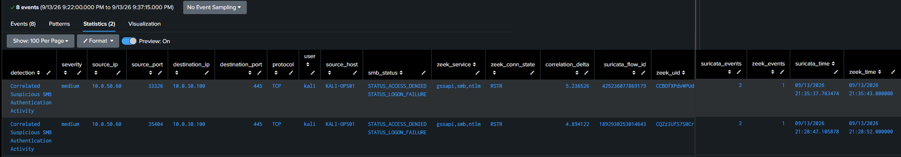
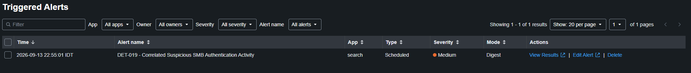
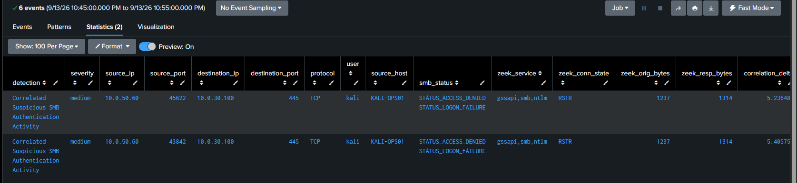

# DET-019 — Correlated Suspicious SMB Authentication Activity

## Overview

Detects suspicious SMB authentication failures observed by Suricata and independently corroborated by Zeek for the same network session. A result requires a suspicious Suricata SMB signal, a matching Zeek TCP/445 connection, the same normalized network tuple, and no more than 30 seconds between the two sensor observations.

The correlation increases confidence that the network session occurred. It does not by itself prove malicious intent, successful authentication, successful lateral movement, use of an administrative share, or compromise.

## Detection Objective

Combine Suricata application-layer SMB authentication context with independent Zeek connection metadata so analysts receive a result only when both sensors observed the corresponding session within the defined temporal window.

## Signal, Corroboration, and Correlation

| Role | Meaning |
|---|---|
| Signal | Suricata observed `SMB2_COMMAND_SESSION_SETUP` with `STATUS_LOGON_FAILURE` or `STATUS_ACCESS_DENIED`. |
| Corroboration | Zeek independently observed the corresponding TCP/445 network connection. |
| Correlation | Both observations share the normalized source IP, source port, destination IP, destination port, and protocol, with an absolute time difference of no more than 30 seconds. |

Simply observing SMB traffic in both sensors is not considered suspicious. Suricata supplies the suspicious authentication signal; Zeek corroborates and enriches the associated network session.

## Validated Lab Scope

| Role | System | Address / service |
|---|---|---|
| Source | KALI-OPS01 | `10.0.50.60` — REDTEAM / `10.0.50.0/24` |
| Destination | WIN-CL01 | `10.0.30.100` — CLIENTS / `10.0.30.0/24` |
| Destination service | SMB | TCP/445 |
| Suspicious-signal sensor | Suricata on pfSense | SMB application-layer telemetry |
| Corroborating sensor | Zeek on ZEEK01 | Connection telemetry |
| SIEM | Splunk Enterprise | `10.0.20.100` |

## Data Sources

### Suricata

```text
index=suricata
sourcetype=suricata:eve
event_type=smb
```

Relevant fields include:

- `src_ip`, `src_port`, `dest_ip`, `dest_port`, and `proto`
- `flow_id`
- `smb.command` and `smb.status`
- `smb.ntlmssp.user` and `smb.ntlmssp.host`

The suspicious Suricata condition is an SMB2 session setup whose status is `STATUS_LOGON_FAILURE` or `STATUS_ACCESS_DENIED`.

### Zeek

```text
index=zeek
sourcetype=zeek:conn:json
id.resp_p=445
```

Relevant fields include:

- `uid`
- `id.orig_h`, `id.orig_p`, `id.resp_h`, and `id.resp_p`
- `proto`, `service`, and `conn_state`
- `orig_bytes` and `resp_bytes`

The validated session included `service=gssapi,smb,ntlm` and `conn_state=RSTR`.

## Correlation Design

The search normalizes both sensors into:

- `source_ip`
- `source_port`
- `destination_ip`
- `destination_port`
- `protocol`

Suricata `flow_id` and Zeek `uid` are sensor-specific identifiers and are not expected to match. The correlation therefore uses the normalized network tuple and temporal proximity rather than attempting to equate identifiers generated independently by different sensors.

## Final SPL

```spl
(
    index=suricata sourcetype="suricata:eve"
    event_type="smb"
    smb.command="SMB2_COMMAND_SESSION_SETUP"
    (smb.status="STATUS_LOGON_FAILURE" OR smb.status="STATUS_ACCESS_DENIED")
)
OR
(
    index=zeek sourcetype="zeek:conn:json"
    "id.resp_p"=445
)
| eval sensor=case(
    index="suricata","Suricata",
    index="zeek","Zeek"
)
| eval source_ip=coalesce(src_ip,'id.orig_h')
| eval source_port=coalesce(src_port,'id.orig_p')
| eval destination_ip=coalesce(dest_ip,'id.resp_h')
| eval destination_port=coalesce(dest_port,'id.resp_p')
| eval protocol=upper(proto)
| stats
    values(sensor) AS sensors
    values(flow_id) AS suricata_flow_id
    values(uid) AS zeek_uid
    values(smb.status) AS smb_status
    values(smb.ntlmssp.user) AS user
    values(smb.ntlmssp.host) AS source_host
    values(service) AS zeek_service
    values(conn_state) AS zeek_conn_state
    values(orig_bytes) AS zeek_orig_bytes
    values(resp_bytes) AS zeek_resp_bytes
    earliest(eval(if(sensor="Suricata",_time,null()))) AS suricata_time
    earliest(eval(if(sensor="Zeek",_time,null()))) AS zeek_time
    count(eval(sensor="Suricata")) AS suricata_events
    count(eval(sensor="Zeek")) AS zeek_events
    BY source_ip source_port destination_ip destination_port protocol
| where suricata_events>0 AND zeek_events>0
| eval correlation_delta=abs(zeek_time-suricata_time)
| where correlation_delta<=30
| eval detection="Correlated Suspicious SMB Authentication Activity"
| eval severity="medium"
| convert ctime(suricata_time) ctime(zeek_time)
| table detection severity source_ip source_port destination_ip destination_port protocol
        user source_host smb_status
        zeek_service zeek_conn_state zeek_orig_bytes zeek_resp_bytes
        correlation_delta
        suricata_flow_id zeek_uid
        suricata_events zeek_events
        suricata_time zeek_time
| sort - suricata_time
```

The search does not require a hard-coded source port, Suricata `flow_id`, or Zeek `uid`.

## Controlled Validation

The authorized validation originated from KALI-OPS01:

```bash
smbclient -L //10.0.30.100 -N
```

The client returned:

```text
session setup failed: NT_STATUS_ACCESS_DENIED
```

Suricata observed traffic from `10.0.50.60` to `10.0.30.100:445/TCP`, including SMB negotiate and session-setup commands. The relevant authentication statuses were `STATUS_LOGON_FAILURE` and `STATUS_ACCESS_DENIED`; Suricata also extracted `user=kali` and `host=KALI-OPS01`.

Zeek independently observed the corresponding TCP/445 sessions and enriched them with `service=gssapi,smb,ntlm`, `conn_state=RSTR`, and byte-count metadata.

Multiple independent sessions were validated:

| Session | Source port | Suricata flow ID | Zeek UID | Correlation delta |
|---|---:|---|---|---:|
| 1 | `35404` | `1892930253014643` | `CQZzIUfS7S0CrhFNa` | Approximately `4.894` seconds |
| 2 | `33326` | `425236077869179` | Independently generated | Approximately `5.237` seconds |

Additional scheduled-alert validation used new ephemeral source ports. This confirmed that the search is not tied to one validation port or sensor identifier.



## Scheduled Alert

| Setting | Validated value |
|---|---|
| Alert name | `DET-019 - Correlated Suspicious SMB Authentication Activity` |
| Type | Scheduled |
| Cron | `*/5 * * * *` |
| Earliest | `-10m@m` |
| Latest | `now` |
| Trigger condition | Number of Results > 0 |
| Severity | Medium |
| Description | Detects suspicious SMB authentication failures observed by Suricata and independently corroborated by Zeek for the same network session within a 30-second correlation window. |

The scheduled alert triggered successfully during controlled validation.



The alert results contained multiple correlated sessions, both suspicious SMB statuses, Zeek service and connection-state enrichment, Zeek byte counts, and the calculated correlation delta.



## MITRE ATT&CK

- Tactic: Lateral Movement
- Technique: [T1021.002 — Remote Services: SMB/Windows Admin Shares](https://attack.mitre.org/techniques/T1021/002/)

The mapping provides scenario context for suspicious authentication activity over SMB/TCP 445. An individual DET-019 result does not prove successful lateral movement or successful use of an administrative share.

DET-019 is not mapped to T1110 (Brute Force). The current search does not require a repeated-attempt threshold and is not a brute-force detector.

## Potential False Positives

- Mistyped or invalid credentials.
- Legitimate administrative SMB activity.
- Service accounts with stale credentials.
- Automated systems attempting SMB authentication.
- Vulnerability scanners or authorized security testing.
- Normal SMB troubleshooting activity.

Zeek corroboration increases confidence that the network session occurred, but it does not establish malicious intent.

## Triage Guidance

1. Review the complete normalized tuple, `correlation_delta`, and both sensor event counts.
2. Review `user`, `source_host`, and all returned `smb_status` values.
3. Confirm that the Suricata result represents an SMB session-setup authentication failure.
4. Use Zeek service, connection state, and byte counts as independent session context.
5. Determine whether the source, identity, destination, and time window correspond to approved administration, automation, scanning, or testing.
6. Correlate Windows authentication, endpoint, firewall, and asset context before concluding lateral movement or compromise.

## Known Limitations

- Both Suricata and Zeek telemetry must be available in Splunk.
- Missing or delayed telemetry from either sensor can prevent correlation.
- Correlation relies on the normalized network tuple and a time difference of no more than 30 seconds rather than a shared sensor identifier.
- Suricata `flow_id` and Zeek `uid` are independent and cannot be matched directly.
- SMB authentication failures can be legitimate and require environmental context.
- The detection does not prove successful authentication, successful lateral movement, or successful access to an SMB administrative share.
- The current logic is not a brute-force detector because it has no threshold for repeated authentication attempts.
- The scheduled search runs every five minutes over a ten-minute window. This intentional overlap tolerates ingestion delay but can repeat alerts for the same activity if suppression or throttling is not configured.
- Sensor coverage and ZEEK01 passive-visibility limitations can affect availability of the corroborating event.

## Evidence

1. [Correlated Suricata and Zeek detection results](../../screenshots/DET-019-01-correlated-smb-detection.png)
2. [Scheduled alert triggered](../../screenshots/DET-019-02-scheduled-alert-triggered.png)
3. [Triggered alert results](../../screenshots/DET-019-03-triggered-alert-results.png)

## Related Documentation

- [Suricata to Splunk Ingestion Validation](../../docs/suricata-splunk-ingestion-validation.md)
- [ZEEK01 Deployment and Telemetry](../../docs/zeek01-deployment-and-telemetry.md)
- [Splunk Detection Catalog](README.md)

## Detection Summary

| Field | Value |
|---|---|
| Detection ID | DET-019 |
| Detection name | Correlated Suspicious SMB Authentication Activity |
| Severity | Medium |
| Status | Validated |
| Primary data sources | Suricata EVE + Zeek connection JSON |
| Suricata source | `suricata` / `suricata:eve` |
| Zeek source | `zeek` / `zeek:conn:json` |
| Validation path | KALI-OPS01 `10.0.50.60` → WIN-CL01 `10.0.30.100:445/TCP` |
| MITRE ATT&CK | T1021.002 — Remote Services: SMB/Windows Admin Shares |
| Scheduled alert | Validated |

## Status

**Validated** — controlled SMB authentication failures were observed by Suricata and independently corroborated by Zeek using the normalized network tuple and a correlation delta of no more than 30 seconds. The scheduled Medium-severity alert triggered successfully. The result does not prove malicious intent, successful authentication, successful lateral movement, administrative-share access, or compromise. This detection is not represented as production-ready.
