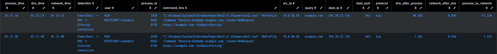
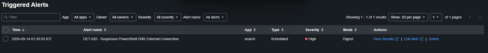

# DET-020 — Suspicious PowerShell DNS External Connection

## Overview

Detects a PowerShell process on WIN-REDTEAM01 that starts, performs DNS resolution, receives an IPv4 answer, and then establishes a network connection to an IP returned by that DNS resolution.

The detection correlates Sysmon process and network telemetry with Zeek DNS JSON. It establishes temporal and IP relationships between the observations; it does not prove that DNS directly caused the connection, that the destination is malicious, or that the host was compromised.

## Detection Objective

Identify a PowerShell process-create event, a subsequent DNS answer, and a subsequent PowerShell network connection to the resolved IPv4 address within a 60-second correlation window. Preserve process, user, command, DNS, destination, protocol, and timing context for analyst review.

## Data Sources

| Purpose | Source |
|---|---|
| PowerShell process creation | Sysmon Event ID 1 |
| PowerShell network connection | Sysmon Event ID 3 |
| Sysmon source | `XmlWinEventLog:Microsoft-Windows-Sysmon/Operational` |
| DNS query and answers | `index=zeek`, `sourcetype=zeek:dns:json` |
| Validated host | `WIN-REDTEAM01` |
| Validated source IP | `10.0.50.50` |

The Zeek app provides search-time extractions for `src_ip`, `src_port`, `dest_ip`, `dest_port`, and `dns_answers`. DET-020 depends on the extracted `dns_answers` field.

## Detection Logic

1. Select Sysmon Event IDs 1 and 3 for `powershell.exe` on WIN-REDTEAM01.
2. Group process and network observations by `ProcessGuid`.
3. Require both a process time and network time, with the network event occurring zero to 60 seconds after process creation.
4. Append Zeek DNS events for `10.0.50.50` with a query and extracted answers.
5. Split and expand `dns_answers`, retaining IPv4 answers as the correlation IP.
6. Associate Sysmon and DNS observations by destination/correlation IP.
7. Expand multivalue process and network timestamps before calculating timing deltas.
8. Require DNS to occur zero to 60 seconds after the process and the network connection zero to 60 seconds after DNS.
9. Remove identical final rows using `ProcessGuid`, query, destination IP, and network time.

## Final Validated SPL

```spl
index=* host="WIN-REDTEAM01"
source="XmlWinEventLog:Microsoft-Windows-Sysmon/Operational"
(EventCode=1 OR EventCode=3)
Image="*\\powershell.exe"

| eval process_time=if(EventCode=1,_time,null())
| eval network_time=if(EventCode=3,_time,null())

| stats
    min(process_time) AS process_time
    min(network_time) AS network_time
    values(User) AS user
    values(CommandLine) AS command_line
    values(ProcessId) AS process_id
    values(SourceIp) AS src_ip
    values(DestinationIp) AS correlation_ip
    values(DestinationPort) AS dest_port
    values(Protocol) AS protocol
    by ProcessGuid

| where isnotnull(process_time)
    AND isnotnull(network_time)

| eval process_network_delta=network_time-process_time

| where process_network_delta>=0
    AND process_network_delta<=60

| append [
    search index=zeek sourcetype="zeek:dns:json"
        src_ip="10.0.50.50"

    | where isnotnull(query)
        AND isnotnull(dns_answers)

    | eval dns_answer_list=split(replace(dns_answers,"\"",""),",")

    | mvexpand dns_answer_list

    | eval correlation_ip=trim(dns_answer_list)

    | where match(correlation_ip,"^\d{1,3}(\.\d{1,3}){3}$")

    | eval dns_time=_time

    | fields correlation_ip dns_time query
]

| eventstats
    values(process_time) AS correlated_process_time
    values(network_time) AS correlated_network_time
    values(ProcessGuid) AS correlated_ProcessGuid
    values(process_id) AS correlated_process_id
    values(user) AS correlated_user
    values(command_line) AS correlated_command_line
    values(src_ip) AS correlated_src_ip
    values(dest_port) AS correlated_dest_port
    values(protocol) AS correlated_protocol
    by correlation_ip

| where isnotnull(dns_time)
    AND isnotnull(correlated_process_time)
    AND isnotnull(correlated_network_time)

| mvexpand correlated_process_time
| mvexpand correlated_network_time

| eval dns_after_process=dns_time-correlated_process_time
| eval network_after_dns=correlated_network_time-dns_time
| eval process_to_network=correlated_network_time-correlated_process_time

| where dns_after_process>=0
    AND dns_after_process<=60
    AND network_after_dns>=0
    AND network_after_dns<=60

| rename
    correlated_ProcessGuid AS ProcessGuid
    correlated_process_id AS process_id
    correlated_user AS user
    correlated_command_line AS command_line
    correlated_src_ip AS src_ip
    correlation_ip AS dest_ip
    correlated_dest_port AS dest_port
    correlated_protocol AS protocol

| eval detection="PowerShell -> DNS -> External Connection"

| eval dns_after_process=round(dns_after_process,3)
| eval network_after_dns=round(network_after_dns,3)
| eval process_to_network=round(process_to_network,3)

| eval process_time=strftime(correlated_process_time,"%H:%M:%S")
| eval dns_time_display=strftime(dns_time,"%H:%M:%S")
| eval network_time=strftime(correlated_network_time,"%H:%M:%S")

| eval dns_time=dns_time_display

| dedup ProcessGuid query dest_ip network_time

| table
    process_time
    dns_time
    network_time
    detection
    user
    process_id
    command_line
    src_ip
    query
    dest_ip
    dest_port
    protocol
    dns_after_process
    network_after_dns
    process_to_network

| sort - process_time
```

## Correlation Troubleshooting

The earlier correlation failed when `eventstats values(process_time)` and `eventstats values(network_time)` produced multivalue timestamps for multiple matching PowerShell processes or connections sharing the same correlation IP. Arithmetic between `dns_time` and those multivalue fields returned null.

The validated fix expands both timestamp fields before calculating the deltas:

```spl
| mvexpand correlated_process_time
| mvexpand correlated_network_time
```

After expansion, the zero-to-60-second filters operated on scalar timestamps. Identical final output rows were then suppressed with:

```spl
| dedup ProcessGuid query dest_ip network_time
```

These commands are part of the final validated search above, not temporary validation overrides.

## Controlled Validation

The authorized test on WIN-REDTEAM01 used:

```powershell
powershell.exe -NoProfile -Command "Resolve-DnsName example.com; Invoke-WebRequest https://example.com -UseBasicParsing"
```

The preferred clean correlation produced:

| Field | Validated value |
|---|---|
| Process time | `01:31:38` |
| DNS time | `01:31:40` |
| Network time | `01:31:40` |
| User | `WIN-REDTEAM01\redadmin` |
| Source IP | `10.0.50.50` |
| DNS query | `example.com` |
| Destination | `104.20.23.154:443/tcp` |
| `dns_after_process` | `1.365` seconds |
| `network_after_dns` | `0.568` seconds |
| `process_to_network` | `1.933` seconds |

A second valid candidate with approximately 40 seconds between process creation and DNS was also visible and remained within the current 60-second rule. The shorter timing chain above is the representative validation result.



## Scheduled Alert

| Setting | Validated value |
|---|---|
| Alert name | `DET-020 - Suspicious PowerShell DNS External Connection` |
| Type | Scheduled |
| Cron | `*/5 * * * *` |
| Earliest | `-30m@m` |
| Latest | `now` |
| Trigger condition | Number of Results > 0 |
| Trigger | Once |
| Mode | Digest |
| Severity | High |
| Action | Add to Triggered Alerts |

The scheduled alert triggered successfully and appeared in Splunk Triggered Alerts.



## Expected Result

A result contains the process, DNS, and network timestamps; PowerShell user, process ID, and command line; source IP; DNS query; resolved destination IP and port; protocol; and all three calculated timing deltas.

The result is a lab-focused correlation lead. It does not establish that the DNS answer caused the connection or that the resolved destination is malicious.

## MITRE ATT&CK

- [T1059.001 — Command and Scripting Interpreter: PowerShell](https://attack.mitre.org/techniques/T1059/001/)
- [T1071.004 — Application Layer Protocol: DNS](https://attack.mitre.org/techniques/T1071/004/)

The mappings describe the PowerShell and DNS behaviors represented in the controlled scenario. No additional technique, successful execution objective, command-and-control behavior, or compromise is inferred from the correlation alone.

## Potential False Positives

- Legitimate PowerShell administration or automation that resolves and contacts public services.
- Software-management and deployment scripts.
- Monitoring, update, or inventory workflows implemented in PowerShell.
- Authorized testing and troubleshooting.
- Public or CDN-backed domains that resolve to shared or frequently changing addresses.
- Multiple PowerShell processes that resolve or contact the same destination within the search period.

## Triage Guidance

1. Review `user`, `process_id`, `command_line`, and `ProcessGuid` context.
2. Confirm whether PowerShell execution was expected for the host and user.
3. Review the DNS query, returned address, destination port, and all three timing deltas.
4. Examine surrounding Sysmon Event IDs 1 and 3 for parent processes and additional connections.
5. Review adjacent Zeek DNS and connection telemetry, endpoint activity, and reputation context.
6. Account for shared/CDN addressing before attributing the connection to one domain.
7. Escalate only when the command, destination, timing, and surrounding activity collectively support suspicious behavior.

## Known Limitations and Tuning

- The Sysmon search is host-specific: `host="WIN-REDTEAM01"`.
- The Zeek DNS search is source-IP-specific: `src_ip="10.0.50.50"`.
- DNS correlation considers IPv4 answers only.
- The correlation window is 60 seconds.
- Multiple PowerShell processes resolving or connecting to the same destination IP during the search period can create multiple candidate correlations.
- `dedup` suppresses identical final detection rows but does not resolve every ambiguous many-to-many relationship.
- Temporal and IP correlation does not prove that DNS directly caused the network connection.
- Public and CDN domains can resolve to shared or changing IP addresses and require additional production tuning.
- The detection is lab-focused and has not been generalized for an enterprise environment.
- DET-020 depends on both Sysmon and Zeek DNS telemetry and on the Zeek `dns_answers` search-time extraction.
- Sensor loss, ingestion delay, or incomplete visibility can prevent or distort correlation.

## Evidence

1. [Triggered alert](../../screenshots/DET-020-triggered-alert.png)
2. [Scheduled-alert correlation results](../../screenshots/DET-020-alert-correlation-results.png)

## Related Documentation

- [ZEEK01 Deployment and Telemetry](../../docs/zeek01-deployment-and-telemetry.md)
- [Splunk Detection Catalog](README.md)

## Detection Summary

| Field | Value |
|---|---|
| Detection ID | DET-020 |
| Detection name | Suspicious PowerShell DNS External Connection |
| Severity | High |
| Status | Validated |
| Primary data sources | Sysmon Event IDs 1 and 3 + Zeek DNS JSON |
| Sysmon source | `XmlWinEventLog:Microsoft-Windows-Sysmon/Operational` |
| Zeek source | `zeek` / `zeek:dns:json` |
| Validated host / source | WIN-REDTEAM01 / `10.0.50.50` |
| Validated destination | `example.com` / `104.20.23.154:443/tcp` |
| MITRE ATT&CK | T1059.001 / T1071.004 |
| Scheduled alert | Validated |

## Status

**Validated** — the final search correlated a PowerShell process, Zeek DNS answer, and Sysmon network connection to the resolved IPv4 address, and the scheduled High-severity alert triggered successfully. The correlation does not prove DNS causation, malicious destination intent, or compromise. This detection is not represented as production-ready.
