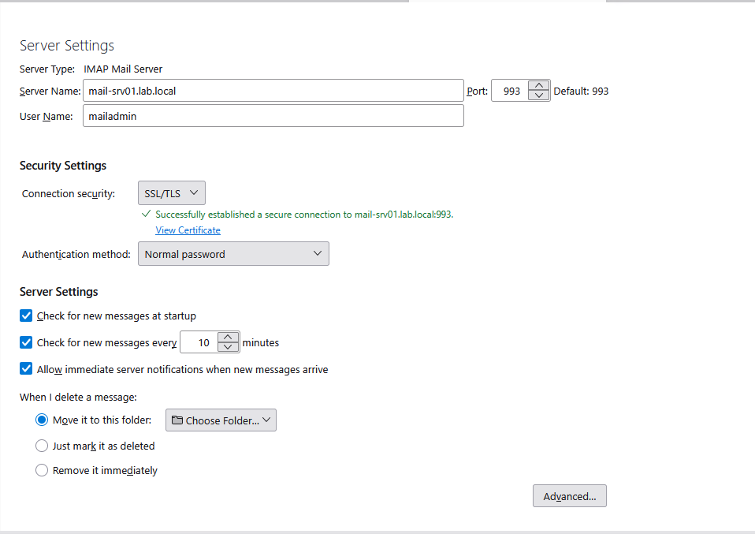
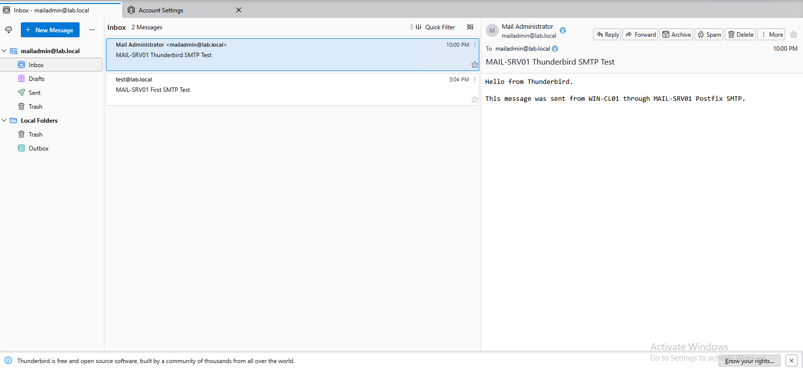
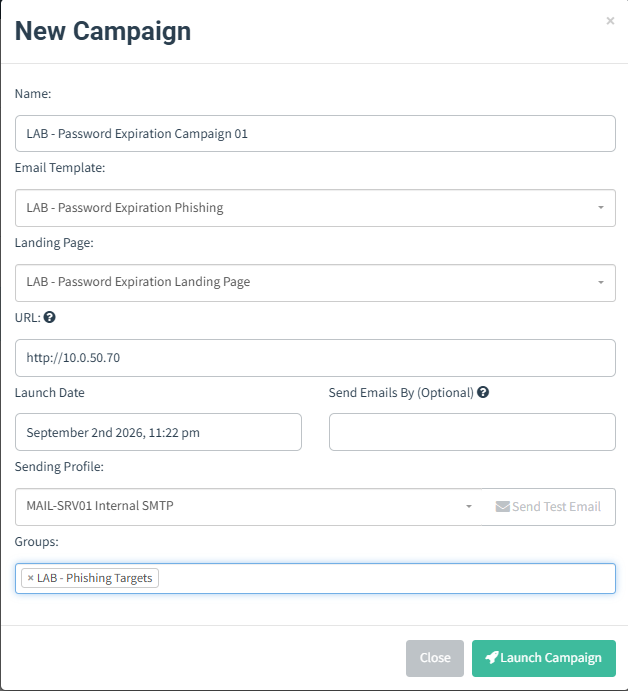
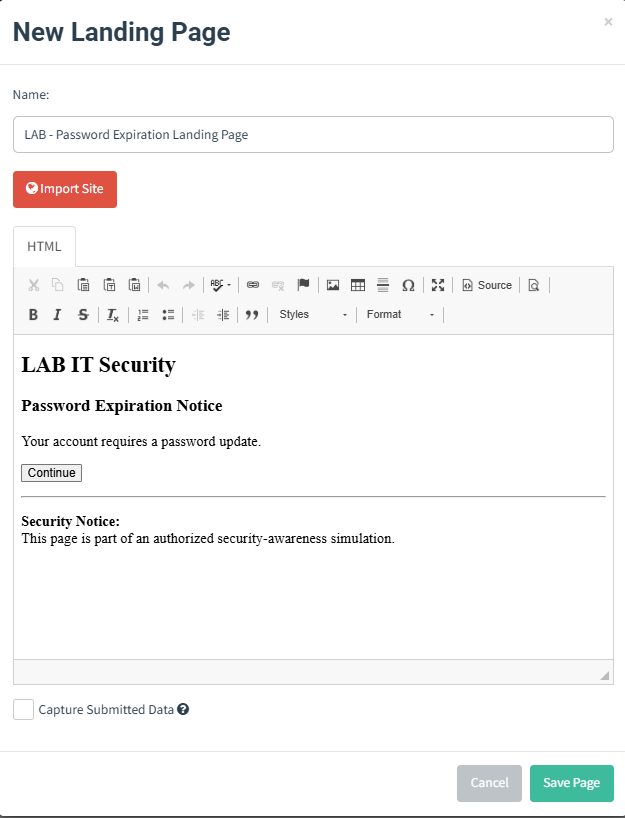
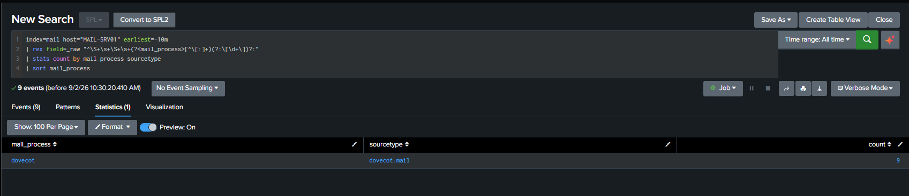
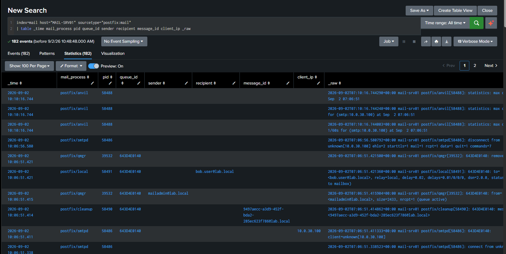
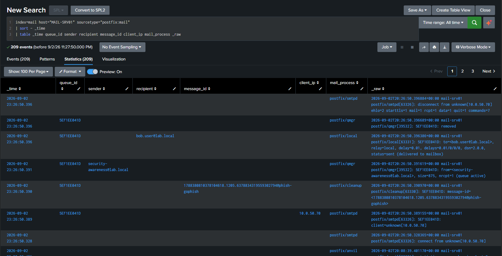
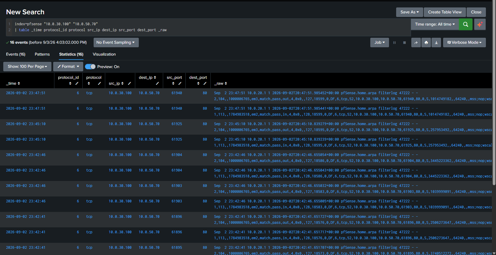

# MAIL-SRV01 and GoPhish Internal Phishing Simulation

## Overview

This project adds an internal mail stack and a controlled phishing-simulation workflow to the SOC & Purple Team Home Lab. Its purpose is not to reproduce an Internet-facing production mail environment. It is a lab-owned workflow for understanding mail delivery, collecting mail and endpoint telemetry, validating network visibility, and investigating a benign phishing-link interaction in Splunk.

The validated investigation chain is:

```text
GoPhish campaign
    -> MAIL-SRV01 / Postfix SMTP transport
    -> bob.user mailbox
    -> Thunderbird mail client on WIN-CL01
    -> Microsoft Edge tracked-link request
    -> Sysmon Event ID 3 endpoint telemetry
    -> pfSense firewall telemetry
    -> Splunk endpoint/network correlation
```

The campaign used a benign password-expiration theme. The landing page identified the exercise as an authorized security-awareness simulation. No credentials were collected, and the final GoPhish result recorded one sent message, one open, one link click, and zero submitted-data events.

## Project Objectives

- Build a Linux-based internal mail stack from discrete open-source components.
- Use GoPhish with the internal SMTP service instead of an external mail provider.
- Deliver a controlled phishing message to a lab mailbox and observe the recipient workflow.
- Ingest and parse Postfix and Dovecot telemetry in Splunk.
- Validate a browser connection independently with endpoint and firewall data.
- Preserve telemetry gaps, parsing failures, and corrective actions as engineering evidence.
- Demonstrate the difference between activity ground truth, sensor visibility, and detection logic.

## Component Responsibilities

The components are intentionally described separately because they perform different functions.

| Component | Category | Responsibility |
|---|---|---|
| MAIL-SRV01 | Internal mail server host | Ubuntu Server that hosts the Postfix and Dovecot services and forwards mail logs to Splunk. |
| Postfix | Mail Transfer Agent (MTA) | Accepts and transports SMTP mail, queues messages, and performs local delivery. |
| Dovecot | Mail access service | Exposes Linux-local mailboxes to clients over IMAP/IMAPS. |
| Thunderbird | Mail User Agent (MUA) | Allows the test user to access the mailbox and interact with the delivered message. |
| PHISH-GOPHISH | Phishing simulation platform | Creates and tracks the authorized internal campaign and sends through MAIL-SRV01. |
| Splunk Enterprise | SIEM | Collects, parses, searches, and correlates mail, endpoint, and network telemetry. |
| Sysmon | Endpoint telemetry sensor | Records the browser network connection as Event ID 3 after the relevant rule is enabled. |
| pfSense | Network control and telemetry source | Routes the inter-zone flow and records matching firewall events. |

MAIL-SRV01 is not a Microsoft Exchange equivalent. It is a Linux-based stack assembled from Postfix for SMTP transport and Dovecot for mailbox access. The current mailboxes are Linux-local accounts; Active Directory mail integration is not claimed.

## Architecture and Network Placement

| System | Address | VMware network | Role |
|---|---|---|---|
| MAIL-SRV01 | `10.0.20.30` | VMnet3 | Postfix, Dovecot, internal mailboxes, TLS, and Splunk Universal Forwarder. |
| PHISH-GOPHISH | `10.0.50.70` | VMnet6 | Internal GoPhish campaign and HTTP landing page. |
| WIN-CL01 | `10.0.30.100` | VMnet4 | Thunderbird recipient and Microsoft Edge endpoint. |
| Splunk Enterprise | `10.0.20.100` | VMnet3 | Central SIEM and search platform. |
| pfSense | Multiple interfaces | VMnet3, VMnet4, VMnet6, and other zones | Inter-zone routing, policy enforcement, and firewall logging. |

The current repository architecture image remains unchanged in this phase. The table above is the authoritative description of the two newly documented systems until the visual diagram is updated separately.

## Internal Mail Stack

### Postfix: SMTP Transport and Delivery

Postfix is the MTA. GoPhish submits campaign mail to Postfix over SMTP; Postfix accepts the message, assigns a queue identifier, processes it through multiple internal stages, and performs local delivery to the target mailbox.

A single message can produce several events, including SMTP acceptance, cleanup and message-ID processing, queue management, delivery, and queue removal. These records should not be counted as separate messages.

The stable correlation key is `queue_id`. When a reliable identifier exists, `stats` grouped by `queue_id` is preferable to `transaction`: it is more explicit, generally more efficient, and makes the lifecycle fields selected by the analyst visible in the SPL.

### Dovecot: Mailbox Access

Dovecot provides IMAP/IMAPS access to Linux-local mailboxes. Thunderbird connects to Dovecot to retrieve and display the message; Dovecot does not perform the SMTP transfer handled by Postfix.

The final Thunderbird configuration successfully established secure IMAPS access to MAIL-SRV01.



*Thunderbird successfully accesses the internal mailbox over the final IMAPS configuration.*

### Thunderbird: Recipient Mail Client

Thunderbird runs on WIN-CL01 and acts as the MUA for the lab user. It retrieves the message through Dovecot and hands the tracked URL to Microsoft Edge when the user follows the link.

The completed mail path was validated from SMTP submission through mailbox delivery and client access.



*The mail client shows successful end-to-end delivery inside the isolated lab.*

## Internal TLS and Lab CA

Postfix and Dovecot were configured with server certificates for `mail-srv01.lab.local`, including the service hostname and lab address in the certificate subject alternative names. Thunderbird trust was established through the internal Lab CA.

This lab workflow also produced an important design lesson. CA signing activity involved MAIL-SRV01, although no CA private-key material is published in this repository. A more production-like design would separate the signing authority from the workload:

1. MAIL-SRV01 generates a private key and certificate signing request.
2. A separate or offline CA validates and signs the request.
3. Only the signed certificate and required public chain return to MAIL-SRV01.
4. The CA private key never resides on the mail server.

## GoPhish Integration and Safe Simulation

PHISH-GOPHISH uses MAIL-SRV01 as its internal SMTP sending infrastructure. The campaign was configured with a benign password-expiration template and an internal URL at `10.0.50.70`.



*The internal campaign uses MAIL-SRV01 as the sending profile and PHISH-GOPHISH as the lab landing-page host.*

The landing page contains no credential form and identifies the page as part of an authorized simulation.



*The controlled landing page provides simulation messaging without collecting credentials.*

### Tracking Ground Truth

GoPhish provides scenario ground truth: it records the campaign state independently from Sysmon and pfSense. The final result showed:

| Outcome | Count |
|---|---:|
| Email Sent | 1 |
| Email Opened | 1 |
| Clicked Link | 1 |
| Submitted Data | 0 |


*The campaign recorded successful delivery and interaction with zero submitted-data events.*

GoPhish tracking counts are campaign-level application evidence. Firewall event counts must not be treated as open or click counts because one flow can be logged more than once across interfaces or directions.

## Splunk Mail Ingestion and Parsing

MAIL-SRV01 writes mixed Postfix and Dovecot events to the mail log. A Splunk Universal Forwarder sends this telemetry to Splunk Enterprise in `index=mail`.

The parsing workflow separates Postfix and Dovecot records into the appropriate sourcetypes before applying search-time field extractions.



*Mixed mail-log records are classified into Postfix and Dovecot sourcetypes.*

### Postfix Search-Time Fields

Validated Postfix fields include process and queue context, sender, recipient, message ID, client information, relay, delay, and delivery status where present.



*The final Postfix search returns extracted fields without temporary `rex` logic.*

### Dovecot Search-Time Fields

Validated Dovecot fields include component, action, user, authentication method, remote and local addresses, process context, session, and disconnect information where present. Session identifiers are operational telemetry and are not reproduced in this public document.

### GoPhish-to-Postfix Delivery Evidence

Postfix telemetry independently confirms that the GoPhish-generated message entered the mail pipeline and was delivered to the lab mailbox.



*Splunk mail events preserve the delivery stages associated with the internal simulation.*

## Endpoint and Network Validation

The final user interaction produced an HTTP connection from Microsoft Edge on WIN-CL01 to PHISH-GOPHISH:

```text
LAB\bob.user
    -> C:\Program Files (x86)\Microsoft\Edge\Application\msedge.exe
    -> 10.0.30.100:<source_port>
    -> 10.0.50.70:80/TCP
```

Validated source ports included `49622`, `49623`, `49629`, and `49630`.

### Sysmon Event ID 3

After the telemetry rule was corrected and a fresh click was generated, Sysmon Event ID 3 recorded the Edge process, user, source address and port, and destination address and port.


*Sysmon records four validated Edge connections to the known internal GoPhish destination.*

### pfSense Telemetry

pfSense independently recorded permitted TCP traffic from `10.0.30.100` to `10.0.50.70:80`. Its search-time extraction returned protocol, source and destination addresses, and source and destination ports without temporary `rex` commands.



*The corrected parser produces usable IPv4 TCP fields from the current pfSense payload.*

### Final Correlation

Endpoint and firewall records were correlated using:

```text
Source IP
+ Source Port
+ Destination IP
+ Destination Port
+ time proximity
```


*The final view aligns Sysmon process and user context with matching pfSense network flows.*

The duplicated pfSense rows visible for some source ports represent network logging behavior across interfaces or directions. They do not represent additional clicks.

## Troubleshooting Case Study 1: Missing Browser Telemetry

### Observation

- GoPhish reported a clicked link.
- pfSense recorded WIN-CL01 traffic to `10.0.50.70:80`.
- Sysmon Event ID 3 initially returned no Microsoft Edge connection.

GoPhish provided scenario ground truth while pfSense independently confirmed the network activity. Together, they showed that the interaction occurred even though the endpoint sensor was initially silent. The missing endpoint event therefore required a sensor-coverage investigation rather than the conclusion that no click occurred.

### Root Cause

Network connection logging was enabled, but the active Sysmon configuration used:

```xml
<NetworkConnect onmatch="include">
```

Only matching processes generated Event ID 3. Microsoft Edge was not covered by the active include rules.

### Corrective Workflow

1. Identify and back up the active Sysmon configuration.
2. Confirm the effective configuration rather than assuming the source XML was loaded.
3. Add the targeted rule:

```xml
<Image condition="image">msedge.exe</Image>
```

4. Validate the XML before loading it.
5. Reload Sysmon and verify the effective configuration.
6. Generate a fresh phishing-link interaction; Sysmon does not create past Event ID 3 records retroactively.
7. Confirm the Edge connection in Splunk and correlate it with pfSense.

### Engineering Lesson

> Absence of telemetry is not evidence of absence of activity.

Selective include rules control noise, but they also create explicit visibility boundaries. Coverage must be validated against known behavior. The targeted Edge rule preserved selective logging without enabling all browser and network noise.

## Troubleshooting Case Study 2: Resilient pfSense Parsing

### Observation

The existing parser expected a legacy syslog prefix similar to:

```text
filterlog[PID]:
```

Current events used an RFC5424-style prefix similar to:

```text
filterlog PID - -
```

As a result, automatic TCP/UDP field extraction failed even though the firewall events were present in Splunk.

### Corrective Method

The extraction was redesigned to anchor against the stable pfSense CSV payload rather than the volatile transport prefix. Validation followed this sequence:

```text
temporary rex
    -> btool --debug
    -> effective configuration validation
    -> Splunk restart where required
    -> final search without rex
```

### Engineering Lesson

Parsers should depend on the most stable available structure. A transport or syslog wrapper can change independently of the underlying event payload. Final validation must prove that configured field extraction works without temporary search-time repair logic.

## Detection and Investigation Use Case

The validated browser activity supports [DET-013 — Browser Connection to Known Phishing Infrastructure](../detections/splunk/DET-013-browser-connection-to-known-phishing-infrastructure.md).

DET-013 is deliberately narrow. Sysmon provides process and user attribution; pfSense provides independent network-path evidence; GoPhish provides the campaign ground truth. A browser connection by itself does not prove phishing, credential theft, or compromise.

## Security Considerations

- The exercise is authorized and restricted to lab-owned systems.
- No credentials were collected by the landing page.
- The environment is internal and is not represented as Internet-facing mail infrastructure.
- GoPhish passwords, tracking identifiers, session tokens, and administrative credentials are excluded.
- CA and server private-key material are excluded.
- Evidence containing unrelated endpoint Internet activity is excluded.
- The GoPhish landing page uses internal HTTP on TCP/80; this is a lab limitation, not a production recommendation.
- Test identities such as `bob.user` are lab-only accounts.

## Known Limitations

- MAIL-SRV01 uses Linux-local mailboxes; Active Directory mail integration is not implemented or claimed.
- The environment does not model Internet mail routing, public DNS, SPF, DKIM, DMARC, external reputation, or production availability.
- The final HTTP interaction is tied to the known lab GoPhish address and port.
- Sysmon visibility depends on the active include rules and correct field extraction.
- pfSense can produce multiple log records for one network flow.
- GoPhish application counts, endpoint network events, and firewall events measure different layers and cannot be compared as equal event counts.
- No scheduled DET-013 Splunk alert is claimed or evidenced.
- The current architecture image does not yet contain MAIL-SRV01 or PHISH-GOPHISH and will be updated separately.

## Lessons Learned

1. Ground truth must come from more than one layer when a sensor appears silent.
2. Missing endpoint telemetry can be a collection-policy gap rather than missing activity.
3. Selective Sysmon logging requires scenario-based coverage testing.
4. Stable payload structure is a safer parsing anchor than a changing syslog prefix.
5. Postfix `queue_id` provides a reliable lifecycle correlation key.
6. `stats` is preferable to `transaction` when a stable correlation key exists.
7. Endpoint and network data are complementary: Sysmon attributes the process and user, while pfSense confirms the routed flow.
8. Counts must be interpreted according to the layer that produced them.
9. Public evidence should prove the engineering result without exposing credentials, tracking identifiers, private keys, or unrelated telemetry.

## Final Validation Status

| Component | Status |
|---|---|
| MAIL-SRV01 Postfix SMTP transport | Validated |
| Dovecot IMAP/IMAPS mailbox access | Validated |
| Thunderbird mailbox access and delivery | Validated |
| Internal TLS trust | Validated in the lab |
| GoPhish-to-Postfix sending | Validated |
| Safe password-expiration campaign | Validated |
| Credential collection | Disabled / zero submissions |
| Splunk `index=mail` ingestion | Validated |
| Postfix and Dovecot search-time fields | Validated |
| Sysmon Event ID 3 Edge visibility | Validated after targeted tuning |
| pfSense TCP field extraction | Validated |
| Sysmon/pfSense correlation | Validated |
| DET-013 scheduled alert | Not implemented or claimed |

## Status

**Phase 1 validated** — the internal mail delivery, safe phishing simulation, mail telemetry, browser telemetry, firewall telemetry, and final endpoint/network correlation were validated inside the isolated lab. The implementation is not represented as production-ready.
