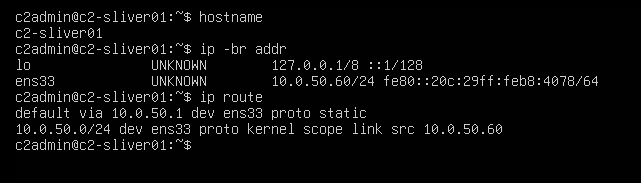
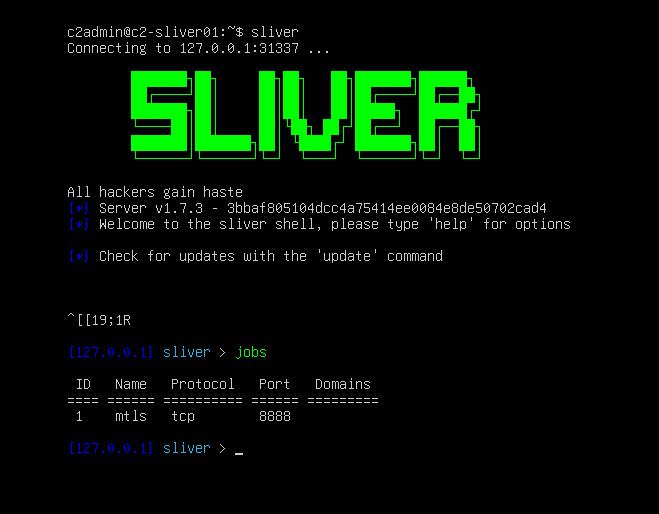
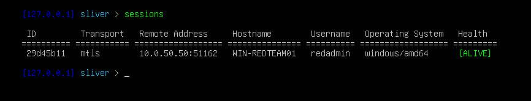
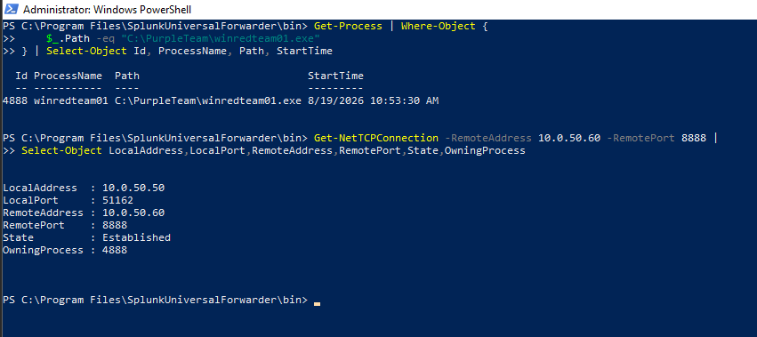
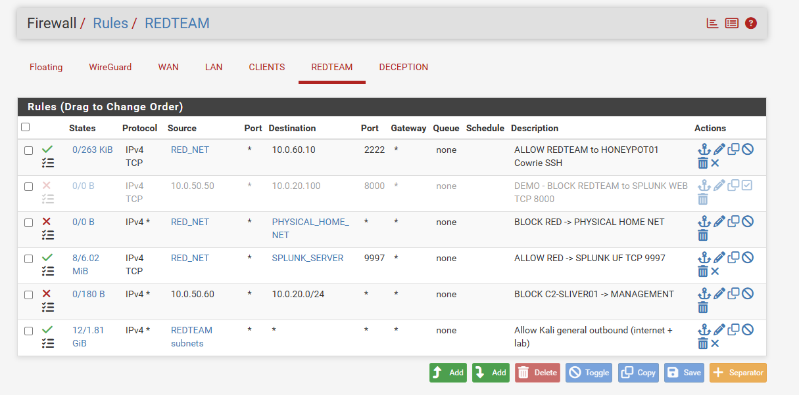

# Sliver C2 Deployment and Purple Team Validation

## Overview

This document describes the deployment, segmentation, validation, and detection-engineering workflow for the Sliver command-and-control infrastructure used in the SOC & Purple Team Home Lab.

The objective was to validate a complete Purple Team workflow:

`C2 Deployment → Endpoint Execution → Network Communication → Endpoint Telemetry → SIEM Visibility → Detection Engineering → Analyst Investigation`

All activity was authorized and performed against lab-owned systems inside the isolated home-lab environment. This implementation is not represented as production-ready.

## Lab Components

| Component | Role | IP address |
|---|---|---|
| C2-SLIVER01 | Sliver C2 server | `10.0.50.60` |
| WIN-REDTEAM01 | Controlled Windows Red Team endpoint | `10.0.50.50` |
| pfSense | Firewall and network segmentation | Multiple interfaces |
| Splunk Enterprise | SIEM and detection platform | `10.0.20.100` |
| Sysmon | Windows endpoint telemetry | WIN-REDTEAM01 |
| Splunk Universal Forwarder | Telemetry forwarding | WIN-REDTEAM01 |

## C2-SLIVER01 Deployment

`C2-SLIVER01` is an Ubuntu Server virtual machine dedicated to controlled Purple Team command-and-control simulations. Sliver was installed on the server and used only within the isolated lab.

The server network configuration is:

- Hostname: `c2-sliver01`
- Address: `10.0.50.60/24`
- Default gateway: `10.0.50.1`
- Network: `10.0.50.0/24`



*The server reports hostname `c2-sliver01`, address `10.0.50.60/24`, and default route through `10.0.50.1`.*

## Sliver mTLS Listener

The exercise used an mTLS listener on TCP/8888. The Sliver `jobs` output confirmed the active listener:

| Field | Value |
|---|---|
| Protocol | mTLS |
| Transport | TCP |
| Port | `8888` |
| C2 server | C2-SLIVER01 |
| C2 IP | `10.0.50.60` |



*The Sliver console shows an active mTLS job listening on TCP/8888.*

## Controlled Windows Implant

A Windows Sliver implant was generated on C2-SLIVER01 for use exclusively in this lab and transferred to WIN-REDTEAM01. The validated endpoint path was:

`C:\PurpleTeam\winredteam01.exe`

Before execution, the generated and transferred artifacts were compared by file size and SHA256 hash. This verified that the endpoint copy matched the lab-generated artifact.

No credentials, private keys, passwords, or sensitive secrets are included in this documentation.

## C2 Session Validation

After the controlled implant executed on WIN-REDTEAM01, it established an mTLS session with C2-SLIVER01:

`WIN-REDTEAM01 (10.0.50.50) → C2-SLIVER01 (10.0.50.60:8888)`

The Sliver console reported the session as alive and showed the endpoint hostname, `redadmin` user, Windows/amd64 platform, and mTLS transport.



*The Sliver console shows an ALIVE mTLS session from WIN-REDTEAM01 at `10.0.50.50`.*

## Endpoint-Side Validation

Windows independently confirmed that `C:\PurpleTeam\winredteam01.exe` was running and owned the established connection to the C2 server.

| Field | Validated value |
|---|---|
| Process ID | `4888` |
| Local address | `10.0.50.50` |
| Local port | `51162` |
| Remote address | `10.0.50.60` |
| Remote port | `8888` |
| State | Established |
| Owning process | `4888` |



*PowerShell correlates the implant path and process ID with the established TCP/8888 connection.*

## Network Segmentation

pfSense segments the Red Team environment from protected lab networks. C2-SLIVER01 was placed in the controlled Red Team network, and a firewall rule blocked traffic from `10.0.50.60` to the management network at `10.0.20.0/24`.



*The pfSense REDTEAM rules include the explicit C2-SLIVER01-to-management block used by the lab safety model.*

## Sysmon Telemetry

The primary telemetry source for the C2 detection was Sysmon Event ID 3 — Network Connection. The expected relationship was:

`C:\PurpleTeam\winredteam01.exe → 10.0.50.60:8888`

During initial validation, the Sliver session was active and Windows showed the established connection, but the expected Event ID 3 for the implant did not appear in Splunk.

## Telemetry Gap Investigation

The investigation established that:

1. Sliver reported an active session.
2. Windows showed `winredteam01.exe` running.
3. Windows showed an established TCP connection to `10.0.50.60:8888`.
4. The connection was owned by the implant process.
5. Sysmon was running.
6. Splunk was receiving other Sysmon telemetry.
7. The implant's expected Event ID 3 was missing.

These observations isolated the issue to telemetry selection rather than C2 connectivity or Splunk ingestion.

## Root Cause

The active Sysmon configuration used selective NetworkConnect filtering:

```xml
<NetworkConnect onmatch="include">
```

Sysmon therefore generated Event ID 3 only when a connection matched an include rule. The implant and its TCP/8888 connection did not initially match the configured rules, creating a visibility gap despite the active endpoint connection.

## Targeted Sysmon Rule

A targeted NetworkConnect rule was added for the validated implant relationship:

```xml
<Rule groupRelation="and">
    <Image condition="is">C:\PurpleTeam\winredteam01.exe</Image>
    <DestinationIp condition="is">10.0.50.60</DestinationIp>
    <DestinationPort condition="is">8888</DestinationPort>
</Rule>
```

The configuration was loaded with:

```powershell
& "C:\Windows\Sysmon64.exe" -c "C:\Sysmon\sysmonconfig.xml"
```

Sysmon reported that the configuration file was validated and updated successfully.

## Retest and Splunk Validation

Sysmon does not generate NetworkConnect events retroactively, so the controlled implant was restarted to establish a new session. The retest produced the expected Event ID 3, which Splunk ingested successfully.

```spl
index=* host="WIN-REDTEAM01"
source="XmlWinEventLog:Microsoft-Windows-Sysmon/Operational"
EventCode=3
Image="*\\winredteam01.exe"
DestinationIp="10.0.50.60"
DestinationPort=8888
| table _time Computer User Image ProcessId SourceIp SourcePort DestinationIp DestinationPort Protocol
| sort - _time
```


*Splunk shows the implant process, process ID, source endpoint, destination C2 address, TCP/8888 port, and user from the successful retest.*

## DET-009 — Sliver C2 Communication

The validated telemetry supports [DET-009 — Sliver C2 Communication](../detections/splunk/DET-009-sliver-c2-communication.md). The detection aggregates Sysmon Event ID 3 communication with the known lab endpoint:

```spl
index=* host="WIN-REDTEAM01"
source="XmlWinEventLog:Microsoft-Windows-Sysmon/Operational"
EventCode=3
DestinationIp="10.0.50.60"
DestinationPort=8888
| stats count
        min(_time) as first_seen
        max(_time) as last_seen
        values(Image) as processes
        values(User) as users
        values(SourceIp) as source_ips
        values(SourcePort) as source_ports
        by Computer DestinationIp DestinationPort Protocol
| convert ctime(first_seen) ctime(last_seen)
```

This is a deterministic detection for known lab C2 infrastructure. TCP/8888 is not a universal Sliver indicator, and the SPL alone does not prove which application-layer protocol produced a connection.


*The detection result shows the implant and controlled PowerShell test activity communicating with the known lab C2 endpoint.*


*The aggregation adds event count, first and last seen times, processes, users, source IPs, and source ports for analyst context.*

## Analyst Triage

The analyst-style investigation reviewed surrounding Sysmon activity and identified:

- PowerShell connectivity testing to TCP/8888
- PowerShell HTTP connections to TCP/8080 during controlled file transfer
- The final Sliver implant connection to TCP/8888


*The timeline reconstructs related activity and distinguishes the implant connection from earlier controlled tests.*

## Purple Team Workflow

```text
Deploy C2 infrastructure
        ↓
Configure mTLS listener
        ↓
Generate and transfer controlled Windows implant
        ↓
Validate file size and SHA256
        ↓
Execute on WIN-REDTEAM01 and establish session
        ↓
Validate endpoint process and network connection
        ↓
Identify Sysmon telemetry gap
        ↓
Tune selective NetworkConnect rules
        ↓
Retest and ingest Event ID 3 into Splunk
        ↓
Build DET-009 and perform analyst triage
```

## Lessons Learned

- Ground truth matters: an active C2 session does not prove that defensive telemetry is complete.
- SIEM visibility depends on events being generated and forwarded by the endpoint.
- Selective Sysmon rules can reduce noise while unintentionally creating blind spots.
- Telemetry-source and detection changes require behavioral retesting.
- Process, user, addressing, timestamps, firewall policy, and session state provide more context than a destination port alone.

## Security and Safety Controls

- Sliver is used only inside the isolated home lab for authorized Purple Team testing.
- Testing targets only lab-owned systems designated for the exercise.
- pfSense restricts C2-SLIVER01 access to protected management networks.
- The deployment is not exposed or documented as production-ready.

## Final Validation Status

| Component | Status |
|---|---|
| C2-SLIVER01 | Operational |
| Sliver mTLS listener on TCP/8888 | Validated |
| WIN-REDTEAM01 implant | Validated |
| Active Sliver session | Validated |
| Endpoint connection | Validated |
| pfSense segmentation | Validated |
| Sysmon Event ID 3 | Validated |
| Splunk ingestion | Validated |
| DET-009 | Validated |
| Analyst triage | Completed |

## Status

**Validated** — Sliver C2 infrastructure, endpoint communication, Sysmon telemetry, Splunk ingestion, and DET-009 were successfully validated inside the isolated Purple Team lab.
