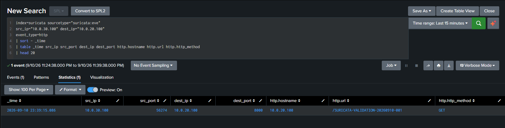
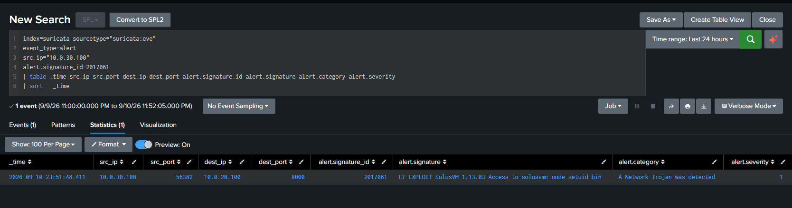

# Suricata to Splunk Ingestion Validation

This document records the validated Suricata EVE JSON ingestion path from pfSense to Splunk Enterprise. It is infrastructure and telemetry validation, not a new `DET-xxx` detection.

## Validated Pipeline

```text
Suricata on pfSense (`em2`)
    -> `/var/log/suricata/suricata_em226383/eve.json`
    -> syslog-ng
    -> TCP/5515
    -> Splunk Enterprise (`10.0.20.100`)
    -> `index=suricata`, `sourcetype=suricata:eve`
```

The validated Splunk metadata is:

| Setting | Validated value |
|---|---|
| Suricata platform | pfSense |
| Monitored interface | `em2` |
| EVE JSON path | `/var/log/suricata/suricata_em226383/eve.json` |
| Transport | syslog-ng over TCP/5515 |
| Destination | `10.0.20.100:5515` |
| Splunk index | `suricata` |
| Splunk sourcetype | `suricata:eve` |
| Splunk source | `suricata:eve` |
| Splunk host | `10.0.20.1` |

syslog-ng statistics confirmed that messages were processed and written with `dropped=0` and `queued=0`.

## Field and Event-Type Validation

Functional Splunk searches confirmed extraction of:

- `event_type`
- `src_ip`
- `dest_ip`
- `alert.signature`
- `alert.category`
- `alert.severity`

Observed EVE event types included `dns`, `smb`, `tls`, `http`, `alert`, `krb5`, `dhcp`, and `rdp`.

Supporting evidence:

- [Raw EVE JSON events](../screenshots/suricata-splunk-eve-json-raw-events.png)
- [Ingestion event count](../screenshots/suricata-splunk-ingestion-event-count.png)
- [Sourcetype validation](../screenshots/suricata-splunk-ingestion-sourcetype-validation.png)
- [Event-type field validation](../screenshots/suricata-splunk-event-type-field-validation.png)
- [Source and destination field validation](../screenshots/suricata-splunk-src-dest-field-validation.png)
- [Nested alert-signature validation](../screenshots/suricata-splunk-nested-alert-signature-validation.png)
- [Alert metadata validation](../screenshots/suricata-splunk-alert-metadata-validation.png)

## Controlled HTTP Telemetry Validation

A controlled request was sent from WIN-CL01 (`10.0.30.100`) to Splunk Enterprise (`10.0.20.100:8000`) with the unique URI marker:

```text
/SURICATA-VALIDATION-20260910-001
```

The corresponding HTTP event was observed in Splunk through the Suricata EVE pipeline.

**Result: PASS**



## Controlled IDS Signature Validation

A controlled HTTP request was intentionally constructed to match an already-enabled Suricata signature and validate the end-to-end IDS alert path.

| Field | Observed value |
|---|---|
| SID | `2017061` |
| Signature | `ET EXPLOIT SolusVM 1.13.03 Access to solusvmc-node setuid bin` |
| Source | `10.0.30.100` |
| Destination | `10.0.20.100:8000` |
| Category | `A Network Trojan was detected` |
| Severity | `1` |

**Result: PASS**



This result does **not** represent exploitation of a real SolusVM vulnerability. It proves that a deliberately crafted request matched the enabled signature and that the resulting alert traversed the complete Suricata-to-Splunk pipeline.

## Scope and Limitations

- Final pipeline status: **ACTIVE / VALIDATED**.
- This validation does not create a new detection ID or claim that every Suricata signature is a production-ready detection.
- Suricata visibility is limited to traffic available to the pfSense/Suricata observation point. It does not establish complete visibility into physical Home/IoT devices that normally use the upstream router instead of pfSense.
- Existing Zeek partial-visibility and VMnet9 isolation statements remain unchanged.

The concise text evidence is preserved in [the final validation record](../screenshots/suricata-splunk-final-validation-2026-09-11.txt).
