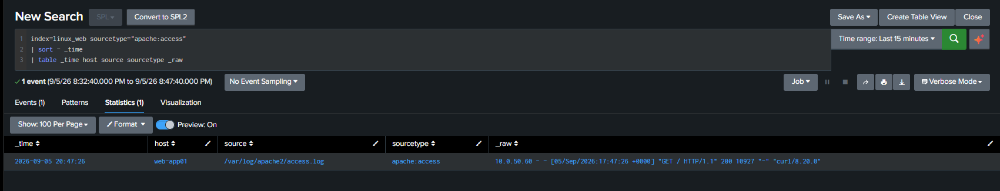
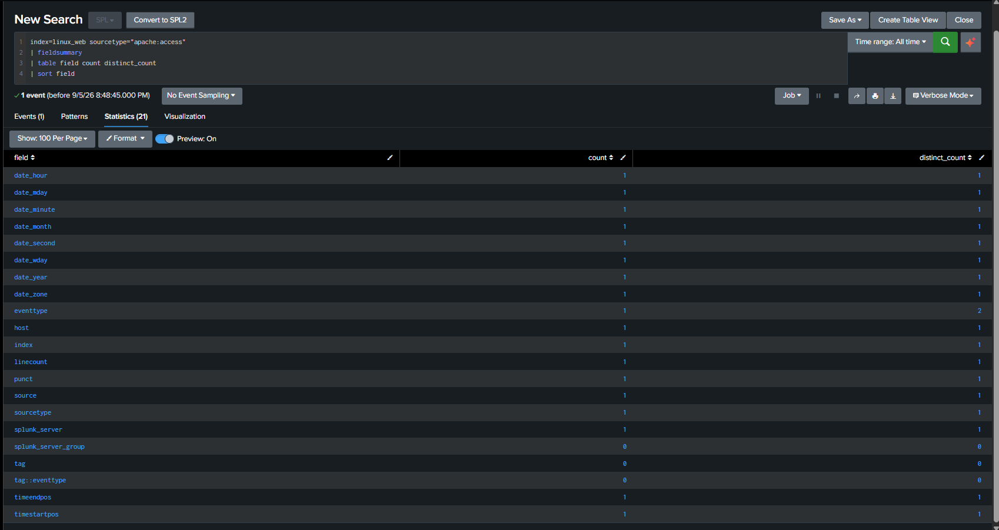
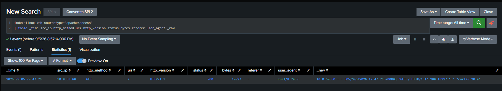

# WEB-APP01 Deployment and Apache Telemetry

## Overview

WEB-APP01 is an authorized Ubuntu/Linux web-application target in the SOC and Purple Team home lab. It supports controlled web-attack simulation and forwards Apache HTTP access telemetry to Splunk Enterprise for detection engineering.

| Field | Validated value |
|---|---|
| Host | WEB-APP01 (`web-app01`) |
| IP address | `10.0.50.102` |
| Network | VMnet6 / Red Team & Targets — `10.0.50.0/24` |
| Web service | Apache HTTP on TCP/80 |
| Apache access log | `/var/log/apache2/access.log` |
| Forwarder | Splunk Universal Forwarder |
| Splunk receiver | Splunk Enterprise — `10.0.20.100:9997` |
| Index | `linux_web` |
| Sourcetype | `apache:access` |

## Telemetry Path

```text
Apache HTTP requests
  -> /var/log/apache2/access.log
  -> Splunk Universal Forwarder
  -> Splunk Enterprise 10.0.20.100 TCP/9997
  -> index=linux_web sourcetype=apache:access
```

The Apache access log was observed with `root:adm` ownership and read access for the `adm` group. The `splunkfwd` service account was added to that group, and log-read and forwarding validation succeeded.



## Search-Time Field Extraction

The `web_lab` Splunk app provides search-time extraction for `apache:access`. Its versioned configuration is stored under [`splunk/web_lab`](../splunk/web_lab/).

The extraction produces these fields:

- `src_ip`
- `http_method`
- `uri`
- `http_version`
- `status`
- `bytes`
- `referer`
- `user_agent`

Before the app configuration was exported, the Apache event exposed only the default Splunk fields in Search & Reporting.



After the `props.conf` and `transforms.conf` configuration was loaded and their knowledge objects were exported at system scope through `metadata/default.meta`, the expected Apache fields became available.



## Validated web_lab Configuration

- [`local/props.conf`](../splunk/web_lab/local/props.conf) associates `apache:access` with the `apache_access_fields` extraction.
- [`local/transforms.conf`](../splunk/web_lab/local/transforms.conf) defines the Apache combined-log regex and field mapping.
- [`metadata/default.meta`](../splunk/web_lab/metadata/default.meta) exports the props and transforms knowledge objects at system scope.

These files contain Splunk Enterprise search-time configuration. The environment does not use Splunk Enterprise Security.

## Network Isolation

The final validated infrastructure state is:

```text
WEB-APP01 -> Internet                              BLOCKED
WEB-APP01 -> Splunk Enterprise 10.0.20.100:9997   ALLOWED
Temporary provisioning Internet-access rule       DISABLED
```

The authoritative test output is preserved in [WEB-APP01 Network Isolation Validation](evidence/WEB-APP01-network-isolation-validation.txt).

This is infrastructure and security validation. It is not DET-014 detection evidence and does not establish whether an XSS attempt occurred.

## Detection Engineering Use

WEB-APP01 supplies the Apache access telemetry used by [DET-014 — Cross-Site Scripting (XSS) Attempt](../detections/splunk/DET-014-cross-site-scripting-xss-attempt.md). The validated detection identifies selected XSS-like request patterns after URI decoding. It does not prove JavaScript execution or successful exploitation.

Suricata alert ingestion into Splunk remains pending and is not part of the validated WEB-APP01 telemetry path described here.

## Security and Scope

- WEB-APP01 is an internal lab target on VMnet6.
- Testing is authorized and limited to lab-owned systems.
- RFC1918 addresses are retained to make the documented telemetry path reproducible.
- No credentials, tokens, cookies, session identifiers, or private keys are included.
- No Internet-facing service or successful compromise is claimed.
